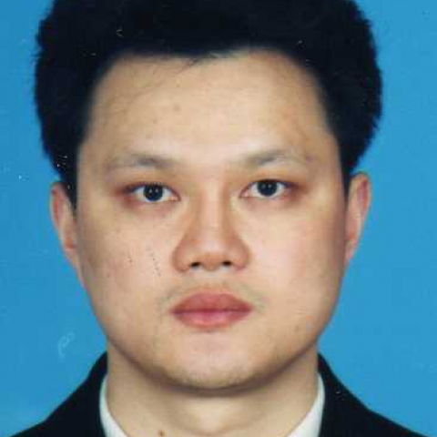

<!-- AUTO-GENERATED-BY: work/generate_obsidian_profiles.py -->

<!-- TEMPLATE: D:\workspace\信息收集整理\医生画像仓库\模板\医生画像模板.md -->

# 黄文生

## 基础信息

| 字段 | 内容 |
|---|---|
| 姓名 | 黄文生 |
| 医院 | 中山大学附属第一医院 |
| 科室 | 外科门诊 |
| 职称/身份 | 副教授 |
| 来源链接 | [官网原文](https://www.fahsysu.org.cn/node/5600) |
| 采集日期 | 2026-08-13 |

## 简介/擅长

从事普通外科、微创外科临床工作十余年，专长于疝与腹壁外科、以及普外、微创外科常见病、多发病等疾病的诊断和治疗，包括腹股沟疝、脐疝等腹壁疝、阑尾、肝囊肿、手汗症、肠道肿瘤等。 研究方向： 疝与腹壁外科； 胃肠道恶性肿瘤以及肿瘤干细胞的基础和临床研究 主要教育和工作经历：1996年毕业于中山医科大学后即留在中山一院外科工作至今，期间于2002-2007年期间攻读博士学位。 2011年晋升副教授、副主任医师。 社会兼职： 无 论著： 以第一作者发表SCI和国家级及省部级学术论文近20篇。 发表的主要学术论著如下： 1.ShRNAmediated gene silencing of β-catenin inhibits growth of human colon cancer cells.. 2.探讨Fas /FasL 的表达与大肠癌发展及转移的关系 3. 靶向β-catenin的shRNA抑制结肠癌细胞增殖的体外实验研究

## 教育与进修经历

- 胃肠道恶性肿瘤以及肿瘤干细胞的基础和临床研究 主要教育和工作经历：1996年毕业于中山医科大学后即留在中山一院外科工作至今，期间于2002-2007年期间攻读博士学位。

## 论文与学术产出

- 社会兼职： 无 论著： 以第一作者发表SCI和国家级及省部级学术论文近20篇。
- 发表的主要学术论著如下： 1.ShRNAmediated gene silencing of β-catenin inhibits growth of human colon cancer cells.. 2.探讨Fas /FasL 的表达与大肠癌发展及转移的关系 3. 靶向β-catenin的shRNA抑制结肠癌细胞增殖的体外实验研究

## 可包装亮点

- 2011年晋升副教授、副主任医师。
- 社会兼职： 无 论著： 以第一作者发表SCI和国家级及省部级学术论文近20篇。
- 发表的主要学术论著如下： 1.ShRNAmediated gene silencing of β-catenin inhibits growth of human colon cancer cells.. 2.探讨Fas /FasL 的表达与大肠癌发展及转移的关系 3. 靶向β-catenin的shRNA抑制结肠癌细胞增殖的体外实验研究

## 重点疾病/人群标签

- 慢性病：
- 肿瘤：肿瘤、靶向、肠癌
- 生殖疾病：
- 免疫/风湿：
- 术后恢复/康复：
- 疑难重症：

## 证据摘录

> 只摘录官网公开信息中的短句或关键字段，不复制大段原文。

- 官网身份字段：副教授
- 官网简介/擅长：从事普通外科、微创外科临床工作十余年，专长于疝与腹壁外科、以及普外、微创外科常见病、多发病等疾病的诊断和治疗，包括腹股沟疝、脐疝等腹壁疝、阑尾、肝囊肿、手汗症、肠道肿瘤等。 研究方向： 疝与腹壁外科； 胃肠道恶性肿瘤以及肿瘤干细胞的基础和临床研究 主要教育和工作经历：1996年毕业于中山医科大学后即留在中山一院外科工作至今，期间于2002-2007年期间攻读博士学位。 2011年晋升副教授、副主任医师。 社会兼职： 无 论著： 以第一…
- 官网亮眼经历线索：2011年晋升副教授、副主任医师。 社会兼职： 无 论著： 以第一作者发表SCI和国家级及省部级学术论文近20篇。 发表的主要学术论著如下： 1.ShRNAmediated gene silencing of β-catenin inhibits growth of human colon cancer cells.. 2.探讨Fas /FasL 的表达与大肠癌发展及转移的关系 3. 靶向β-catenin的shRNA抑制结肠癌细胞增…
- 来源链接：https://www.fahsysu.org.cn/node/5600

## BD 画像摘要

黄文生医生可作为肿瘤方向的基础画像候选。后续 BD 使用应继续以官网来源和人工复核为准，不添加疗效承诺或无来源包装。

## 合规边界

- 仅使用医院官网、官方公众号、官方小程序等公开渠道。
- 不采集私人电话、私人微信、家庭住址、患者隐私或非公开排班信息。
- 不写“保证治愈”“疗效第一”“包治疑难杂症”等无法由官网证明的表述。
