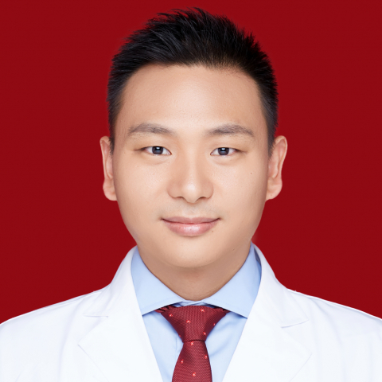

<!-- AUTO-GENERATED-BY: work/generate_obsidian_profiles.py -->

<!-- TEMPLATE: D:\workspace\信息收集整理\医生画像仓库\模板\医生画像模板.md -->

# 黄斌

## 基础信息

| 字段 | 内容 |
|---|---|
| 姓名 | 黄斌 |
| 医院 | 中山大学附属第一医院 |
| 科室 | 泌尿外科 |
| 职称/身份 | 主任医师 |
| 来源链接 | [官网原文](https://www.fahsysu.org.cn/node/683) |
| 采集日期 | 2026-08-13 |

## 简介/擅长

专注于各类泌尿及生殖系统肿瘤的临床诊治，尤其在膀胱癌、前列腺癌领域经验丰富。 膀胱癌方面：致力于各类型肿瘤的微创切除手术、高危患者保膀胱综合治疗、根治性膀胱治疗及术后疾病控制管理； 前列腺癌方面：擅长临床各期前列腺癌的个体化治疗、机器人辅助前列腺癌根治术、新型内分泌治疗及术后随访管理，同时在肾癌、泌尿系结石、前列腺增生、各类型泌尿系统畸形等方面亦有较高的诊治水平。 掌握和擅长各类泌尿外科手术和微创泌尿外科技术（机器人、腹腔镜、腔内镜等）。 研究方向：长期致力于泌尿系统肿瘤（膀胱癌、前列腺癌、肾癌）的致病机制、诊疗新技术及各类微创技术应用的研究。 主要教育和工作经历： 2013年博士毕业于中山大学附属第一医院泌尿外科并留院工作 2011-2013年赴美国康奈尔大学纽约长老会医院（New York Presbyterian Hospital ）留学（国家公派） 2016年赴日本冈山大学附属医院（Okayama University Hospital）交流（访问学者） 社会兼职： 广东省医师协会泌尿外科医师分会委员、广东省健康管理学会男性健康专业委员会委员、广东省泌尿生殖协会泌尿微创分会委员、广东省泌尿生殖协会男性健康管理学...

## 教育与进修经历

- 主要教育和工作经历： 2013年博士毕业于中山大学附属第一医院泌尿外科并留院工作 2011-2013年赴美国康奈尔大学纽约长老会医院（New York Presbyterian Hospital ）留学（国家公派） 2016年赴日本冈山大学附属医院（Okayama University Hospital）交流（访问学者） 社会兼职： 广东省医师协会泌尿外科医师分会委员、广东省健康管理学会男性健康专业委员会委员、广东省泌尿生殖协会泌尿微创分会委员、广东省泌尿生殖协会男性健康管理学分会委员、广东省泌尿生殖协会肾脏外科…

## 科研项目与成果

- 其他主要工作成绩（比如获奖情况）： 主持国家自然科学基金1项、广东省自然科学基金项目1项、广东省科技计划项目1项。

## 可包装亮点

- 主要教育和工作经历： 2013年博士毕业于中山大学附属第一医院泌尿外科并留院工作 2011-2013年赴美国康奈尔大学纽约长老会医院（New York Presbyterian Hospital ）留学（国家公派） 2016年赴日本冈山大学附属医院（Okayama University Hospital）交流（访问学者） 社会兼职： 广东省医师协会泌尿外科…
- 其他主要...

## 重点疾病/人群标签

- 慢性病：
- 肿瘤：肿瘤、癌、生殖、术后、高危
- 生殖疾病：肿瘤、癌、生殖、术后、高危
- 免疫/风湿：
- 术后恢复/康复：肿瘤、癌、生殖、术后、高危
- 疑难重症：肿瘤、癌、生殖、术后、高危

## 证据摘录

> 只摘录官网公开信息中的短句或关键字段，不复制大段原文。

- 官网身份字段：主任医师
- 官网简介/擅长：专注于各类泌尿及生殖系统肿瘤的临床诊治，尤其在膀胱癌、前列腺癌领域经验丰富。 膀胱癌方面：致力于各类型肿瘤的微创切除手术、高危患者保膀胱综合治疗、根治性膀胱治疗及术后疾病控制管理； 前列腺癌方面：擅长临床各期前列腺癌的个体化治疗、机器人辅助前列腺癌根治术、新型内分泌治疗及术后随访管理，同时在肾癌、泌尿系结石、前列腺增生、各类型泌尿系统畸形等方面亦有较高的诊治水平。 掌握和擅长各类泌尿外科手术和微创泌尿外科技术（机器人、腹腔镜、腔内镜等…
- 官网亮眼经历线索：主要教育和工作经历： 2013年博士毕业于中山大学附属第一医院泌尿外科并留院工作 2011-2013年赴美国康奈尔大学纽约长老会医院（New York Presbyterian Hospital ）留学（国家公派） 2016年赴日本冈山大学附属医院（Okayama University Hospital）交流（访问学者） 社会兼职： 广东省医师协会泌尿外科医师分会委员、广东省健康管理学会男性健康专业委员会委员、广东省泌尿生殖协会泌尿微…
- 来源链接：https://www.fahsysu.org.cn/node/683

## BD 画像摘要

黄斌医生可作为肿瘤、生殖疾病、术后恢复/康复、疑难重症方向的基础画像候选。后续 BD 使用应继续以官网来源和人工复核为准，不添加疗效承诺或无来源包装。

## 合规边界

- 仅使用医院官网、官方公众号、官方小程序等公开渠道。
- 不采集私人电话、私人微信、家庭住址、患者隐私或非公开排班信息。
- 不写“保证治愈”“疗效第一”“包治疑难杂症”等无法由官网证明的表述。
