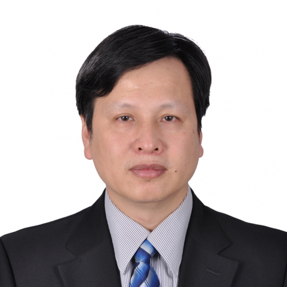

<!-- AUTO-GENERATED-BY: work/generate_obsidian_profiles.py -->

<!-- TEMPLATE: D:\workspace\信息收集整理\医生画像仓库\模板\医生画像模板.md -->

# 黄权

## 基础信息

| 字段 | 内容 |
|---|---|
| 姓名 | 黄权 |
| 医院 | 中山大学附属第一医院 |
| 科室 | 神经外科 |
| 职称/身份 | 主任医师 |
| 来源链接 | [官网原文](https://www.fahsysu.org.cn/node/631) |
| 采集日期 | 2026-08-13 |

## 简介/擅长

1984年开始从事神经外科，曾接受神经外科各专业病种规范培训，临床经验丰富，具有各种神经外科疾病的治疗经验。 目前主要从事神经系统肿瘤学的临床和基础研究，专注脑膜瘤和神经纤维瘤，治疗颅底和海绵窦等高难度手术例数超过2000例，总死亡率低于0.9%,达到世界的先进水平，是神经外科保持多年无死亡率的医生。 听神经瘤面神经的解剖保留和功能良好率达到98%和90%以上。 具有应用导航和神经内镜等微创技术治疗的丰富经验。 中山大学附属第一医院头面眶颅联合组主要专家。 中国首例世界第五例D型连头婴分离的主要手术专家。 研究方向：神经系统肿瘤（听神经瘤和脑膜瘤） 主要教育和工作经历：1984年留校于中山大学附属第一医院，从事神经外科至今。 1979-1984 中山医学院医疗系本科毕业，学士学位。 2000年中山大学外科学硕士学位。 1997-1998 美国加州大学圣地亚哥医学院神经外科访问学者和进修。 社会兼职：中国广东省中西医结合神经外科分会副主委。 中国抗癌协会和广东省协会委员。 中国中青年神经外科学会全国委员。 中华显微外科杂志编委。 论著： Mir-218 inhibits the invasive ability of g...

## 教育与进修经历

- 1984年开始从事神经外科，曾接受神经外科各专业病种规范培训，临床经验丰富，具有各种神经外科疾病的治疗经验。
- 医疗特长： 1984年开始从事神经外科，曾接受神经外科各专业病种规范培训，临床经验丰富，具有各种神经外科疾病的治疗经验。
- 1979-1984 中山医学院医疗系本科毕业，学士学位。
- 2000年中山大学外科学硕士学位。

## 可包装亮点

- 1997-1998 美国加州大学圣地亚哥医学院神经外科访问学者和进修。
- 中国抗癌协会和广东省协会委员。
- 中国中青年神经外科学会全国委员。
- 70(5):478-81. Epub 2008 Feb 8. 专著： 其他主要工作成绩（比如获奖情况）：D型连头婴分离手术，2003 广东省科技进步奖三等奖。

## 重点疾病/人群标签

- 慢性病：
- 肿瘤：肿瘤、癌、瘤、胚胎
- 生殖疾病：肿瘤、癌、瘤、胚胎
- 免疫/风湿：
- 术后恢复/康复：
- 疑难重症：

## 证据摘录

> 只摘录官网公开信息中的短句或关键字段，不复制大段原文。

- 官网身份字段：主任医师
- 官网简介/擅长：1984年开始从事神经外科，曾接受神经外科各专业病种规范培训，临床经验丰富，具有各种神经外科疾病的治疗经验。 目前主要从事神经系统肿瘤学的临床和基础研究，专注脑膜瘤和神经纤维瘤，治疗颅底和海绵窦等高难度手术例数超过2000例，总死亡率低于0.9%,达到世界的先进水平，是神经外科保持多年无死亡率的医生。 听神经瘤面神经的解剖保留和功能良好率达到98%和90%以上。 具有应用导航和神经内镜等微创技术治疗的丰富经验。 中山大学附属第一医院头…
- 官网亮眼经历线索：1997-1998 美国加州大学圣地亚哥医学院神经外科访问学者和进修。 中国抗癌协会和广东省协会委员。 中国中青年神经外科学会全国委员。 70(5):478-81. Epub 2008 Feb 8. 专著： 其他主要工作成绩（比如获奖情况）：D型连头婴分离手术，2003 广东省科技进步奖三等奖。
- 来源链接：https://www.fahsysu.org.cn/node/631

## BD 画像摘要

黄权医生可作为肿瘤、生殖疾病方向的基础画像候选。后续 BD 使用应继续以官网来源和人工复核为准，不添加疗效承诺或无来源包装。

## 合规边界

- 仅使用医院官网、官方公众号、官方小程序等公开渠道。
- 不采集私人电话、私人微信、家庭住址、患者隐私或非公开排班信息。
- 不写“保证治愈”“疗效第一”“包治疑难杂症”等无法由官网证明的表述。
