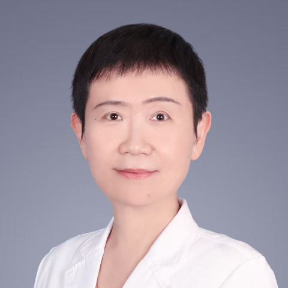

<!-- AUTO-GENERATED-BY: work/generate_obsidian_profiles.py -->

<!-- TEMPLATE: D:\workspace\信息收集整理\医生画像仓库\模板\医生画像模板.md -->

# 黄柳一

## 基础信息

| 字段 | 内容 |
|---|---|
| 姓名 | 黄柳一 |
| 医院 | 中山大学附属第一医院 |
| 科室 | 儿科一科 |
| 职称/身份 | 副主任医师/副教授 |
| 来源链接 | [官网原文](https://www.fahsysu.org.cn/node/854) |
| 采集日期 | 2026-08-13 |

## 简介/擅长

长期从事儿科呼吸及感染疾病的相关工作，擅长治疗小儿呼吸系统疾病，包括慢性咳嗽、哮喘、咳嗽变异性哮喘、胸闷型哮喘、鼻炎、鼻窦炎、睡眠呼吸障碍、上呼吸道感染、气管炎、支气管炎、肺炎、支气管扩张、肺不张、肺脓肿、胸腔积液以及其他系统感染性疾病。 1987年本科毕业于中山大学临床专业，1992年研究生毕业于中山大学儿科专业。 任中国医药质量管理协会儿科呼吸标准化诊治及质量控制工作委员会常委、广东省医学会儿科学分会呼吸病学组副组长、广东省药学会理事会儿科临床合理用药专家委员会副主任委员、广东省哮喘协助组副组长、广东省呼吸联盟副理事长、广东省基层医药学会儿科呼吸感染专业委员会副主任委员，中南儿科呼吸联盟常委，广东省临床医学学会儿科呼吸专业委员会副主任委员、中国医药质量管理协会儿科呼吸标准化诊治及质量控制工作委员会常委、广东和谐医患纠纷人民调解委员会医学专家顾问等。 主持广东省卫生厅基金，广东省中医药管理局基金，中山大学教学科研基金等多项项目。 在 sci 及核心杂志发表论文多篇。 多次获“岭南名医”称号。

## 教育与进修经历

- 1987年本科毕业于中山大学临床专业，1992年研究生毕业于中山大学儿科专业。

## 科研项目与成果

- 主持广东省卫生厅基金，广东省中医药管理局基金，中山大学教学科研基金等多项项目。

## 论文与学术产出

- 在 sci 及核心杂志发表论文多篇。

## 可包装亮点

- 任中国医药质量管理协会儿科呼吸标准化诊治及质量控制工作委员会常委、广东省医学会儿科学分会呼吸病学组副组长、广东省药学会理事会儿科临床合理用药专家委员会副主任委员、广东省哮喘协助组副组长、广东省呼吸联盟副理事长、广东省基层医药学会儿科呼吸感染专业委员会副主任委员，中南儿科呼吸联盟常委，广东省临床医学学会儿科呼吸专业委员会副主任委员、中国医药质量管理协会儿科呼…
- 在 sci 及核心杂志发表论文多篇。
- 多次获“岭南名医”称号。

## 重点疾病/人群标签

- 慢性病：慢性、感染
- 肿瘤：
- 生殖疾病：
- 免疫/风湿：慢性、感染
- 术后恢复/康复：
- 疑难重症：

## 证据摘录

> 只摘录官网公开信息中的短句或关键字段，不复制大段原文。

- 官网身份字段：副主任医师/副教授
- 官网简介/擅长：长期从事儿科呼吸及感染疾病的相关工作，擅长治疗小儿呼吸系统疾病，包括慢性咳嗽、哮喘、咳嗽变异性哮喘、胸闷型哮喘、鼻炎、鼻窦炎、睡眠呼吸障碍、上呼吸道感染、气管炎、支气管炎、肺炎、支气管扩张、肺不张、肺脓肿、胸腔积液以及其他系统感染性疾病。 1987年本科毕业于中山大学临床专业，1992年研究生毕业于中山大学儿科专业。 任中国医药质量管理协会儿科呼吸标准化诊治及质量控制工作委员会常委、广东省医学会儿科学分会呼吸病学组副组长、广东省药学会…
- 官网亮眼经历线索：任中国医药质量管理协会儿科呼吸标准化诊治及质量控制工作委员会常委、广东省医学会儿科学分会呼吸病学组副组长、广东省药学会理事会儿科临床合理用药专家委员会副主任委员、广东省哮喘协助组副组长、广东省呼吸联盟副理事长、广东省基层医药学会儿科呼吸感染专业委员会副主任委员，中南儿科呼吸联盟常委，广东省临床医学学会儿科呼吸专业委员会副主任委员、中国医药质量管理协会儿科呼吸标准化诊治及质量控制工作委员会常委、广东和谐医患纠纷人民调解委员会医学专家顾问…
- 来源链接：https://www.fahsysu.org.cn/node/854

## BD 画像摘要

黄柳一医生可作为慢性病、免疫/风湿/感染方向的基础画像候选。后续 BD 使用应继续以官网来源和人工复核为准，不添加疗效承诺或无来源包装。

## 合规边界

- 仅使用医院官网、官方公众号、官方小程序等公开渠道。
- 不采集私人电话、私人微信、家庭住址、患者隐私或非公开排班信息。
- 不写“保证治愈”“疗效第一”“包治疑难杂症”等无法由官网证明的表述。
