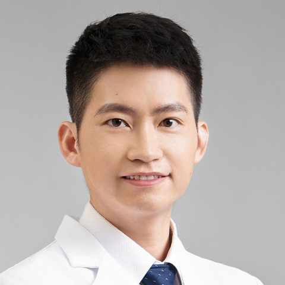

<!-- AUTO-GENERATED-BY: work/generate_obsidian_profiles.py -->

<!-- TEMPLATE: D:\workspace\信息收集整理\医生画像仓库\模板\医生画像模板.md -->

# 黄沛森

## 基础信息

| 字段 | 内容 |
|---|---|
| 姓名 | 黄沛森 |
| 医院 | 中山大学附属第一医院 |
| 科室 | 心内六科（CCU） |
| 职称/身份 | 副主任医师 |
| 来源链接 | [官网原文](https://www.fahsysu.org.cn/node/38087) |
| 采集日期 | 2026-08-13 |

## 简介/擅长

冠心病、心绞痛、心肌梗死、瓣膜病、心力衰竭、心律失常、心肌病的精准化、个体化治疗，精通冠心病、瓣膜病的介入手术治疗和心血管急危重症的救治，每年完成近千例心血管介入手术。 对高血压、高血脂、高尿酸等心血管危险因素管理有丰富经验。 曾入选中山一院-香港医管局医生交流计划在香港伊利沙伯医院、基督教联合医院工作，研修冠心病、瓣膜病微创介入手术治疗。 医学博士，硕士研究生导师； 中山一院“柯麟新星”人才计划获得者； 美国北卡罗来纳州大学教堂山分校McAllister心脏研究所访问学者； 国家冠脉介入治疗资质专家。 研究方向 长期致力于冠心病、心力衰竭和瓣膜病的临床和转化基础研究。 对心肌梗死、心力衰竭的防治、心肌再生修复、冠心病药物球囊和生物可吸收支架等“介入无植入”策略的有着深入的研究。 主持国自然、省自然等国家和省部级课题6项，获中山一院“柯麟新星”人才计划支持，在Cardiovascular Research、Science Translational Medicine、Stem Cell Research & Therapy、Molecular Therapy: Nucleic Acids等领域内权威杂志发表SCI论文2...

## 教育与进修经历

- 美国北卡罗来纳州大学教堂山分校McAllister心脏研究所访问学者；
- 主要教育和工作经历 2009-2014 中山大学中山医学院本科 2014-2019 北京协和医学院 中国医学科学院阜外医院博士研究生（获优秀毕业生称号） 2017-2018 美国北卡罗来纳州大学教堂山分校McAllister心脏研究所访问学者 2019-2023 中山大学附属第一医院心内科临床博士后、住院医师、助理研究员 2023-2025 中山大学附属第一医院心内科主治医师 2025-2026 香港伊利沙伯医院、基督教联合医院 心内科专科医生（心血管介入独立术者） 2025-至今 中山大学附属第一医院心内科副主…

## 科研项目与成果

- 主持国自然、省自然等国家和省部级课题6项，获中山一院“柯麟新星”人才计划支持，在Cardiovascular Research、Science Translational Medicine、Stem Cell Research & Therapy、Molecular Therapy: Nucleic Acids等领域内权威杂志发表SCI论文20余篇，获得国家发明专利和国际PCT专利授权多项。

## 论文与学术产出

- 主持国自然、省自然等国家和省部级课题6项，获中山一院“柯麟新星”人才计划支持，在Cardiovascular Research、Science Translational Medicine、Stem Cell Research & Therapy、Molecular Therapy: Nucleic Acids等领域内权威杂志发表SCI论文20余篇，获得国家发明专利和国际PCT专利授权多项。

## 可包装亮点

- 擅长冠心病、心绞痛、心肌梗死、瓣膜病、心力衰竭、心律失常、心肌病的精准化、个体化治疗，精通冠心病、瓣膜病的介入手术治疗和心血管急危重症的救治，每年完成近千例心血管介入手术。
- 医疗特长： 擅长冠心病、心绞痛、心肌梗死、瓣膜病、心力衰竭、心律失常、心肌病的精准化、个体化治疗，精通冠心病、瓣膜病的介入手术治疗和心血管急危重症的救治，每年完成近千例心血管介入手术。
- 曾入选中山一院-香港医管局医生交流计划在香港伊利沙伯医院、基督教联合医院工作，研修冠心病、瓣膜病微创介入手术治疗。
- 中山一院“柯麟新星”人才计划获得者；

## 重点疾病/人群标签

- 慢性病：高血压、冠心病、心力衰竭、重症、急危重
- 肿瘤：
- 生殖疾病：
- 免疫/风湿：
- 术后恢复/康复：
- 疑难重症：高血压、冠心病、心力衰竭、重症、急危重

## 证据摘录

> 只摘录官网公开信息中的短句或关键字段，不复制大段原文。

- 官网身份字段：副主任医师
- 官网简介/擅长：冠心病、心绞痛、心肌梗死、瓣膜病、心力衰竭、心律失常、心肌病的精准化、个体化治疗，精通冠心病、瓣膜病的介入手术治疗和心血管急危重症的救治，每年完成近千例心血管介入手术。 对高血压、高血脂、高尿酸等心血管危险因素管理有丰富经验。 曾入选中山一院-香港医管局医生交流计划在香港伊利沙伯医院、基督教联合医院工作，研修冠心病、瓣膜病微创介入手术治疗。 医学博士，硕士研究生导师； 中山一院“柯麟新星”人才计划获得者； 美国北卡罗来纳州大学教堂山分…
- 官网亮眼经历线索：擅长冠心病、心绞痛、心肌梗死、瓣膜病、心力衰竭、心律失常、心肌病的精准化、个体化治疗，精通冠心病、瓣膜病的介入手术治疗和心血管急危重症的救治，每年完成近千例心血管介入手术。 医疗特长： 擅长冠心病、心绞痛、心肌梗死、瓣膜病、心力衰竭、心律失常、心肌病的精准化、个体化治疗，精通冠心病、瓣膜病的介入手术治疗和心血管急危重症的救治，每年完成近千例心血管介入手术。 曾入选中山一院-香港医管局医生交流计划在香港伊利沙伯医院、基督教联合医院工作…
- 来源链接：https://www.fahsysu.org.cn/node/38087

## BD 画像摘要

黄沛森医生可作为慢性病、疑难重症方向的基础画像候选。后续 BD 使用应继续以官网来源和人工复核为准，不添加疗效承诺或无来源包装。

## 合规边界

- 仅使用医院官网、官方公众号、官方小程序等公开渠道。
- 不采集私人电话、私人微信、家庭住址、患者隐私或非公开排班信息。
- 不写“保证治愈”“疗效第一”“包治疑难杂症”等无法由官网证明的表述。
