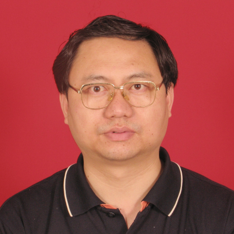

<!-- AUTO-GENERATED-BY: work/generate_obsidian_profiles.py -->

<!-- TEMPLATE: D:\workspace\信息收集整理\医生画像仓库\模板\医生画像模板.md -->

# 黄海威

## 基础信息

| 字段 | 内容 |
|---|---|
| 姓名 | 黄海威 |
| 医院 | 中山大学附属第一医院 |
| 科室 | 神经二科（脑血管病专科） |
| 职称/身份 | 主任医师/教授 |
| 来源链接 | [官网原文](https://www.fahsysu.org.cn/node/896) |
| 采集日期 | 2026-08-13 |

## 简介/擅长

长期工作在医疗第一线，有30余年的临床工作经验，对神经科疑难疾病的诊治和危重病人的抢救积累了丰富经验，尤其擅长脑血管疾病、中枢神经系统感染性疾病、中毒与放射性脑病、脊髓病及神经系统罕见病的诊治，并带领团队致力于常见症状如头晕、眩晕、平衡障碍、功能性神经症状等的诊治和康复。 多次参与省医疗队的外派抢救工作。 先后承担国家及省市级科研项目10余项，在国内外发表科研论文近百篇，参与编写《临床神经病学》及《脑卒中》等多本专著，获卫生部及省科技厅科研成果奖多项。 研究方向： 脑血管疾病、中毒与放射性脑病、前庭系统疾病 主要教育和工作经历： 1983年9月－1989年6月 中山医科大学 大学本科学习 1991年9月－1994年6月 中山医科大学 硕士研究生学习 1989年6月－1994年12月 中山医科大学附属第一医院神经科 任住院医师工作 1994年12月－2000年12月 中山医科大学附属第一医院神经科 任主治/讲师工作 2000年12月－2007年12月 中山大学附属第一医院神经科 任副教授/副主任医师 2007年12月－至今 中山大学附属第一医院神经科 任教授主任医师/科主任 社会兼职： 华南眩晕中心联盟执行主席兼秘书长 ...

## 科研项目与成果

- 先后承担国家及省市级科研项目10余项，在国内外发表科研论文近百篇，参与编写《临床神经病学》及《脑卒中》等多本专著，获卫生部及省科技厅科研成果奖多项。

## 论文与学术产出

- 先后承担国家及省市级科研项目10余项，在国内外发表科研论文近百篇，参与编写《临床神经病学》及《脑卒中》等多本专著，获卫生部及省科技厅科研成果奖多项。

## 可包装亮点

- 长期工作在医疗第一线，有30余年的临床工作经验，对神经科疑难疾病的诊治和危重病人的抢救积累了丰富经验，尤其擅长脑血管疾病、中枢神经系统感染性疾病、中毒与放射性脑病、脊髓病及神经系统罕见病的诊治，并带领团队致力于常见症状如头晕、眩晕、平衡障碍、功能性神经症状等的诊治和康复。
- 先后承担国家及省市级科研项目10余项，在国内外发表科研论文近百篇，参与编写《临床神经病学》及《脑卒中》等多本专著，获卫生部及省科技厅科研成果奖多项。
- 医疗特长：长期工作在医疗第一线，有30余年的临床工作经验，对神经科疑难疾病的诊治和危重病人的抢救积累了丰富经验，尤其擅长脑血管疾病、中枢神经系统感染性疾病、中毒与放射性脑病、脊髓病及神经系统罕见病的诊治，并带领团队致力于常见症状如头晕、眩晕、平衡障碍、功能性神经症状等的诊治和康复。
- 先后承担国家及省市级科研项目10余项，在国内外发表科研论文近百篇，参与编写《临床神经病学》及《脑卒中》等多本专著，获卫生部及省...

## 重点疾病/人群标签

- 慢性病：
- 肿瘤：
- 生殖疾病：
- 免疫/风湿：感染、康复、疑难、危重、罕见
- 术后恢复/康复：感染、康复、疑难、危重、罕见
- 疑难重症：感染、康复、疑难、危重、罕见

## 证据摘录

> 只摘录官网公开信息中的短句或关键字段，不复制大段原文。

- 官网身份字段：主任医师/教授
- 官网简介/擅长：长期工作在医疗第一线，有30余年的临床工作经验，对神经科疑难疾病的诊治和危重病人的抢救积累了丰富经验，尤其擅长脑血管疾病、中枢神经系统感染性疾病、中毒与放射性脑病、脊髓病及神经系统罕见病的诊治，并带领团队致力于常见症状如头晕、眩晕、平衡障碍、功能性神经症状等的诊治和康复。 多次参与省医疗队的外派抢救工作。 先后承担国家及省市级科研项目10余项，在国内外发表科研论文近百篇，参与编写《临床神经病学》及《脑卒中》等多本专著，获卫生部及省科技…
- 官网亮眼经历线索：长期工作在医疗第一线，有30余年的临床工作经验，对神经科疑难疾病的诊治和危重病人的抢救积累了丰富经验，尤其擅长脑血管疾病、中枢神经系统感染性疾病、中毒与放射性脑病、脊髓病及神经系统罕见病的诊治，并带领团队致力于常见症状如头晕、眩晕、平衡障碍、功能性神经症状等的诊治和康复。 先后承担国家及省市级科研项目10余项，在国内外发表科研论文近百篇，参与编写《临床神经病学》及《脑卒中》等多本专著，获卫生部及省科技厅科研成果奖多项。 医疗特长：长期…
- 来源链接：https://www.fahsysu.org.cn/node/896

## BD 画像摘要

黄海威医生可作为免疫/风湿/感染、术后恢复/康复、疑难重症方向的基础画像候选。后续 BD 使用应继续以官网来源和人工复核为准，不添加疗效承诺或无来源包装。

## 合规边界

- 仅使用医院官网、官方公众号、官方小程序等公开渠道。
- 不采集私人电话、私人微信、家庭住址、患者隐私或非公开排班信息。
- 不写“保证治愈”“疗效第一”“包治疑难杂症”等无法由官网证明的表述。
