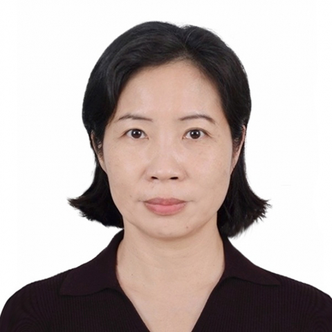

<!-- AUTO-GENERATED-BY: work/generate_obsidian_profiles.py -->

<!-- TEMPLATE: D:\workspace\信息收集整理\医生画像仓库\模板\医生画像模板.md -->

# 黄知敏

## 基础信息

| 字段 | 内容 |
|---|---|
| 姓名 | 黄知敏 |
| 医院 | 中山大学附属第一医院 |
| 科室 | 内分泌内科 |
| 职称/身份 | 主任医师 |
| 来源链接 | [官网原文](https://www.fahsysu.org.cn/node/840) |
| 采集日期 | 2026-08-13 |

## 简介/擅长

从事内分泌领域工作20余年，擅长糖尿病、甲亢与甲减、垂体性疾病、肾上腺疾病、恶性肿瘤免疫治疗相关内分泌疾病、脂肪肝、痛风等疾病的诊断与治疗。 对罕见特殊病例，如A型胰岛素抵抗综合征、暴发性1型糖尿病、肿瘤相关性低磷血症佝偻病、自身免疫性低血糖症等均具有丰富的诊治经验。 研究方向2型糖尿病胰岛素短期强化治疗、胰岛素抵抗及胰岛素受体病、内分泌罕见病的诊治。 主要教育和工作经历： 医学博士，博士研究生导师。 1996年本科毕业于中山医科大学临床医学系； 2013年9月至2015年8月于美国得克萨斯州西南医学中心药学部进行胰岛素信号通路研究； 2017年3月至5月获郑裕彤奖学金资助于香港大学李嘉诚医学院玛丽医院参与脂肪肝临床研究。 多次获评中山大学附属第一医院优秀教师、研究生教育先进工作者。 曾主持国家自然科学基金面上项目、广东省医学科学技术研究基金课题及广东省科技计划项目； 已发表学术论文50余篇，其中SCI论著40余篇，参编专著4部。 专家

## 教育与进修经历

- 1996年本科毕业于中山医科大学临床医学系；

## 科研项目与成果

- 曾主持国家自然科学基金面上项目、广东省医学科学技术研究基金课题及广东省科技计划项目；

## 论文与学术产出

- 已发表学术论文50余篇，其中SCI论著40余篇，参编专著4部。

## 可包装亮点

- 2013年9月至2015年8月于美国得克萨斯州西南医学中心药学部进行胰岛素信号通路研究；
- 2017年3月至5月获郑裕彤奖学金资助于香港大学李嘉诚医学院玛丽医院参与脂肪肝临床研究。
- 曾主持国家自然科学基金面上项目、广东省医学科学技术研究基金课题及广东省科技计划项目；
- 已发表学术论文50余篇，其中SCI论著40余篇，参编专著4部。

## 重点疾病/人群标签

- 慢性病：糖尿病、肿瘤、免疫、罕见
- 肿瘤：糖尿病、肿瘤、免疫、罕见
- 生殖疾病：
- 免疫/风湿：糖尿病、肿瘤、免疫、罕见
- 术后恢复/康复：
- 疑难重症：糖尿病、肿瘤、免疫、罕见

## 证据摘录

> 只摘录官网公开信息中的短句或关键字段，不复制大段原文。

- 官网身份字段：主任医师
- 官网简介/擅长：从事内分泌领域工作20余年，擅长糖尿病、甲亢与甲减、垂体性疾病、肾上腺疾病、恶性肿瘤免疫治疗相关内分泌疾病、脂肪肝、痛风等疾病的诊断与治疗。 对罕见特殊病例，如A型胰岛素抵抗综合征、暴发性1型糖尿病、肿瘤相关性低磷血症佝偻病、自身免疫性低血糖症等均具有丰富的诊治经验。 研究方向2型糖尿病胰岛素短期强化治疗、胰岛素抵抗及胰岛素受体病、内分泌罕见病的诊治。 主要教育和工作经历： 医学博士，博士研究生导师。 1996年本科毕业于中山医科大学…
- 官网亮眼经历线索：2013年9月至2015年8月于美国得克萨斯州西南医学中心药学部进行胰岛素信号通路研究； 2017年3月至5月获郑裕彤奖学金资助于香港大学李嘉诚医学院玛丽医院参与脂肪肝临床研究。 曾主持国家自然科学基金面上项目、广东省医学科学技术研究基金课题及广东省科技计划项目； 已发表学术论文50余篇，其中SCI论著40余篇，参编专著4部。
- 来源链接：https://www.fahsysu.org.cn/node/840

## BD 画像摘要

黄知敏医生可作为慢性病、肿瘤、免疫/风湿/感染、疑难重症方向的基础画像候选。后续 BD 使用应继续以官网来源和人工复核为准，不添加疗效承诺或无来源包装。

## 合规边界

- 仅使用医院官网、官方公众号、官方小程序等公开渠道。
- 不采集私人电话、私人微信、家庭住址、患者隐私或非公开排班信息。
- 不写“保证治愈”“疗效第一”“包治疑难杂症”等无法由官网证明的表述。
