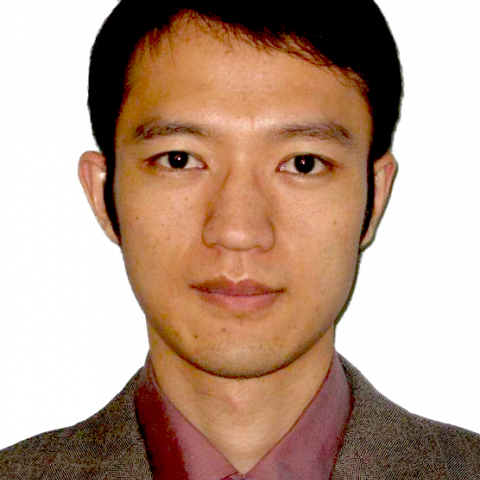

<!-- AUTO-GENERATED-BY: work/generate_obsidian_profiles.py -->

<!-- TEMPLATE: D:\workspace\信息收集整理\医生画像仓库\模板\医生画像模板.md -->

# 黄轩

## 基础信息

| 字段 | 内容 |
|---|---|
| 姓名 | 黄轩 |
| 医院 | 中山大学附属第一医院 |
| 科室 | 产科 |
| 职称/身份 | 副主任医师 |
| 来源链接 | [官网原文](https://www.fahsysu.org.cn/node/595) |
| 采集日期 | 2026-08-13 |

## 简介/擅长

优生遗传咨询，胎儿疾病的产前筛查、产前诊断和宫内治疗，以及复杂性双胎的诊治。 研究方向： 1. 胎盘发育的转录表达及转录调控； 2. 胎儿肢体发育短小的遗传学病因 主要教育和工作经历： 2002年毕业于华中科技大学同济医学院，2002-2004年在江西省妇幼保健院优生遗传科工作，2007年中山大学附属第一医院妇产科胎儿医学硕士毕业，毕业后留院工作至今，2015年获妇产科胎儿医学博士学位。 2017年1月至2019年1月，公派赴美，在德州大学西南医学中心完成博士后培训，并在全美最大的产科医院、《Williams Obstetrics》主编单位Parkland Memorial Hospital访问学习。 社会兼职：无 论著：发表第一或并列第一作者论文10篇，其中SCI论文3篇，2次在国际会议上做口头报告。 分别发表在PRENATAL DIAGNOSIS、JOURNAL OF CELLULAR AND MOLECULAR MEDICINE、PLoS One、中华妇产科学杂志、中华围产医学杂志、中华遗传医学杂志等国内外期刊。 专著：无 其他主要工作成绩（比如获奖情况）：获评中山一院“优秀见习带教老师”，以及同学们自发评选的“...

## 教育与进修经历

- 2. 胎儿肢体发育短小的遗传学病因 主要教育和工作经历： 2002年毕业于华中科技大学同济医学院，2002-2004年在江西省妇幼保健院优生遗传科工作，2007年中山大学附属第一医院妇产科胎儿医学硕士毕业，毕业后留院工作至今，2015年获妇产科胎儿医学博士学位。
- 2017年1月至2019年1月，公派赴美，在德州大学西南医学中心完成博士后培训，并在全美最大的产科医院、《Williams Obstetrics》主编单位Parkland Memorial Hospital访问学习。
- 专著：无 其他主要工作成绩（比如获奖情况）：获评中山一院“优秀见习带教老师”，以及同学们自发评选的“我最喜爱的实操培训教官”，教学测试考评结果为“优秀”。

## 论文与学术产出

- 2017年1月至2019年1月，公派赴美，在德州大学西南医学中心完成博士后培训，并在全美最大的产科医院、《Williams Obstetrics》主编单位Parkland Memorial Hospital访问学习。
- 社会兼职：无 论著：发表第一或并列第一作者论文10篇，其中SCI论文3篇，2次在国际会议上做口头报告。
- 分别发表在PRENATAL DIAGNOSIS、JOURNAL OF CELLULAR AND MOLECULAR MEDICINE、PLoS One、中华妇产科学杂志、中华围产医学杂志、中华遗传医学杂志等国内外期刊。

## 可包装亮点

- 2017年1月至2019年1月，公派赴美，在德州大学西南医学中心完成博士后培训，并在全美最大的产科医院、《Williams Obstetrics》主编单位Parkland Memorial Hospital访问学习。
- 社会兼职：无 论著：发表第一或并列第一作者论文10篇，其中SCI论文3篇，2次在国际会议上做口头报告。
- 分别发表在PRENATAL DIAGNOSIS、JOURNAL OF CELLULAR AND MOLECULAR MEDICINE、PLoS One、中华妇产科学杂志、中华围产医学杂志、中华遗传医学杂志等国内外期刊。
- 专著：无 其他主要工作成绩（比如获奖情况）：获评中山一院“优秀见习带教老师”，以及同学们自发评选的“我最喜爱的实操培训教官”，教学测试考评结果为“优秀”。

## 重点疾病/人群标签

- 慢性病：
- 肿瘤：
- 生殖疾病：
- 免疫/风湿：
- 术后恢复/康复：
- 疑难重症：复杂

## 证据摘录

> 只摘录官网公开信息中的短句或关键字段，不复制大段原文。

- 官网身份字段：副主任医师
- 官网简介/擅长：优生遗传咨询，胎儿疾病的产前筛查、产前诊断和宫内治疗，以及复杂性双胎的诊治。 研究方向： 1. 胎盘发育的转录表达及转录调控； 2. 胎儿肢体发育短小的遗传学病因 主要教育和工作经历： 2002年毕业于华中科技大学同济医学院，2002-2004年在江西省妇幼保健院优生遗传科工作，2007年中山大学附属第一医院妇产科胎儿医学硕士毕业，毕业后留院工作至今，2015年获妇产科胎儿医学博士学位。 2017年1月至2019年1月，公派赴美，在德…
- 官网亮眼经历线索：2017年1月至2019年1月，公派赴美，在德州大学西南医学中心完成博士后培训，并在全美最大的产科医院、《Williams Obstetrics》主编单位Parkland Memorial Hospital访问学习。 社会兼职：无 论著：发表第一或并列第一作者论文10篇，其中SCI论文3篇，2次在国际会议上做口头报告。 分别发表在PRENATAL DIAGNOSIS、JOURNAL OF CELLULAR AND MOLECULAR…
- 来源链接：https://www.fahsysu.org.cn/node/595

## BD 画像摘要

黄轩医生可作为疑难重症方向的基础画像候选。后续 BD 使用应继续以官网来源和人工复核为准，不添加疗效承诺或无来源包装。

## 合规边界

- 仅使用医院官网、官方公众号、官方小程序等公开渠道。
- 不采集私人电话、私人微信、家庭住址、患者隐私或非公开排班信息。
- 不写“保证治愈”“疗效第一”“包治疑难杂症”等无法由官网证明的表述。
