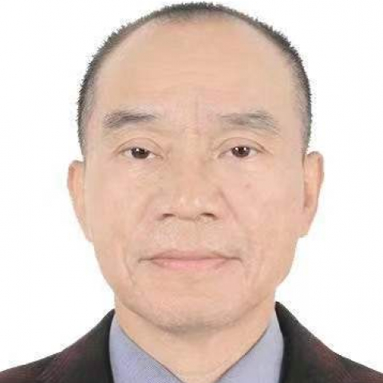

<!-- AUTO-GENERATED-BY: work/generate_obsidian_profiles.py -->

<!-- TEMPLATE: D:\workspace\信息收集整理\医生画像仓库\模板\医生画像模板.md -->

# 黎东明

## 基础信息

| 字段 | 内容 |
|---|---|
| 姓名 | 黎东明 |
| 医院 | 中山大学附属第一医院 |
| 科室 | 肝外科 |
| 职称/身份 | 主任医师 |
| 来源链接 | [官网原文](https://www.fahsysu.org.cn/node/651) |
| 采集日期 | 2026-08-13 |

## 简介/擅长

本人1986年毕业于原中山医科大学，随后分配到附属第一医院外科（肝胆外科）工作，至今已从事临床医疗、教学和科研工作36年多。 擅长对肝癌、胆管癌（胆囊癌）、胰腺癌、肝内外胆管结石、先天性胆管囊性扩张症及门脉高压症等疑难疾病的诊断和治疗，尤其对肝癌，胆管癌及肝内外胆管结石等手术治疗有独到的见解。 临床经验丰富，技术精湛，工作务实进取，深受广大患者好评。 主要教育和工作经历：1980~1986年就读于中山医科大学6年制本科学习，毕业后分配到中山大学附属第一医院肝胆外科工作，从临床住院医生做起，到主治医生、副主任医师，再到主任医师，脚踏实地从事临床医疗工作至今超过36年。 研究方向：肝癌和胆管癌的外科治疗，肝脏储备功能的研究。 论著：近期在国内、外核心杂志上发表论著共10多篇，其中在国外发表的SCI文章两篇，IF分别为5.228和2.741。 专著：参编10多本学术专著的撰写

## 教育与进修经历

- 本人1986年毕业于原中山医科大学，随后分配到附属第一医院外科（肝胆外科）工作，至今已从事临床医疗、教学和科研工作36年多。
- 医疗特长： 本人1986年毕业于原中山医科大学，随后分配到附属第一医院外科（肝胆外科）工作，至今已从事临床医疗、教学和科研工作36年多。
- 主要教育和工作经历：1980~1986年就读于中山医科大学6年制本科学习，毕业后分配到中山大学附属第一医院肝胆外科工作，从临床住院医生做起，到主治医生、副主任医师，再到主任医师，脚踏实地从事临床医疗工作至今超过36年。

## 科研项目与成果

- 本人1986年毕业于原中山医科大学，随后分配到附属第一医院外科（肝胆外科）工作，至今已从事临床医疗、教学和科研工作36年多。
- 医疗特长： 本人1986年毕业于原中山医科大学，随后分配到附属第一医院外科（肝胆外科）工作，至今已从事临床医疗、教学和科研工作36年多。

## 论文与学术产出

- 论著：近期在国内、外核心杂志上发表论著共10多篇，其中在国外发表的SCI文章两篇，IF分别为5.228和2.741。
- 专著：参编10多本学术专著的撰写

## 可包装亮点

- 擅长对肝癌、胆管癌（胆囊癌）、胰腺癌、肝内外胆管结石、先天性胆管囊性扩张症及门脉高压症等疑难疾病的诊断和治疗，尤其对肝癌，胆管癌及肝内外胆管结石等手术治疗有独到的见解。
- 主要教育和工作经历：1980~1986年就读于中山医科大学6年制本科学习，毕业后分配到中山大学附属第一医院肝胆外科工作，从临床住院医生做起，到主治医生、副主任医师，再到主任医师，脚踏实地从事临床医疗工作至今超过36年。
- 论著：近期在国内、外核心杂志上发表论著共10多篇，其中在国外发表的SCI文章两篇，IF分别为5.228和2.741。

## 重点疾病/人群标签

- 慢性病：
- 肿瘤：癌、肝癌、疑难
- 生殖疾病：
- 免疫/风湿：
- 术后恢复/康复：
- 疑难重症：癌、肝癌、疑难

## 证据摘录

> 只摘录官网公开信息中的短句或关键字段，不复制大段原文。

- 官网身份字段：主任医师
- 官网简介/擅长：本人1986年毕业于原中山医科大学，随后分配到附属第一医院外科（肝胆外科）工作，至今已从事临床医疗、教学和科研工作36年多。 擅长对肝癌、胆管癌（胆囊癌）、胰腺癌、肝内外胆管结石、先天性胆管囊性扩张症及门脉高压症等疑难疾病的诊断和治疗，尤其对肝癌，胆管癌及肝内外胆管结石等手术治疗有独到的见解。 临床经验丰富，技术精湛，工作务实进取，深受广大患者好评。 主要教育和工作经历：1980~1986年就读于中山医科大学6年制本科学习，毕业后分配…
- 官网亮眼经历线索：擅长对肝癌、胆管癌（胆囊癌）、胰腺癌、肝内外胆管结石、先天性胆管囊性扩张症及门脉高压症等疑难疾病的诊断和治疗，尤其对肝癌，胆管癌及肝内外胆管结石等手术治疗有独到的见解。 擅长对肝癌、胆管癌（胆囊癌）、胰腺癌、肝内外胆管结石、先天性胆管囊性扩张症及门脉高压症等疑难疾病的诊断和治疗，尤其对肝癌，胆管癌及肝内外胆管结石等手术治疗有独到的见解。 主要教育和工作经历：1980~1986年就读于中山医科大学6年制本科学习，毕业后分配到中山大学附属…
- 来源链接：https://www.fahsysu.org.cn/node/651

## BD 画像摘要

黎东明医生可作为肿瘤、疑难重症方向的基础画像候选。后续 BD 使用应继续以官网来源和人工复核为准，不添加疗效承诺或无来源包装。

## 合规边界

- 仅使用医院官网、官方公众号、官方小程序等公开渠道。
- 不采集私人电话、私人微信、家庭住址、患者隐私或非公开排班信息。
- 不写“保证治愈”“疗效第一”“包治疑难杂症”等无法由官网证明的表述。
