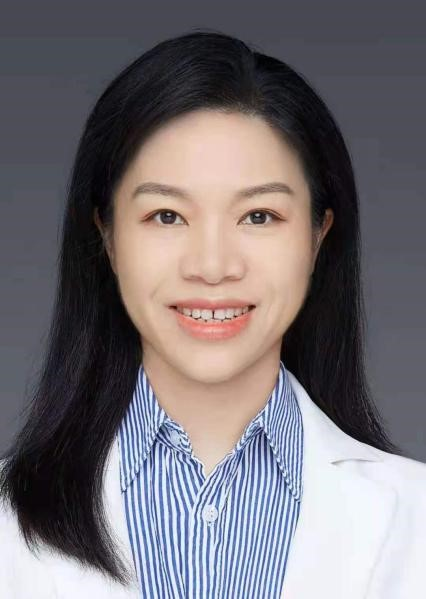

<!-- AUTO-GENERATED-BY: work/generate_obsidian_profiles.py -->

<!-- TEMPLATE: D:\workspace\信息收集整理\医生画像仓库\模板\医生画像模板.md -->

# 何易

## 基础信息

| 字段 | 内容 |
|---|---|
| 姓名 | 何易 |
| 医院 | 中山大学附属第三医院 |
| 科室 | 血液内科 |
| 职称/身份 | 副主任医师 导师资格 硕士生导师 |
| 来源链接 | [官网原文](https://www.zssy.com.cn/node/16728) |
| 采集日期 | 2026-08-10 |

## 简介/擅长

从事急慢性白血病 、 淋巴瘤、浆细胞肿瘤、骨髓增生异常综合征、骨髓增殖性疾病的诊治及造血干细胞移植的工作，在恶性血液病实验诊断和CART治疗方面具有丰富经验，在研究领域发表高水平论文多篇。

## 可包装亮点

- 副主任医师 导师资格 硕士生导师 从事急慢性白血病 、 淋巴瘤、浆细胞肿瘤、骨髓增生异常综合征、骨髓增殖性疾病的诊治及造血干细胞移植的工作，在恶性血液病实验诊断和CART治疗方面具有丰富经验，在研究领域发表高水平论文多篇。
- 血液科副主任医师 广东省医学会血液病学分会中西医结合组委员 中国中西医结合学会检验医学专业委员会流式细胞分析诊断专家委员会委员 中国老年保健医学研究会肿瘤防治分会第一届委员会第一学术部委员。
- 毕业于中山医科大学，从事血液病医教研工作，曾在苏州血液病研究所、北京大学第一人民医院、陆道培血液病专科医院、天津血液病研究所进修学习。

## 重点疾病/人群标签

- 慢性病：慢性、肿瘤、淋巴瘤、白血病
- 肿瘤：慢性、肿瘤、淋巴瘤、白血病
- 生殖疾病：
- 免疫/风湿：
- 术后恢复/康复：
- 疑难重症：

## 证据摘录

> 只摘录官网公开信息中的短句或关键字段，不复制大段原文。

- 官网身份字段：副主任医师 导师资格 硕士生导师
- 官网简介/擅长：从事急慢性白血病 、 淋巴瘤、浆细胞肿瘤、骨髓增生异常综合征、骨髓增殖性疾病的诊治及造血干细胞移植的工作，在恶性血液病实验诊断和CART治疗方面具有丰富经验，在研究领域发表高水平论文多篇。
- 官网亮眼经历线索：副主任医师 导师资格 硕士生导师 从事急慢性白血病 、 淋巴瘤、浆细胞肿瘤、骨髓增生异常综合征、骨髓增殖性疾病的诊治及造血干细胞移植的工作，在恶性血液病实验诊断和CART治疗方面具有丰富经验，在研究领域发表高水平论文多篇。 血液科副主任医师 广东省医学会血液病学分会中西医结合组委员 中国中西医结合学会检验医学专业委员会流式细胞分析诊断专家委员会委员 中国老年保健医学研究会肿瘤防治分会第一届委员会第一学术部委员。 毕业于中山医科大学，从…
- 来源链接：https://www.zssy.com.cn/node/16728

## BD 画像摘要

何易医生可作为慢性病、肿瘤方向的基础画像候选。后续 BD 使用应继续以官网来源和人工复核为准，不添加疗效承诺或无来源包装。

## 合规边界

- 仅使用医院官网、官方公众号、官方小程序等公开渠道。
- 不采集私人电话、私人微信、家庭住址、患者隐私或非公开排班信息。
- 不写“保证治愈”“疗效第一”“包治疑难杂症”等无法由官网证明的表述。
