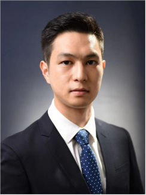

<!-- AUTO-GENERATED-BY: work/generate_obsidian_profiles.py -->

<!-- TEMPLATE: D:\workspace\信息收集整理\医生画像仓库\模板\医生画像模板.md -->

# 何磊

## 基础信息

| 字段 | 内容 |
|---|---|
| 姓名 | 何磊 |
| 医院 | 中山大学附属第三医院 |
| 科室 | 脊柱侧弯中心 |
| 职称/身份 | 副主任医师 导师资格 硕士生导师 |
| 来源链接 | [官网原文](https://www.zssy.com.cn/node/15479) |
| 采集日期 | 2026-08-10 |

## 简介/擅长

主攻脊柱畸形疾病及微创脊柱外科技术，擅长各类脊柱畸形（婴幼儿、青少年、成人及老年脊柱侧后凸畸形，强直性脊柱炎后凸等）的综合治疗，在脊柱侧弯筛诊治和脊柱常见病微创手术方面具有丰富经验。

## 可包装亮点

- 副主任医师 导师资格 硕士生导师 中山大学附属第三医院脊柱外科 / 脊柱侧弯中心 / 罕见病中心 / 副主任医师 ， 医学博士， 硕士生导师；
- 中山大学附属第三医院粤东医院脊柱微创中心 / 脊柱侧弯中心副主任 主持国家自然科学基金及省部级科研项目 10 项，以第一作者 / 通讯作者发表 SCI 和核心期刊论文 30 余篇，参编英文专著 1 本。
- 曾获广东省科技进步奖一等奖、广东省十大科普健康传播大使、广州市优秀科普专家等荣誉。

## 重点疾病/人群标签

- 慢性病：
- 肿瘤：
- 生殖疾病：
- 免疫/风湿：强直性脊柱炎、罕见
- 术后恢复/康复：
- 疑难重症：强直性脊柱炎、罕见

## 证据摘录

> 只摘录官网公开信息中的短句或关键字段，不复制大段原文。

- 官网身份字段：副主任医师 导师资格 硕士生导师
- 官网简介/擅长：主攻脊柱畸形疾病及微创脊柱外科技术，擅长各类脊柱畸形（婴幼儿、青少年、成人及老年脊柱侧后凸畸形，强直性脊柱炎后凸等）的综合治疗，在脊柱侧弯筛诊治和脊柱常见病微创手术方面具有丰富经验。
- 官网亮眼经历线索：副主任医师 导师资格 硕士生导师 中山大学附属第三医院脊柱外科 / 脊柱侧弯中心 / 罕见病中心 / 副主任医师 ， 医学博士， 硕士生导师； 中山大学附属第三医院粤东医院脊柱微创中心 / 脊柱侧弯中心副主任 主持国家自然科学基金及省部级科研项目 10 项，以第一作者 / 通讯作者发表 SCI 和核心期刊论文 30 余篇，参编英文专著 1 本。 曾获广东省科技进步奖一等奖、广东省十大科普健康传播大使、广州市优秀科普专家等荣誉。
- 来源链接：https://www.zssy.com.cn/node/15479

## BD 画像摘要

何磊医生可作为免疫/风湿/感染、疑难重症方向的基础画像候选。后续 BD 使用应继续以官网来源和人工复核为准，不添加疗效承诺或无来源包装。

## 合规边界

- 仅使用医院官网、官方公众号、官方小程序等公开渠道。
- 不采集私人电话、私人微信、家庭住址、患者隐私或非公开排班信息。
- 不写“保证治愈”“疗效第一”“包治疑难杂症”等无法由官网证明的表述。
