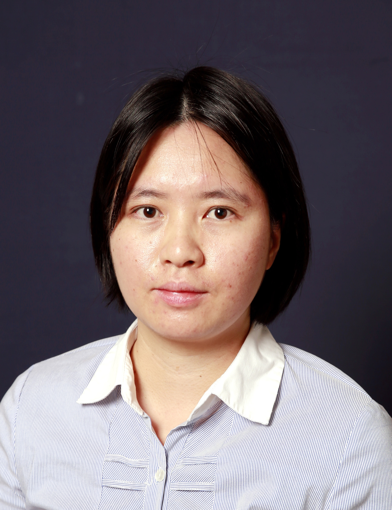

<!-- AUTO-GENERATED-BY: work/generate_obsidian_profiles.py -->

<!-- TEMPLATE: D:\workspace\信息收集整理\医生画像仓库\模板\医生画像模板.md -->

# 余青芬

## 基础信息

| 字段 | 内容 |
|---|---|
| 姓名 | 余青芬 |
| 医院 | 中山大学附属第三医院 |
| 科室 | 神经内科 |
| 职称/身份 | 副研究员 导师资格 硕士生导师 |
| 来源链接 | [官网原文](https://www.zssy.com.cn/node/11152) |
| 采集日期 | 2026-08-10 |

## 简介/擅长

生物物理数据计算。

## 可包装亮点

- 副研究员 导师资格 硕士生导师 副研究员，计算生物物理学和生物信息学中心主任，硕士生导师，中山大学“百人计划”青年学术骨干。
- 以第一作者/通讯作者（含共同）在Nano Lett., J Neurol. Neurosurg. Psychiatry, Nat. Commun., J Phys. Chem. B等学术期刊发表论文，主持国家自然科学基金青年项目。

## 重点疾病/人群标签

- 慢性病：
- 肿瘤：
- 生殖疾病：
- 免疫/风湿：
- 术后恢复/康复：
- 疑难重症：

## 证据摘录

> 只摘录官网公开信息中的短句或关键字段，不复制大段原文。

- 官网身份字段：副研究员 导师资格 硕士生导师
- 官网简介/擅长：生物物理数据计算。
- 官网亮眼经历线索：副研究员 导师资格 硕士生导师 副研究员，计算生物物理学和生物信息学中心主任，硕士生导师，中山大学“百人计划”青年学术骨干。 以第一作者/通讯作者（含共同）在Nano Lett., J Neurol. Neurosurg. Psychiatry, Nat. Commun., J Phys. Chem. B等学术期刊发表论文，主持国家自然科学基金青年项目。
- 来源链接：https://www.zssy.com.cn/node/11152

## BD 画像摘要

余青芬医生可作为中山大学附属第三医院神经内科的基础医生资料入库。当前重点方向以总底表标签为准，官网未展示的信息保持空白。

## 合规边界

- 仅使用医院官网、官方公众号、官方小程序等公开渠道。
- 不采集私人电话、私人微信、家庭住址、患者隐私或非公开排班信息。
- 不写“保证治愈”“疗效第一”“包治疑难杂症”等无法由官网证明的表述。
