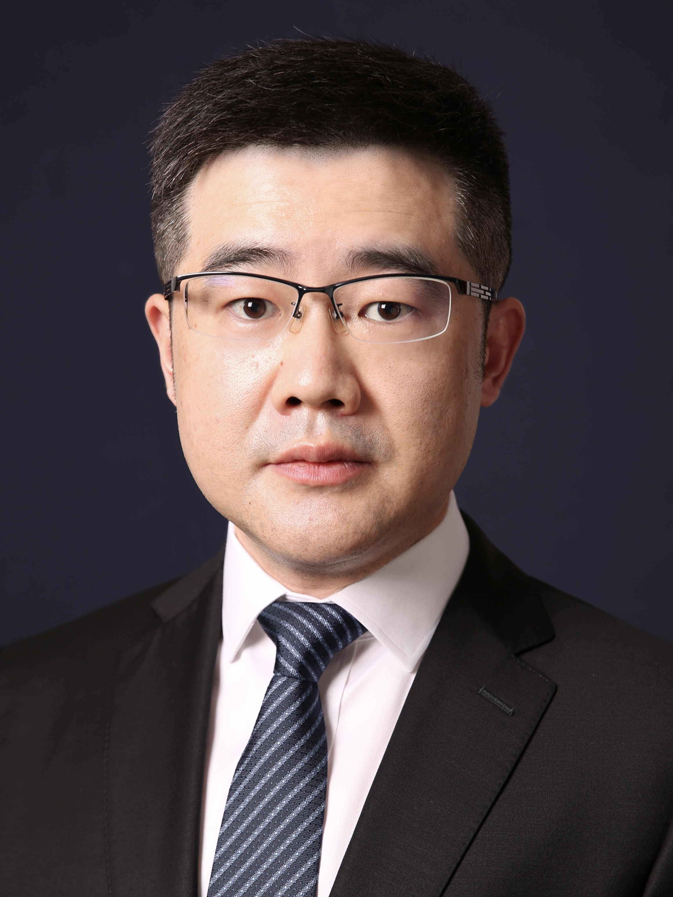

<!-- AUTO-GENERATED-BY: work/generate_obsidian_profiles.py -->

<!-- TEMPLATE: D:\workspace\信息收集整理\医生画像仓库\模板\医生画像模板.md -->

# 傅斌生

## 基础信息

| 字段 | 内容 |
|---|---|
| 姓名 | 傅斌生 |
| 医院 | 中山大学附属第三医院 |
| 科室 | 肝脏外科暨肝移植中心 |
| 职称/身份 | 主任医师 导师资格 博士生导师 |
| 来源链接 | [官网原文](https://www.zssy.com.cn/node/11132) |
| 采集日期 | 2026-08-10 |

## 简介/擅长

肝胆胰外科及肝移植专家。擅长肝胆胰良恶性肿瘤、肝内外胆管结石、肝硬化门静脉高压症等肝胆胰外科疾病的诊治以及肝脏移植围手术期处理、受者随访管理。尤其在成人和儿童肝脏移植手术，包括活体肝移植、劈离式肝移植、腹腔镜辅助微创肝移植、再次肝移植等复杂和困难肝脏移植术式等方面具有丰富的临床经验。

## 可包装亮点

- 主任医师 导师资格 博士生导师 傅斌生，主任医师，医学博士，博士生导师。
- 主要从事肝脏移植和肝胆胰外科的临床、科研和教学工作，美国匹兹堡大学医学中心Starzl器官移植研究所和匹兹堡儿童医院访问学者。
- 现任中华医学会器官移植学分会青年学组委员、中华医学会器官移植学分会器官获取与评估学组委员、中国医师协会外科医师分会青年医师专家工作组副组长、中国医师协会外科医师分会器官移植围手术期管理专家工作组专家委员、中国医师协会外科医师分会胆道外科专家工作组专家委员、中国医师协会外科医师分会门静脉高压症专家工作组专家委员、中国医师协会儿童重症医师分会器官移植学组专家委…

## 重点疾病/人群标签

- 慢性病：
- 肿瘤：肿瘤、免疫、重症、复杂
- 生殖疾病：
- 免疫/风湿：肿瘤、免疫、重症、复杂
- 术后恢复/康复：
- 疑难重症：肿瘤、免疫、重症、复杂

## 证据摘录

> 只摘录官网公开信息中的短句或关键字段，不复制大段原文。

- 官网身份字段：主任医师 导师资格 博士生导师
- 官网简介/擅长：肝胆胰外科及肝移植专家。擅长肝胆胰良恶性肿瘤、肝内外胆管结石、肝硬化门静脉高压症等肝胆胰外科疾病的诊治以及肝脏移植围手术期处理、受者随访管理。尤其在成人和儿童肝脏移植手术，包括活体肝移植、劈离式肝移植、腹腔镜辅助微创肝移植、再次肝移植等复杂和困难肝脏移植术式等方面具有丰富的临床经验。
- 官网亮眼经历线索：主任医师 导师资格 博士生导师 傅斌生，主任医师，医学博士，博士生导师。 主要从事肝脏移植和肝胆胰外科的临床、科研和教学工作，美国匹兹堡大学医学中心Starzl器官移植研究所和匹兹堡儿童医院访问学者。 现任中华医学会器官移植学分会青年学组委员、中华医学会器官移植学分会器官获取与评估学组委员、中国医师协会外科医师分会青年医师专家工作组副组长、中国医师协会外科医师分会器官移植围手术期管理专家工作组专家委员、中国医师协会外科医师分会胆道外科…
- 来源链接：https://www.zssy.com.cn/node/11132

## BD 画像摘要

傅斌生医生可作为肿瘤、免疫/风湿/感染、疑难重症方向的基础画像候选。后续 BD 使用应继续以官网来源和人工复核为准，不添加疗效承诺或无来源包装。

## 合规边界

- 仅使用医院官网、官方公众号、官方小程序等公开渠道。
- 不采集私人电话、私人微信、家庭住址、患者隐私或非公开排班信息。
- 不写“保证治愈”“疗效第一”“包治疑难杂症”等无法由官网证明的表述。
