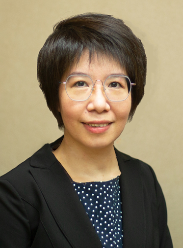

<!-- AUTO-GENERATED-BY: work/generate_obsidian_profiles.py -->

<!-- TEMPLATE: D:\workspace\信息收集整理\医生画像仓库\模板\医生画像模板.md -->

# 冯佩英

## 基础信息

| 字段 | 内容 |
|---|---|
| 姓名 | 冯佩英 |
| 医院 | 中山大学附属第三医院 |
| 科室 | 变态反应（过敏）学科 |
| 职称/身份 | 主任医师 导师资格 博士生导师 |
| 来源链接 | [官网原文](https://www.zssy.com.cn/node/15300) |
| 采集日期 | 2026-08-10 |

## 简介/擅长

诊治各种感染性皮肤病和过敏性皮肤病，尤其是头癣、手足癣、体股癣、灰指甲、特应性皮炎、食物过敏、湿疹皮炎、脱发和皮肤感染性肉芽肿。

## 可包装亮点

- 主任医师 导师资格 博士生导师 主任医师，医学博士，博士生导师，从事临床医学、教学和科研工作20多年，多次赴荷兰皇家科学院真菌生物多样性研究中心访学，主要研究方向是真菌生物多样性与临床、微生物与皮肤变态反应性疾病相关研究。
- 中国菌物学会医学真菌专业委员会委员兼秘书，世界华人医师协会皮肤科医师协会委员，广东省中华医学会皮肤分会真菌组副组长，国际ISHAM着色芽生菌病组通讯员/秘书。

## 重点疾病/人群标签

- 慢性病：
- 肿瘤：
- 生殖疾病：
- 免疫/风湿：感染
- 术后恢复/康复：
- 疑难重症：

## 证据摘录

> 只摘录官网公开信息中的短句或关键字段，不复制大段原文。

- 官网身份字段：主任医师 导师资格 博士生导师
- 官网简介/擅长：诊治各种感染性皮肤病和过敏性皮肤病，尤其是头癣、手足癣、体股癣、灰指甲、特应性皮炎、食物过敏、湿疹皮炎、脱发和皮肤感染性肉芽肿。
- 官网亮眼经历线索：主任医师 导师资格 博士生导师 主任医师，医学博士，博士生导师，从事临床医学、教学和科研工作20多年，多次赴荷兰皇家科学院真菌生物多样性研究中心访学，主要研究方向是真菌生物多样性与临床、微生物与皮肤变态反应性疾病相关研究。 中国菌物学会医学真菌专业委员会委员兼秘书，世界华人医师协会皮肤科医师协会委员，广东省中华医学会皮肤分会真菌组副组长，国际ISHAM着色芽生菌病组通讯员/秘书。
- 来源链接：https://www.zssy.com.cn/node/15300

## BD 画像摘要

冯佩英医生可作为免疫/风湿/感染方向的基础画像候选。后续 BD 使用应继续以官网来源和人工复核为准，不添加疗效承诺或无来源包装。

## 合规边界

- 仅使用医院官网、官方公众号、官方小程序等公开渠道。
- 不采集私人电话、私人微信、家庭住址、患者隐私或非公开排班信息。
- 不写“保证治愈”“疗效第一”“包治疑难杂症”等无法由官网证明的表述。
