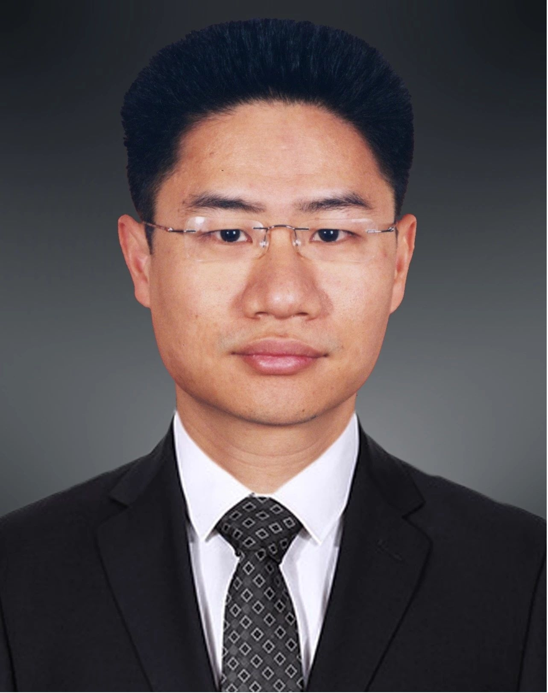

<!-- AUTO-GENERATED-BY: work/generate_obsidian_profiles.py -->

<!-- TEMPLATE: D:\workspace\信息收集整理\医生画像仓库\模板\医生画像模板.md -->

# 凌云彪

## 基础信息

| 字段 | 内容 |
|---|---|
| 姓名 | 凌云彪 |
| 医院 | 中山大学附属第三医院 |
| 科室 | 肝胆外科 |
| 职称/身份 | 主任医师 导师资格 硕士生导师 |
| 来源链接 | [官网原文](https://www.zssy.com.cn/node/14119) |
| 采集日期 | 2026-08-10 |

## 简介/擅长

擅长于肝癌、肝脏良/恶性肿瘤、胆囊结石及肝内外胆管结石、胆囊息肉、胆总管囊肿、胆囊癌、胆管癌、胰腺癌、胰腺良/恶性肿瘤、胰腺炎、十二指肠良/恶性肿瘤、梗阻性黄疸、肝硬化门静脉高压症、消化道出血、脾肿大与脾亢、脾脏肿瘤等疾病的诊断和手术治疗。尤其在肝胆胰脾外科疑难危重疾病的诊治以及其复杂外科手术、腹腔镜微创外科技术、肝癌的微创治疗及其规范化综合诊治、腹腔镜肝癌切除及精准肝癌切除、门脉高压症的外科治疗、复杂肝胆道结石的微创手术等方面，积累有丰富的临床经验。

## 可包装亮点

- 主任医师 导师资格 硕士生导师 尤其在肝胆胰脾外科疑难危重疾病的诊治以及其复杂外科手术、腹腔镜微创外科技术、肝癌的微创治疗及其规范化综合诊治、腹腔镜肝癌切除及精准肝癌切除、门脉高压症的外科治疗、复杂肝胆道结石的微创手术等方面，积累有丰富的临床经验。
- 主任医师，医学博士，研究生导师。
- 毕业于中山医科大学，一直在其附属医院从事临床医疗工作30年，期间多次赴国外进修学习多种先进的临床诊疗技术。

## 重点疾病/人群标签

- 慢性病：
- 肿瘤：肿瘤、癌、肝癌、疑难、危重、复杂、多学科
- 生殖疾病：
- 免疫/风湿：
- 术后恢复/康复：
- 疑难重症：肿瘤、癌、肝癌、疑难、危重、复杂、多学科

## 证据摘录

> 只摘录官网公开信息中的短句或关键字段，不复制大段原文。

- 官网身份字段：主任医师 导师资格 硕士生导师
- 官网简介/擅长：擅长于肝癌、肝脏良/恶性肿瘤、胆囊结石及肝内外胆管结石、胆囊息肉、胆总管囊肿、胆囊癌、胆管癌、胰腺癌、胰腺良/恶性肿瘤、胰腺炎、十二指肠良/恶性肿瘤、梗阻性黄疸、肝硬化门静脉高压症、消化道出血、脾肿大与脾亢、脾脏肿瘤等疾病的诊断和手术治疗。尤其在肝胆胰脾外科疑难危重疾病的诊治以及其复杂外科手术、腹腔镜微创外科技术、肝癌的微创治疗及其规范化综合诊治、腹腔镜肝癌切除及精准肝癌切除、门脉高压症的外科治疗、复杂肝胆道结石的微创手术等方面，积累…
- 官网亮眼经历线索：主任医师 导师资格 硕士生导师 尤其在肝胆胰脾外科疑难危重疾病的诊治以及其复杂外科手术、腹腔镜微创外科技术、肝癌的微创治疗及其规范化综合诊治、腹腔镜肝癌切除及精准肝癌切除、门脉高压症的外科治疗、复杂肝胆道结石的微创手术等方面，积累有丰富的临床经验。 主任医师，医学博士，研究生导师。 毕业于中山医科大学，一直在其附属医院从事临床医疗工作30年，期间多次赴国外进修学习多种先进的临床诊疗技术。
- 来源链接：https://www.zssy.com.cn/node/14119

## BD 画像摘要

凌云彪医生可作为肿瘤、疑难重症方向的基础画像候选。后续 BD 使用应继续以官网来源和人工复核为准，不添加疗效承诺或无来源包装。

## 合规边界

- 仅使用医院官网、官方公众号、官方小程序等公开渠道。
- 不采集私人电话、私人微信、家庭住址、患者隐私或非公开排班信息。
- 不写“保证治愈”“疗效第一”“包治疑难杂症”等无法由官网证明的表述。
