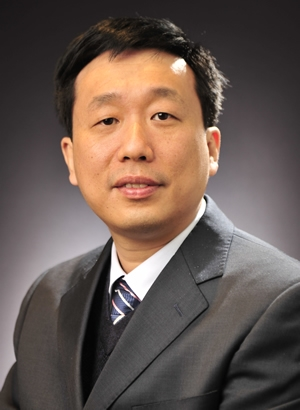

<!-- AUTO-GENERATED-BY: work/generate_obsidian_profiles.py -->

<!-- TEMPLATE: D:\workspace\信息收集整理\医生画像仓库\模板\医生画像模板.md -->

# 凌士奇

## 基础信息

| 字段 | 内容 |
|---|---|
| 姓名 | 凌士奇 |
| 医院 | 中山大学附属第三医院 |
| 科室 | 眼科 |
| 职称/身份 | 主任医师 |
| 来源链接 | [官网原文](https://www.zssy.com.cn/node/11079) |
| 采集日期 | 2026-08-10 |

## 简介/擅长

儿童眼病的治疗及手术；斜视、弱视、近视的治疗及手术；眼表疾病（角膜炎、结膜炎、翼状胬肉、泪道病）的诊治，擅长角膜移植术、羊膜移植术、角膜缘干细胞移植术。

## 可包装亮点

- 主任医师 眼科学博士、博士后、广州市卫生局局管人才、美国南卡纳罗纳大学访问学者。
- 目前以第一负责人主持国家级基金项目3项、省级基金2项，以第一作者发表SCI论文6篇。

## 重点疾病/人群标签

- 慢性病：
- 肿瘤：
- 生殖疾病：
- 免疫/风湿：
- 术后恢复/康复：
- 疑难重症：

## 证据摘录

> 只摘录官网公开信息中的短句或关键字段，不复制大段原文。

- 官网身份字段：主任医师
- 官网简介/擅长：儿童眼病的治疗及手术；斜视、弱视、近视的治疗及手术；眼表疾病（角膜炎、结膜炎、翼状胬肉、泪道病）的诊治，擅长角膜移植术、羊膜移植术、角膜缘干细胞移植术。
- 官网亮眼经历线索：主任医师 眼科学博士、博士后、广州市卫生局局管人才、美国南卡纳罗纳大学访问学者。 目前以第一负责人主持国家级基金项目3项、省级基金2项，以第一作者发表SCI论文6篇。
- 来源链接：https://www.zssy.com.cn/node/11079

## BD 画像摘要

凌士奇医生可作为中山大学附属第三医院眼科的基础医生资料入库。当前重点方向以总底表标签为准，官网未展示的信息保持空白。

## 合规边界

- 仅使用医院官网、官方公众号、官方小程序等公开渠道。
- 不采集私人电话、私人微信、家庭住址、患者隐私或非公开排班信息。
- 不写“保证治愈”“疗效第一”“包治疑难杂症”等无法由官网证明的表述。
