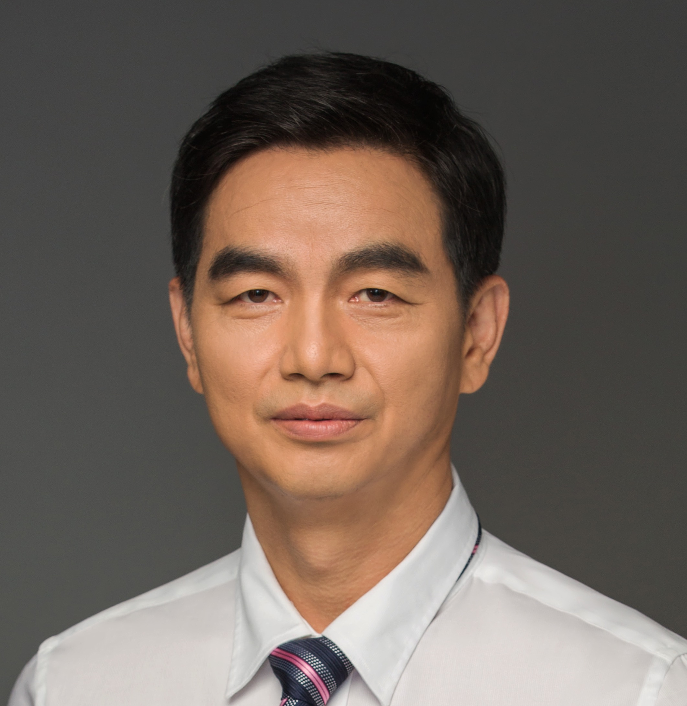

<!-- AUTO-GENERATED-BY: work/generate_obsidian_profiles.py -->

<!-- TEMPLATE: D:\workspace\信息收集整理\医生画像仓库\模板\医生画像模板.md -->

# 刁惠波

## 基础信息

| 字段 | 内容 |
|---|---|
| 姓名 | 刁惠波 |
| 医院 | 中山大学附属第三医院 |
| 科室 | 口腔科 |
| 职称/身份 | 副主任医师 |
| 来源链接 | [官网原文](https://www.zssy.com.cn/node/14217) |
| 采集日期 | 2026-08-10 |

## 简介/擅长

种植义齿修复，牙体缺损修复，固定义齿修复（金瓷冠、全瓷冠），活动义齿修复，全口义齿修复，前牙美容修复

## 可包装亮点

- 副主任医师 副主任医师，硕士生导师，中华医学会广东分会口腔修复专业委员会常委。
- 近年来在国内专业杂志上发表论文10多篇。

## 重点疾病/人群标签

- 慢性病：
- 肿瘤：
- 生殖疾病：
- 免疫/风湿：
- 术后恢复/康复：
- 疑难重症：

## 证据摘录

> 只摘录官网公开信息中的短句或关键字段，不复制大段原文。

- 官网身份字段：副主任医师
- 官网简介/擅长：种植义齿修复，牙体缺损修复，固定义齿修复（金瓷冠、全瓷冠），活动义齿修复，全口义齿修复，前牙美容修复
- 官网亮眼经历线索：副主任医师 副主任医师，硕士生导师，中华医学会广东分会口腔修复专业委员会常委。 近年来在国内专业杂志上发表论文10多篇。
- 来源链接：https://www.zssy.com.cn/node/14217

## BD 画像摘要

刁惠波医生可作为中山大学附属第三医院口腔科的基础医生资料入库。当前重点方向以总底表标签为准，官网未展示的信息保持空白。

## 合规边界

- 仅使用医院官网、官方公众号、官方小程序等公开渠道。
- 不采集私人电话、私人微信、家庭住址、患者隐私或非公开排班信息。
- 不写“保证治愈”“疗效第一”“包治疑难杂症”等无法由官网证明的表述。
