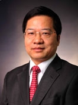

<!-- AUTO-GENERATED-BY: work/generate_obsidian_profiles.py -->

<!-- TEMPLATE: D:\workspace\信息收集整理\医生画像仓库\模板\医生画像模板.md -->

# 刘仁斌

## 基础信息

| 字段 | 内容 |
|---|---|
| 姓名 | 刘仁斌 |
| 医院 | 中山大学附属第三医院 |
| 科室 | 甲状腺、乳腺外科 |
| 职称/身份 | 主任医师 导师资格 博士生导师 |
| 来源链接 | [官网原文](https://www.zssy.com.cn/node/14184) |
| 采集日期 | 2026-08-10 |

## 简介/擅长

各期乳腺癌的手术、化疗、内分泌治疗及靶向治疗有较高的造诣，对甲状腺良恶性疾病诊治，特别在甲状腺手术及术中甲状旁腺、喉返神经保护特有专长。

## 可包装亮点

- 主任医师 导师资格 博士生导师 教授、主任医师、博士生导师，甲状腺乳腺外科主任及乳腺疾病诊治中心主任，学科带头人。
- 1999年赴香港大学玛丽医院外科临床进修，曾于美国哈佛大学附属麻省总医院从事博士后研究及临床进修4年余，师从哈佛大学麻省总医院乳腺癌症中心主任Barbara L. Smith教授、Samuel D. Rabkin及著名甲状腺外科专家Gregory W. Randolph教授。
- 先后多次被评为中山大学优秀教师及先进医务工作者，曾被评为中山大学校级优秀共产党员及中山三院优秀共产党员，2015年被评为“羊城好医生”。

## 重点疾病/人群标签

- 慢性病：
- 肿瘤：化疗、靶向、乳腺癌
- 生殖疾病：
- 免疫/风湿：
- 术后恢复/康复：
- 疑难重症：

## 证据摘录

> 只摘录官网公开信息中的短句或关键字段，不复制大段原文。

- 官网身份字段：主任医师 导师资格 博士生导师
- 官网简介/擅长：各期乳腺癌的手术、化疗、内分泌治疗及靶向治疗有较高的造诣，对甲状腺良恶性疾病诊治，特别在甲状腺手术及术中甲状旁腺、喉返神经保护特有专长。
- 官网亮眼经历线索：主任医师 导师资格 博士生导师 教授、主任医师、博士生导师，甲状腺乳腺外科主任及乳腺疾病诊治中心主任，学科带头人。 1999年赴香港大学玛丽医院外科临床进修，曾于美国哈佛大学附属麻省总医院从事博士后研究及临床进修4年余，师从哈佛大学麻省总医院乳腺癌症中心主任Barbara L. Smith教授、Samuel D. Rabkin及著名甲状腺外科专家Gregory W. Randolph教授。 先后多次被评为中山大学优秀教师及先进医务工作…
- 来源链接：https://www.zssy.com.cn/node/14184

## BD 画像摘要

刘仁斌医生可作为肿瘤方向的基础画像候选。后续 BD 使用应继续以官网来源和人工复核为准，不添加疗效承诺或无来源包装。

## 合规边界

- 仅使用医院官网、官方公众号、官方小程序等公开渠道。
- 不采集私人电话、私人微信、家庭住址、患者隐私或非公开排班信息。
- 不写“保证治愈”“疗效第一”“包治疑难杂症”等无法由官网证明的表述。
