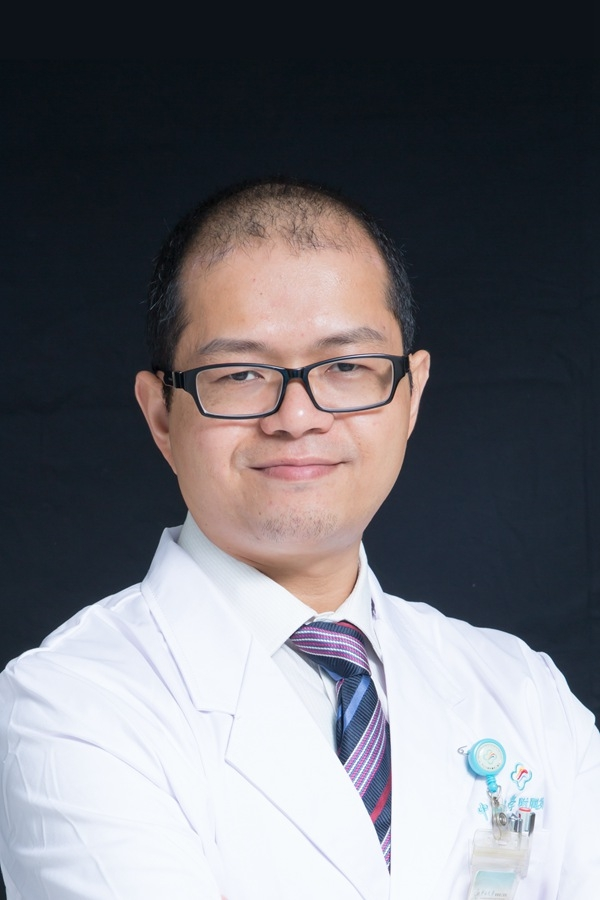

<!-- AUTO-GENERATED-BY: work/generate_obsidian_profiles.py -->

<!-- TEMPLATE: D:\workspace\信息收集整理\医生画像仓库\模板\医生画像模板.md -->

# 刘健培

## 基础信息

| 字段 | 内容 |
|---|---|
| 姓名 | 刘健培 |
| 医院 | 中山大学附属第三医院 |
| 科室 | 胃肠外科 |
| 职称/身份 | 副主任医师 导师资格 硕士生导师 |
| 来源链接 | [官网原文](https://www.zssy.com.cn/node/14165) |
| 采集日期 | 2026-08-10 |

## 简介/擅长

从事胃肠外科临床工作18年，对胃癌、结直肠癌、胃肠间质瘤、痔疮和疝的诊治有丰富临床经验。擅长胃肠、肛肠良恶性疾病微创手术治疗，包括胃肠恶性肿瘤腹腔镜根治手术、结直肠息肉双镜联合切除手术、经自然腔道取标本胃肠肿瘤微创手术（NOSES）。提倡加速康复外科理念和术后胃肠功能保护。

## 可包装亮点

- 副主任医师 导师资格 硕士生导师 2003年本科毕业于中山大学医学院临床医学系，2010年获得中山大学外科学博士学位，2015年晋升副主任医师，2017年获得硕士研究生导师资格。

## 重点疾病/人群标签

- 慢性病：
- 肿瘤：肿瘤、瘤、胃癌、肠癌、术后、康复
- 生殖疾病：
- 免疫/风湿：
- 术后恢复/康复：肿瘤、瘤、胃癌、肠癌、术后、康复
- 疑难重症：

## 证据摘录

> 只摘录官网公开信息中的短句或关键字段，不复制大段原文。

- 官网身份字段：副主任医师 导师资格 硕士生导师
- 官网简介/擅长：从事胃肠外科临床工作18年，对胃癌、结直肠癌、胃肠间质瘤、痔疮和疝的诊治有丰富临床经验。擅长胃肠、肛肠良恶性疾病微创手术治疗，包括胃肠恶性肿瘤腹腔镜根治手术、结直肠息肉双镜联合切除手术、经自然腔道取标本胃肠肿瘤微创手术（NOSES）。提倡加速康复外科理念和术后胃肠功能保护。
- 官网亮眼经历线索：副主任医师 导师资格 硕士生导师 2003年本科毕业于中山大学医学院临床医学系，2010年获得中山大学外科学博士学位，2015年晋升副主任医师，2017年获得硕士研究生导师资格。
- 来源链接：https://www.zssy.com.cn/node/14165

## BD 画像摘要

刘健培医生可作为肿瘤、术后恢复/康复方向的基础画像候选。后续 BD 使用应继续以官网来源和人工复核为准，不添加疗效承诺或无来源包装。

## 合规边界

- 仅使用医院官网、官方公众号、官方小程序等公开渠道。
- 不采集私人电话、私人微信、家庭住址、患者隐私或非公开排班信息。
- 不写“保证治愈”“疗效第一”“包治疑难杂症”等无法由官网证明的表述。
