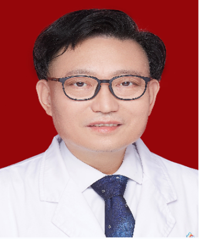

<!-- AUTO-GENERATED-BY: work/generate_obsidian_profiles.py -->

<!-- TEMPLATE: D:\workspace\信息收集整理\医生画像仓库\模板\医生画像模板.md -->

# 刘加军

## 基础信息

| 字段 | 内容 |
|---|---|
| 姓名 | 刘加军 |
| 医院 | 中山大学附属第三医院 |
| 科室 | 血液内科 |
| 职称/身份 | 主任医师 导师资格 博士生导师 |
| 来源链接 | [官网原文](https://www.zssy.com.cn/node/14198) |
| 采集日期 | 2026-08-10 |

## 简介/擅长

从事内科血液学临床医疗工作30多年。对各种贫血、出血性疾病及复发难治性血液肿瘤有熟练的诊治能力。诊疗疾病包括血液病造血干细胞移植、白血病化疗、恶性淋巴瘤和多发性骨髓瘤等恶性血液疾病的个体化治疗方案选择、各种原因不明的贫血、不明原因的长期发热以及淋巴结肿大的鉴别诊断和治疗等。

## 可包装亮点

- 主任医师 导师资格 博士生导师 血液内科科主任，教授、主任医师，博士研究生导师，从事内科血液学临床医疗工作30多年。
- 2006 年被评为教育部“新世纪优秀人才”，2008 -2009年被评为教育部科技论文在线优秀评审专家。
- 是中山大学“千百十人才工程”培养对 象，2011年荣获广东省科技进步三等奖。

## 重点疾病/人群标签

- 慢性病：
- 肿瘤：肿瘤、瘤、淋巴瘤、白血病、化疗、靶向、难治
- 生殖疾病：
- 免疫/风湿：
- 术后恢复/康复：
- 疑难重症：肿瘤、瘤、淋巴瘤、白血病、化疗、靶向、难治

## 证据摘录

> 只摘录官网公开信息中的短句或关键字段，不复制大段原文。

- 官网身份字段：主任医师 导师资格 博士生导师
- 官网简介/擅长：从事内科血液学临床医疗工作30多年。对各种贫血、出血性疾病及复发难治性血液肿瘤有熟练的诊治能力。诊疗疾病包括血液病造血干细胞移植、白血病化疗、恶性淋巴瘤和多发性骨髓瘤等恶性血液疾病的个体化治疗方案选择、各种原因不明的贫血、不明原因的长期发热以及淋巴结肿大的鉴别诊断和治疗等。
- 官网亮眼经历线索：主任医师 导师资格 博士生导师 血液内科科主任，教授、主任医师，博士研究生导师，从事内科血液学临床医疗工作30多年。 2006 年被评为教育部“新世纪优秀人才”，2008 -2009年被评为教育部科技论文在线优秀评审专家。 是中山大学“千百十人才工程”培养对 象，2011年荣获广东省科技进步三等奖。
- 来源链接：https://www.zssy.com.cn/node/14198

## BD 画像摘要

刘加军医生可作为肿瘤、疑难重症方向的基础画像候选。后续 BD 使用应继续以官网来源和人工复核为准，不添加疗效承诺或无来源包装。

## 合规边界

- 仅使用医院官网、官方公众号、官方小程序等公开渠道。
- 不采集私人电话、私人微信、家庭住址、患者隐私或非公开排班信息。
- 不写“保证治愈”“疗效第一”“包治疑难杂症”等无法由官网证明的表述。
