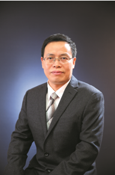

<!-- AUTO-GENERATED-BY: work/generate_obsidian_profiles.py -->

<!-- TEMPLATE: D:\workspace\信息收集整理\医生画像仓库\模板\医生画像模板.md -->

# 刘小彭

## 基础信息

| 字段 | 内容 |
|---|---|
| 姓名 | 刘小彭 |
| 医院 | 中山大学附属第三医院 |
| 科室 | 泌尿外科 |
| 职称/身份 | 主任医师 导师资格 硕士生导师 |
| 来源链接 | [官网原文](https://www.zssy.com.cn/node/14244) |
| 采集日期 | 2026-08-10 |

## 简介/擅长

擅长泌尿外科各种常见及疑难疾病的诊断和机器人辅助 和腔镜下 微创手术治疗。在前列腺增癌、膀胱癌和肾癌等 恶性 肿瘤、前列腺增生剜除术 及男 女性尿失禁等的微创手术治疗方面具有丰富的经验。 负责泌尿肿瘤 MDT ， 致力于前列腺癌的综合治疗包括机器人辅助腹腔镜微创手术、 MDT 、全程管理及一体化诊疗和前列腺增生的个体化微创治疗、尿控及性功能康复。

## 可包装亮点

- 主任医师 导师资格 硕士生导师 擅长泌尿外科各种常见及疑难疾病的诊断和机器人辅助 和腔镜下 微创手术治疗。
- 负责泌尿肿瘤 MDT ， 致力于前列腺癌的综合治疗包括机器人辅助腹腔镜微创手术、 MDT 、全程管理及一体化诊疗和前列腺增生的个体化微创治疗、尿控及性功能康复。
- 主任医师，博士生导师 ，学术任职包括 广东省医学会泌尿外科分会尿控学组和前列腺学组委员 ， 广东省医师协会泌尿外科分会委员 ， 中华腔镜泌尿外科学杂志 （电子版） 编委、总编助理 ， 中国医促会泌尿健康促进分会委员 ， 中国医促会泌尿生殖分会 (GUA-CPAM) 委员 ， 海峡两岸医药卫生交流协会泌尿外科专委会激光学组委员 ， 广东省泌尿生殖协会盆底分会…

## 重点疾病/人群标签

- 慢性病：
- 肿瘤：肿瘤、癌、生殖、康复、疑难、MDT
- 生殖疾病：肿瘤、癌、生殖、康复、疑难、MDT
- 免疫/风湿：
- 术后恢复/康复：肿瘤、癌、生殖、康复、疑难、MDT
- 疑难重症：肿瘤、癌、生殖、康复、疑难、MDT

## 证据摘录

> 只摘录官网公开信息中的短句或关键字段，不复制大段原文。

- 官网身份字段：主任医师 导师资格 硕士生导师
- 官网简介/擅长：擅长泌尿外科各种常见及疑难疾病的诊断和机器人辅助 和腔镜下 微创手术治疗。在前列腺增癌、膀胱癌和肾癌等 恶性 肿瘤、前列腺增生剜除术 及男 女性尿失禁等的微创手术治疗方面具有丰富的经验。 负责泌尿肿瘤 MDT ， 致力于前列腺癌的综合治疗包括机器人辅助腹腔镜微创手术、 MDT 、全程管理及一体化诊疗和前列腺增生的个体化微创治疗、尿控及性功能康复。
- 官网亮眼经历线索：主任医师 导师资格 硕士生导师 擅长泌尿外科各种常见及疑难疾病的诊断和机器人辅助 和腔镜下 微创手术治疗。 负责泌尿肿瘤 MDT ， 致力于前列腺癌的综合治疗包括机器人辅助腹腔镜微创手术、 MDT 、全程管理及一体化诊疗和前列腺增生的个体化微创治疗、尿控及性功能康复。 主任医师，博士生导师 ，学术任职包括 广东省医学会泌尿外科分会尿控学组和前列腺学组委员 ， 广东省医师协会泌尿外科分会委员 ， 中华腔镜泌尿外科学杂志 （电子版） 编委…
- 来源链接：https://www.zssy.com.cn/node/14244

## BD 画像摘要

刘小彭医生可作为肿瘤、生殖疾病、术后恢复/康复、疑难重症方向的基础画像候选。后续 BD 使用应继续以官网来源和人工复核为准，不添加疗效承诺或无来源包装。

## 合规边界

- 仅使用医院官网、官方公众号、官方小程序等公开渠道。
- 不采集私人电话、私人微信、家庭住址、患者隐私或非公开排班信息。
- 不写“保证治愈”“疗效第一”“包治疑难杂症”等无法由官网证明的表述。
