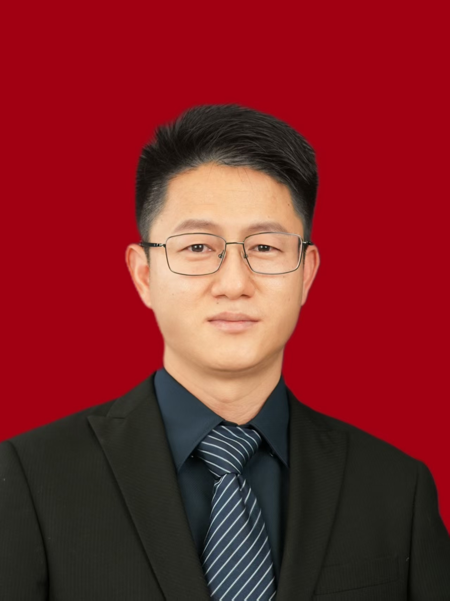

<!-- AUTO-GENERATED-BY: work/generate_obsidian_profiles.py -->

<!-- TEMPLATE: D:\workspace\信息收集整理\医生画像仓库\模板\医生画像模板.md -->

# 刘立宝

## 基础信息

| 字段 | 内容 |
|---|---|
| 姓名 | 刘立宝 |
| 医院 | 中山大学附属第三医院 |
| 科室 | 心胸外科 |
| 职称/身份 | 副主任医师 导师资格 硕士生导师 |
| 来源链接 | [官网原文](https://www.zssy.com.cn/node/15259) |
| 采集日期 | 2026-08-10 |

## 简介/擅长

从事心胸外科工作20余年，擅长胸外科各种疾病诊治，尤其是肺结节及多发肺结节、肺癌、食管癌、气胸、肺大疱、手汗症、胸腺瘤及胸膜肿瘤等外科治疗有丰富经验。能熟练完成各种微创手术，包括胸腔镜下肺部分切除、肺叶切除、肺癌根治、支气管袖状切除及肺动脉成形、肺段切除，纵膈肿物切除及胸腹腔镜联合食管癌根治术等等微创手术，精通围术期快速康复对患者全程管理。

## 可包装亮点

- 副主任医师 导师资格 硕士生导师 胸外科专家 毕业于中山大学外科学 副主任医师 硕士研究生导师 广州市医学会胸心外科学会常委 广东省基层医药学会胸部肿瘤学会委员 广东省临床医学会食管肿瘤专业委员会委员

## 重点疾病/人群标签

- 慢性病：
- 肿瘤：肿瘤、癌、瘤、肺癌、康复
- 生殖疾病：
- 免疫/风湿：
- 术后恢复/康复：肿瘤、癌、瘤、肺癌、康复
- 疑难重症：

## 证据摘录

> 只摘录官网公开信息中的短句或关键字段，不复制大段原文。

- 官网身份字段：副主任医师 导师资格 硕士生导师
- 官网简介/擅长：从事心胸外科工作20余年，擅长胸外科各种疾病诊治，尤其是肺结节及多发肺结节、肺癌、食管癌、气胸、肺大疱、手汗症、胸腺瘤及胸膜肿瘤等外科治疗有丰富经验。能熟练完成各种微创手术，包括胸腔镜下肺部分切除、肺叶切除、肺癌根治、支气管袖状切除及肺动脉成形、肺段切除，纵膈肿物切除及胸腹腔镜联合食管癌根治术等等微创手术，精通围术期快速康复对患者全程管理。
- 官网亮眼经历线索：副主任医师 导师资格 硕士生导师 胸外科专家 毕业于中山大学外科学 副主任医师 硕士研究生导师 广州市医学会胸心外科学会常委 广东省基层医药学会胸部肿瘤学会委员 广东省临床医学会食管肿瘤专业委员会委员
- 来源链接：https://www.zssy.com.cn/node/15259

## BD 画像摘要

刘立宝医生可作为肿瘤、术后恢复/康复方向的基础画像候选。后续 BD 使用应继续以官网来源和人工复核为准，不添加疗效承诺或无来源包装。

## 合规边界

- 仅使用医院官网、官方公众号、官方小程序等公开渠道。
- 不采集私人电话、私人微信、家庭住址、患者隐私或非公开排班信息。
- 不写“保证治愈”“疗效第一”“包治疑难杂症”等无法由官网证明的表述。
