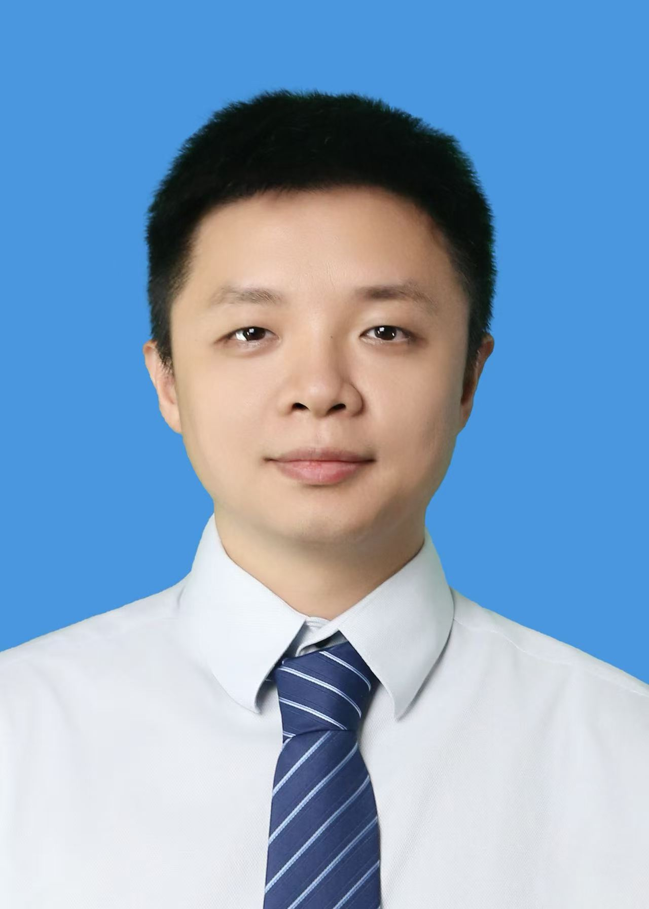

<!-- AUTO-GENERATED-BY: work/generate_obsidian_profiles.py -->

<!-- TEMPLATE: D:\workspace\信息收集整理\医生画像仓库\模板\医生画像模板.md -->

# 卢逸

## 基础信息

| 字段 | 内容 |
|---|---|
| 姓名 | 卢逸 |
| 医院 | 中山大学附属第三医院 |
| 科室 | 肝胆外科 |
| 职称/身份 | 副主任医生 导师资格 硕士生导师 |
| 来源链接 | [官网原文](https://www.zssy.com.cn/node/30110) |
| 采集日期 | 2026-08-10 |

## 简介/擅长

擅长于肝胆、胰腺、脾脏外科疾病的诊断和治疗，包括胆石症、肝硬化门静脉高压症、肝胆胰脾良恶性肿瘤等的规范化治疗。

## 可包装亮点

- 副主任医生 导师资格 硕士生导师 肝胆外科专家，医学博士、副主任医师，硕士生导师，从事肝胆胰脾外科临床工作10余年。
- 社会任职： * 广东省肝脏病学会综合治疗专委会 常务委员 * 广东省研究型医院学会肝胆胰外科专业委员会 常务委员 * 广东省基层医药学会转移性肝癌专业委员会 常务委员 * 中国妇幼保健协会遗传代谢病和维生素代谢专委会 常务委员 * 广州市白云区政协大健康工作室顾问 * 2021年荣获西藏昌都市优秀援藏人才 * 广州市健康科普专家（肿瘤…

## 重点疾病/人群标签

- 慢性病：代谢、肿瘤、肝癌
- 肿瘤：代谢、肿瘤、肝癌
- 生殖疾病：
- 免疫/风湿：
- 术后恢复/康复：
- 疑难重症：

## 证据摘录

> 只摘录官网公开信息中的短句或关键字段，不复制大段原文。

- 官网身份字段：副主任医生 导师资格 硕士生导师
- 官网简介/擅长：擅长于肝胆、胰腺、脾脏外科疾病的诊断和治疗，包括胆石症、肝硬化门静脉高压症、肝胆胰脾良恶性肿瘤等的规范化治疗。
- 官网亮眼经历线索：副主任医生 导师资格 硕士生导师 肝胆外科专家，医学博士、副主任医师，硕士生导师，从事肝胆胰脾外科临床工作10余年。 社会任职： * 广东省肝脏病学会综合治疗专委会 常务委员 * 广东省研究型医院学会肝胆胰外科专业委员会 常务委员 * 广东省基层医药学会转移性肝癌专业委员会 常务委员 * 中国妇幼保健协会遗传代谢病和维生素代谢专委会 常务委员 * 广州市白云区政协大健康工作室顾问 * 2021年荣获西藏昌都市优秀援藏…
- 来源链接：https://www.zssy.com.cn/node/30110

## BD 画像摘要

卢逸医生可作为慢性病、肿瘤方向的基础画像候选。后续 BD 使用应继续以官网来源和人工复核为准，不添加疗效承诺或无来源包装。

## 合规边界

- 仅使用医院官网、官方公众号、官方小程序等公开渠道。
- 不采集私人电话、私人微信、家庭住址、患者隐私或非公开排班信息。
- 不写“保证治愈”“疗效第一”“包治疑难杂症”等无法由官网证明的表述。
