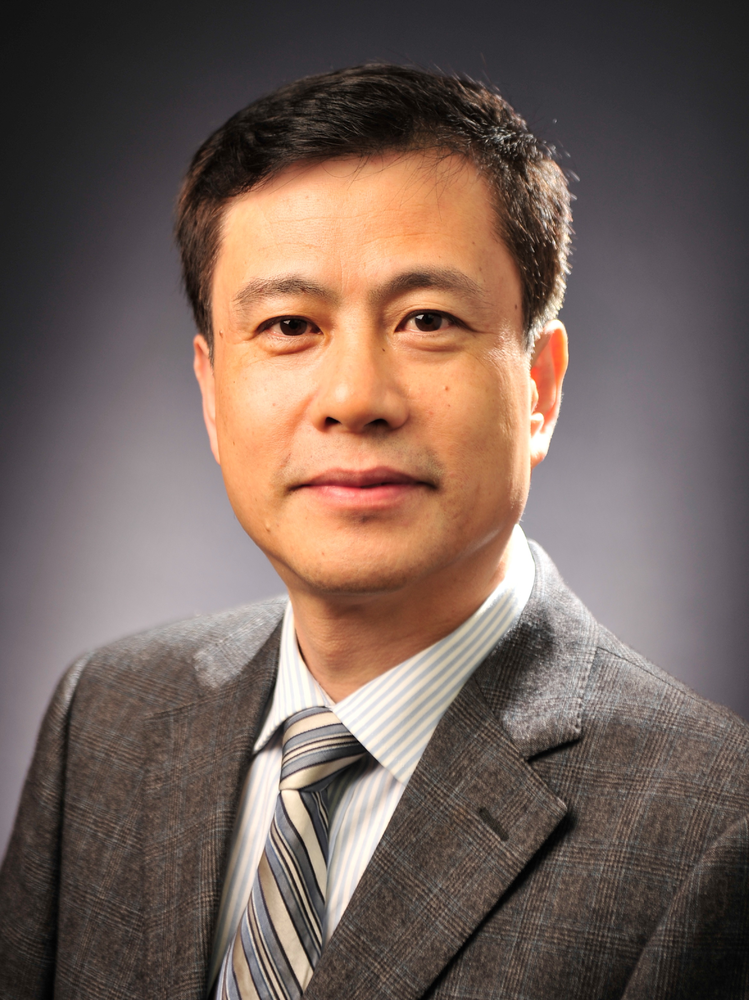

<!-- AUTO-GENERATED-BY: work/generate_obsidian_profiles.py -->

<!-- TEMPLATE: D:\workspace\信息收集整理\医生画像仓库\模板\医生画像模板.md -->

# 卫洪波

## 基础信息

| 字段 | 内容 |
|---|---|
| 姓名 | 卫洪波 |
| 医院 | 中山大学附属第三医院 |
| 科室 | 胃肠外科 |
| 职称/身份 | 主任医师, 教授 导师资格 博士生导师 |
| 来源链接 | [官网原文](https://www.zssy.com.cn/node/11060) |
| 采集日期 | 2026-08-10 |

## 简介/擅长

从事普通外科临床工作近40年，在胃肠道良恶性疾病的微创手术治疗方面具有较深的造诣；是国内最早开展腹腔镜微创治疗胃肠道恶性肿瘤的先驱者之一；近年来一直从事盆腔自主神经保护的直肠癌根治术研究：在国内率先开展腹腔镜下保留盆腔自主神经直肠癌根治术，国内外首次提出并验证腹腔镜保留Denonvilliers 筋膜直肠癌手术（iTME）可有效保护排尿及性功能学说，有效降低了直肠癌术后排尿及性功能障碍发生率，推翻了传统的手术层面，于2018年美国外科医师协会（ACS）年会上进行了大会报告，RCT研究结果发表在外科学顶级期刊Annals of Surgery，受到业界广泛认可。

## 可包装亮点

- 主任医师, 教授 导师资格 博士生导师 近年来一直从事盆腔自主神经保护的直肠癌根治术研究：在国内率先开展腹腔镜下保留盆腔自主神经直肠癌根治术，国内外首次提出并验证腹腔镜保留Denonvilliers 筋膜直肠癌手术（iTME）可有效保护排尿及性功能学说，有效降低了直肠癌术后排尿及性功能障碍发生率，推翻了传统的手术层面，于2018年美国外科医师协会（ACS）…
- 卫洪波，男，中山大学附属第三医院，医学博士，教授，主任医师，外科学及分子生物学博士研究生导师，胃肠外科主任。
- 现任中国医师协会结直肠癌分会微创解剖专委会主任委员、广东省医师协会微创外科分会主任委员、广东省临床医学学会副会长及胃肠外科专业委员会主任委员，广东省医学会结直肠肛门外科学分会副主任委员，广东省抗癌协会胃癌专业委员会副主任委员，中国老年保健医学研究会老年胃...

## 重点疾病/人群标签

- 慢性病：
- 肿瘤：肿瘤、癌、胃癌、肠癌、术后、功能障碍
- 生殖疾病：
- 免疫/风湿：
- 术后恢复/康复：肿瘤、癌、胃癌、肠癌、术后、功能障碍
- 疑难重症：

## 证据摘录

> 只摘录官网公开信息中的短句或关键字段，不复制大段原文。

- 官网身份字段：主任医师, 教授 导师资格 博士生导师
- 官网简介/擅长：从事普通外科临床工作近40年，在胃肠道良恶性疾病的微创手术治疗方面具有较深的造诣；是国内最早开展腹腔镜微创治疗胃肠道恶性肿瘤的先驱者之一；近年来一直从事盆腔自主神经保护的直肠癌根治术研究：在国内率先开展腹腔镜下保留盆腔自主神经直肠癌根治术，国内外首次提出并验证腹腔镜保留Denonvilliers 筋膜直肠癌手术（iTME）可有效保护排尿及性功能学说，有效降低了直肠癌术后排尿及性功能障碍发生率，推翻了传统的手术层面，于2018年美国外科…
- 官网亮眼经历线索：主任医师, 教授 导师资格 博士生导师 近年来一直从事盆腔自主神经保护的直肠癌根治术研究：在国内率先开展腹腔镜下保留盆腔自主神经直肠癌根治术，国内外首次提出并验证腹腔镜保留Denonvilliers 筋膜直肠癌手术（iTME）可有效保护排尿及性功能学说，有效降低了直肠癌术后排尿及性功能障碍发生率，推翻了传统的手术层面，于2018年美国外科医师协会（ACS）年会上进行了大会报告，RCT研究结果发表在外科学顶级期刊Annals of Su…
- 来源链接：https://www.zssy.com.cn/node/11060

## BD 画像摘要

卫洪波医生可作为肿瘤、术后恢复/康复方向的基础画像候选。后续 BD 使用应继续以官网来源和人工复核为准，不添加疗效承诺或无来源包装。

## 合规边界

- 仅使用医院官网、官方公众号、官方小程序等公开渠道。
- 不采集私人电话、私人微信、家庭住址、患者隐私或非公开排班信息。
- 不写“保证治愈”“疗效第一”“包治疑难杂症”等无法由官网证明的表述。
