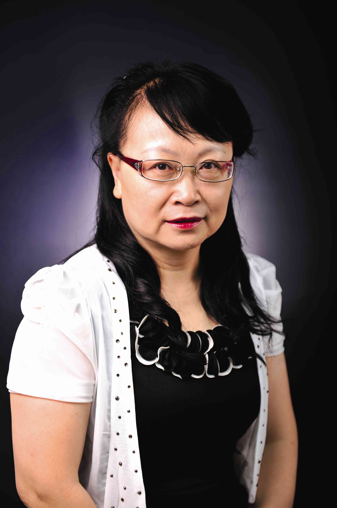

<!-- AUTO-GENERATED-BY: work/generate_obsidian_profiles.py -->

<!-- TEMPLATE: D:\workspace\信息收集整理\医生画像仓库\模板\医生画像模板.md -->

# 古洁若

## 基础信息

| 字段 | 内容 |
|---|---|
| 姓名 | 古洁若 |
| 医院 | 中山大学附属第三医院 |
| 科室 | 风湿免疫科 |
| 职称/身份 | 教授 导师资格 博士生导师 |
| 来源链接 | [官网原文](https://www.zssy.com.cn/node/11077) |
| 采集日期 | 2026-08-10 |

## 简介/擅长

脊柱关节炎、强直性脊柱炎，高尿酸血症、痛风，类风湿关节炎、系统性红斑狼疮、干燥综合症、肌炎、皮肌炎、骨关节炎、骨质疏松、免疫异常相关的生殖和不良妊娠、不明原因发热等风湿免疫病诊治

## 可包装亮点

- 教授 导师资格 博士生导师 风湿免疫科学科带头人、广东省免疫疾病临床医学研究中心主任、广东省风湿免疫专业质量控制中心主任、博士生导师。
- 中山大学首届名医；
- 首届国家名医“国之名医•卓越建树”荣誉称号获得者；

## 重点疾病/人群标签

- 慢性病：
- 肿瘤：
- 生殖疾病：生殖、风湿、免疫、红斑狼疮、类风湿、强直性脊柱炎
- 免疫/风湿：生殖、风湿、免疫、红斑狼疮、类风湿、强直性脊柱炎
- 术后恢复/康复：
- 疑难重症：

## 证据摘录

> 只摘录官网公开信息中的短句或关键字段，不复制大段原文。

- 官网身份字段：教授 导师资格 博士生导师
- 官网简介/擅长：脊柱关节炎、强直性脊柱炎，高尿酸血症、痛风，类风湿关节炎、系统性红斑狼疮、干燥综合症、肌炎、皮肌炎、骨关节炎、骨质疏松、免疫异常相关的生殖和不良妊娠、不明原因发热等风湿免疫病诊治
- 官网亮眼经历线索：教授 导师资格 博士生导师 风湿免疫科学科带头人、广东省免疫疾病临床医学研究中心主任、广东省风湿免疫专业质量控制中心主任、博士生导师。 中山大学首届名医； 首届国家名医“国之名医•卓越建树”荣誉称号获得者；
- 来源链接：https://www.zssy.com.cn/node/11077

## BD 画像摘要

古洁若医生可作为生殖疾病、免疫/风湿/感染方向的基础画像候选。后续 BD 使用应继续以官网来源和人工复核为准，不添加疗效承诺或无来源包装。

## 合规边界

- 仅使用医院官网、官方公众号、官方小程序等公开渠道。
- 不采集私人电话、私人微信、家庭住址、患者隐私或非公开排班信息。
- 不写“保证治愈”“疗效第一”“包治疑难杂症”等无法由官网证明的表述。
