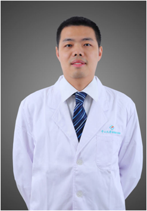

<!-- AUTO-GENERATED-BY: work/generate_obsidian_profiles.py -->

<!-- TEMPLATE: D:\workspace\信息收集整理\医生画像仓库\模板\医生画像模板.md -->

# 吕海金

## 基础信息

| 字段 | 内容 |
|---|---|
| 姓名 | 吕海金 |
| 医院 | 中山大学附属第三医院 |
| 科室 | 外科ICU |
| 职称/身份 | 副主任医师 导师资格 硕士生导师 |
| 来源链接 | [官网原文](https://www.zssy.com.cn/node/15119) |
| 采集日期 | 2026-08-10 |

## 简介/擅长

擅长外科危重症尤其是肝脏移植多脏器功能不全的诊治。以第一作者或通讯作者发表论文 12 篇，其中 SCI 6 篇，主持和参与省部级基金 6 项。受邀 BMJ 、 Stem cells translational medicine 审稿。

## 可包装亮点

- 副主任医师 导师资格 硕士生导师 擅长外科危重症尤其是肝脏移植多脏器功能不全的诊治。
- 以第一作者或通讯作者发表论文 12 篇，其中 SCI 6 篇，主持和参与省部级基金 6 项。
- 外科 ICU/ 器官移植 ICU 副主任医师 广东省病理生理协会重症医学分会 青年委员 广东省医院感染预防与控制学分会，重症感染预防与治疗学组成员 广东省医学会器官移植分会 委员

## 重点疾病/人群标签

- 慢性病：
- 肿瘤：
- 生殖疾病：
- 免疫/风湿：感染、危重、重症
- 术后恢复/康复：
- 疑难重症：感染、危重、重症

## 证据摘录

> 只摘录官网公开信息中的短句或关键字段，不复制大段原文。

- 官网身份字段：副主任医师 导师资格 硕士生导师
- 官网简介/擅长：擅长外科危重症尤其是肝脏移植多脏器功能不全的诊治。以第一作者或通讯作者发表论文 12 篇，其中 SCI 6 篇，主持和参与省部级基金 6 项。受邀 BMJ 、 Stem cells translational medicine 审稿。
- 官网亮眼经历线索：副主任医师 导师资格 硕士生导师 擅长外科危重症尤其是肝脏移植多脏器功能不全的诊治。 以第一作者或通讯作者发表论文 12 篇，其中 SCI 6 篇，主持和参与省部级基金 6 项。 外科 ICU/ 器官移植 ICU 副主任医师 广东省病理生理协会重症医学分会 青年委员 广东省医院感染预防与控制学分会，重症感染预防与治疗学组成员 广东省医学会器官移植分会 委员
- 来源链接：https://www.zssy.com.cn/node/15119

## BD 画像摘要

吕海金医生可作为免疫/风湿/感染、疑难重症方向的基础画像候选。后续 BD 使用应继续以官网来源和人工复核为准，不添加疗效承诺或无来源包装。

## 合规边界

- 仅使用医院官网、官方公众号、官方小程序等公开渠道。
- 不采集私人电话、私人微信、家庭住址、患者隐私或非公开排班信息。
- 不写“保证治愈”“疗效第一”“包治疑难杂症”等无法由官网证明的表述。
