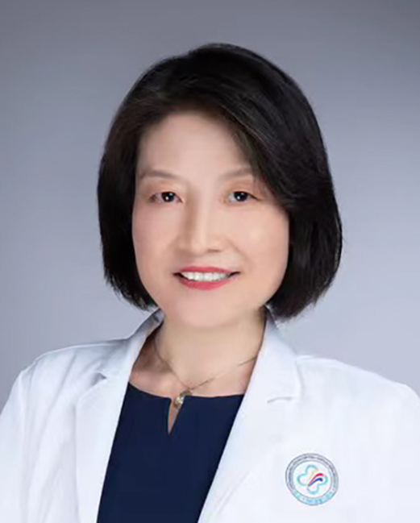

<!-- AUTO-GENERATED-BY: work/generate_obsidian_profiles.py -->

<!-- TEMPLATE: D:\workspace\信息收集整理\医生画像仓库\模板\医生画像模板.md -->

# 唐录英

## 基础信息

| 字段 | 内容 |
|---|---|
| 姓名 | 唐录英 |
| 医院 | 中山大学附属第三医院 |
| 科室 | 病理科 |
| 职称/身份 | 主任医师 导师资格 硕士生导师 |
| 来源链接 | [官网原文](https://www.zssy.com.cn/node/11212) |
| 采集日期 | 2026-08-10 |

## 简介/擅长

至今已从事病理工作30多年，具有丰富的临床病理诊断经验，对多个系统肿瘤的疑难病理诊断有较高的诊断水平，特别在乳腺、女性生殖系统病变的病理诊断方面有很强的诊断能力。

## 可包装亮点

- 主任医师 导师资格 硕士生导师 至今已从事病理工作30多年，具有丰富的临床病理诊断经验，对多个系统肿瘤的疑难病理诊断有较高的诊断水平，特别在乳腺、女性生殖系统病变的病理诊断方面有很强的诊断能力。
- 其中1990年在中山医科大学病理教研室进行临床病理专科培训一年，2004年于美国Vanderbilt大学肿瘤中心从事研究工作。
- 作为项目负责人主持国家自然科学基金2项，作为第二参与国家自然科学基金4项，还参加广东省自然科学基金及科技攻关项目近20项，发表论文30余篇，其中包含第一或通讯作者Sci论文15篇。

## 重点疾病/人群标签

- 慢性病：
- 肿瘤：肿瘤、乳腺癌、生殖、疑难
- 生殖疾病：肿瘤、乳腺癌、生殖、疑难
- 免疫/风湿：
- 术后恢复/康复：
- 疑难重症：肿瘤、乳腺癌、生殖、疑难

## 证据摘录

> 只摘录官网公开信息中的短句或关键字段，不复制大段原文。

- 官网身份字段：主任医师 导师资格 硕士生导师
- 官网简介/擅长：至今已从事病理工作30多年，具有丰富的临床病理诊断经验，对多个系统肿瘤的疑难病理诊断有较高的诊断水平，特别在乳腺、女性生殖系统病变的病理诊断方面有很强的诊断能力。
- 官网亮眼经历线索：主任医师 导师资格 硕士生导师 至今已从事病理工作30多年，具有丰富的临床病理诊断经验，对多个系统肿瘤的疑难病理诊断有较高的诊断水平，特别在乳腺、女性生殖系统病变的病理诊断方面有很强的诊断能力。 其中1990年在中山医科大学病理教研室进行临床病理专科培训一年，2004年于美国Vanderbilt大学肿瘤中心从事研究工作。 作为项目负责人主持国家自然科学基金2项，作为第二参与国家自然科学基金4项，还参加广东省自然科学基金及科技攻关项目近…
- 来源链接：https://www.zssy.com.cn/node/11212

## BD 画像摘要

唐录英医生可作为肿瘤、生殖疾病、疑难重症方向的基础画像候选。后续 BD 使用应继续以官网来源和人工复核为准，不添加疗效承诺或无来源包装。

## 合规边界

- 仅使用医院官网、官方公众号、官方小程序等公开渠道。
- 不采集私人电话、私人微信、家庭住址、患者隐私或非公开排班信息。
- 不写“保证治愈”“疗效第一”“包治疑难杂症”等无法由官网证明的表述。
