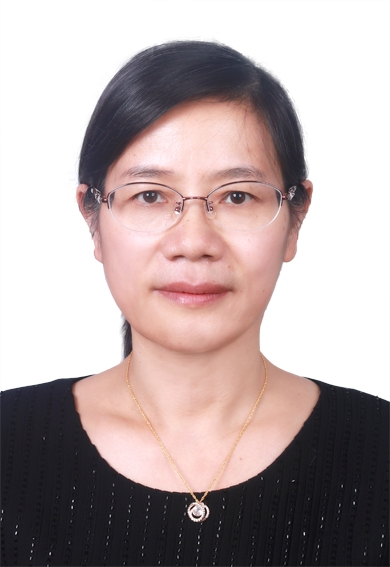

<!-- AUTO-GENERATED-BY: work/generate_obsidian_profiles.py -->

<!-- TEMPLATE: D:\workspace\信息收集整理\医生画像仓库\模板\医生画像模板.md -->

# 唐新意

## 基础信息

| 字段 | 内容 |
|---|---|
| 姓名 | 唐新意 |
| 医院 | 中山大学附属第三医院 |
| 科室 | 儿科 |
| 职称/身份 | 副主任医师 导师资格 硕士生导师 |
| 来源链接 | [官网原文](https://www.zssy.com.cn/node/11202) |
| 采集日期 | 2026-08-10 |

## 简介/擅长

对儿童发热及各种感染性疾病、难治性咳嗽、儿童心血管疾病、新生儿危重症及各种儿童疑难病能给予较好的诊治及指导。

## 可包装亮点

- 副主任医师 导师资格 硕士生导师 对儿童发热及各种感染性疾病、难治性咳嗽、儿童心血管疾病、新生儿危重症及各种儿童疑难病能给予较好的诊治及指导。
- 武汉同济医科大学儿科心血管专业硕士毕业，在中山三院从事儿科临床工至今已25年，2011~2017年任中山三院岭南医院儿科主任，现任中山三院天河院区新生儿科主任，主持省卫生厅基金、校基金及教改课题各一项，参与国家自然科学基金省科技计划项目各1项，发表主要国内外杂志文章近20篇。
- 任中国新生儿医师协会预防保健分会委员，广东省医师协会围产医学分会委员，广东省医师协会新生儿科分会委员，广州市儿科学及少年健康管理委员会委员，广州市重症营养学组委员，广州市妇幼营养专业委员会委员，广东省消化营养学组委员等社会兼职。

## 重点疾病/人群标签

- 慢性病：
- 肿瘤：
- 生殖疾病：
- 免疫/风湿：感染、营养、疑难、危重、重症、难治
- 术后恢复/康复：感染、营养、疑难、危重、重症、难治
- 疑难重症：感染、营养、疑难、危重、重症、难治

## 证据摘录

> 只摘录官网公开信息中的短句或关键字段，不复制大段原文。

- 官网身份字段：副主任医师 导师资格 硕士生导师
- 官网简介/擅长：对儿童发热及各种感染性疾病、难治性咳嗽、儿童心血管疾病、新生儿危重症及各种儿童疑难病能给予较好的诊治及指导。
- 官网亮眼经历线索：副主任医师 导师资格 硕士生导师 对儿童发热及各种感染性疾病、难治性咳嗽、儿童心血管疾病、新生儿危重症及各种儿童疑难病能给予较好的诊治及指导。 武汉同济医科大学儿科心血管专业硕士毕业，在中山三院从事儿科临床工至今已25年，2011~2017年任中山三院岭南医院儿科主任，现任中山三院天河院区新生儿科主任，主持省卫生厅基金、校基金及教改课题各一项，参与国家自然科学基金省科技计划项目各1项，发表主要国内外杂志文章近20篇。 任中国新生儿医师…
- 来源链接：https://www.zssy.com.cn/node/11202

## BD 画像摘要

唐新意医生可作为免疫/风湿/感染、术后恢复/康复、疑难重症方向的基础画像候选。后续 BD 使用应继续以官网来源和人工复核为准，不添加疗效承诺或无来源包装。

## 合规边界

- 仅使用医院官网、官方公众号、官方小程序等公开渠道。
- 不采集私人电话、私人微信、家庭住址、患者隐私或非公开排班信息。
- 不写“保证治愈”“疗效第一”“包治疑难杂症”等无法由官网证明的表述。
