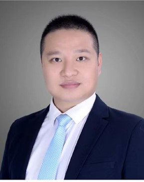

<!-- AUTO-GENERATED-BY: work/generate_obsidian_profiles.py -->

<!-- TEMPLATE: D:\workspace\信息收集整理\医生画像仓库\模板\医生画像模板.md -->

# 喻勇

## 基础信息

| 字段 | 内容 |
|---|---|
| 姓名 | 喻勇 |
| 医院 | 中山大学附属第三医院 |
| 科室 | 康复医学科 |
| 职称/身份 | 副主任医师 |
| 来源链接 | [官网原文](https://www.zssy.com.cn/node/28157) |
| 采集日期 | 2026-08-10 |

## 简介/擅长

脑卒中，脑外伤，脊髓损伤所致的运动功能障碍和排尿障碍康复，超声引导下肉毒毒素注射技术、尿道外括约肌球囊扩张及注射技术、膀胱镜下逼尿肌肉毒毒注射。

## 可包装亮点

- 副主任医师 副主任医师，医学博士。
- 中山大学附属第三医院粤东医院康复医学科主任。
- 香港中文大学威尔斯亲王医院访问学者，中国康复研究中心神经泌尿科进修学习。

## 重点疾病/人群标签

- 慢性病：
- 肿瘤：
- 生殖疾病：
- 免疫/风湿：
- 术后恢复/康复：康复、功能障碍
- 疑难重症：

## 证据摘录

> 只摘录官网公开信息中的短句或关键字段，不复制大段原文。

- 官网身份字段：副主任医师
- 官网简介/擅长：脑卒中，脑外伤，脊髓损伤所致的运动功能障碍和排尿障碍康复，超声引导下肉毒毒素注射技术、尿道外括约肌球囊扩张及注射技术、膀胱镜下逼尿肌肉毒毒注射。
- 官网亮眼经历线索：副主任医师 副主任医师，医学博士。 中山大学附属第三医院粤东医院康复医学科主任。 香港中文大学威尔斯亲王医院访问学者，中国康复研究中心神经泌尿科进修学习。
- 来源链接：https://www.zssy.com.cn/node/28157

## BD 画像摘要

喻勇医生可作为术后恢复/康复方向的基础画像候选。后续 BD 使用应继续以官网来源和人工复核为准，不添加疗效承诺或无来源包装。

## 合规边界

- 仅使用医院官网、官方公众号、官方小程序等公开渠道。
- 不采集私人电话、私人微信、家庭住址、患者隐私或非公开排班信息。
- 不写“保证治愈”“疗效第一”“包治疑难杂症”等无法由官网证明的表述。
