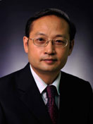

<!-- AUTO-GENERATED-BY: work/generate_obsidian_profiles.py -->

<!-- TEMPLATE: D:\workspace\信息收集整理\医生画像仓库\模板\医生画像模板.md -->

# 夏小平

## 基础信息

| 字段 | 内容 |
|---|---|
| 姓名 | 夏小平 |
| 医院 | 中山大学附属第三医院 |
| 科室 | 眼科 |
| 职称/身份 | 教授 |
| 来源链接 | [官网原文](https://www.zssy.com.cn/node/11059) |
| 采集日期 | 2026-08-10 |

## 简介/擅长

眼科显微手术（含白内障手术、青光眼手术等）及视网膜变性的临床治疗，在中山三院开展国内外第一例雪旺氏细胞巩膜深层移植术治疗视网膜色素变性，经美国犹他州立大学Moran眼科中心的教授和广州市有关眼科专家在中山三院进行现场学术演讨，认为手术效果良好，该临床方向特色突出，有重要的理论意义和实用价值。

## 可包装亮点

- 眼科显微手术（含白内障手术、青光眼手术等）及视网膜变性的临床治疗，在中山三院开展国内外第一例雪旺氏细胞巩膜深层移植术治疗视网膜色素变性，经美国犹他州立大学Moran眼科中心的教授和广州市有关眼科专家在中山三院进行现场学术演讨，认为手术效果良好，该临床方向特色突出，有重要的理论意义和实用价值。
- 夏小平 科室 眼科 职称 教授 擅长 眼科显微手术（含白内障手术、青光眼手术等）及视网膜变性的临床治疗，在中山三院开展国内外第一例雪旺氏细胞巩膜深层移植术治疗视网膜色素变性，经美国犹他州立大学Moran眼科中心的教授和广州市有关眼科专家在中山三院进行现场学术演讨，认为手术效果良好，该临床方向特色突出，有重要的理论意…

## 重点疾病/人群标签

- 慢性病：
- 肿瘤：
- 生殖疾病：
- 免疫/风湿：
- 术后恢复/康复：
- 疑难重症：

## 证据摘录

> 只摘录官网公开信息中的短句或关键字段，不复制大段原文。

- 官网身份字段：教授
- 官网简介/擅长：眼科显微手术（含白内障手术、青光眼手术等）及视网膜变性的临床治疗，在中山三院开展国内外第一例雪旺氏细胞巩膜深层移植术治疗视网膜色素变性，经美国犹他州立大学Moran眼科中心的教授和广州市有关眼科专家在中山三院进行现场学术演讨，认为手术效果良好，该临床方向特色突出，有重要的理论意义和实用价值。
- 官网亮眼经历线索：眼科显微手术（含白内障手术、青光眼手术等）及视网膜变性的临床治疗，在中山三院开展国内外第一例雪旺氏细胞巩膜深层移植术治疗视网膜色素变性，经美国犹他州立大学Moran眼科中心的教授和广州市有关眼科专家在中山三院进行现场学术演讨，认为手术效果良好，该临床方向特色突出，有重要的理论意义和实用价值。 夏小平 科室 眼科 职称 教授 擅长 眼科显微手术（含白内障手术、青光眼手术等）及视网膜变性的临床治疗…
- 来源链接：https://www.zssy.com.cn/node/11059

## BD 画像摘要

夏小平医生可作为中山大学附属第三医院眼科的基础医生资料入库。当前重点方向以总底表标签为准，官网未展示的信息保持空白。

## 合规边界

- 仅使用医院官网、官方公众号、官方小程序等公开渠道。
- 不采集私人电话、私人微信、家庭住址、患者隐私或非公开排班信息。
- 不写“保证治愈”“疗效第一”“包治疑难杂症”等无法由官网证明的表述。
