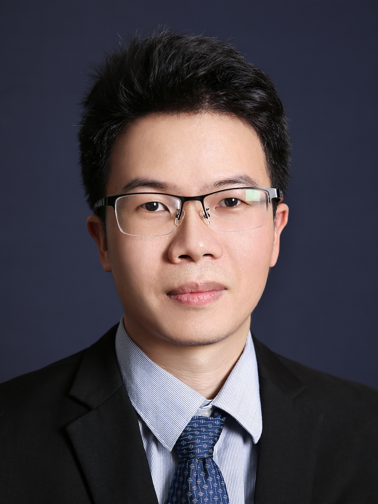

<!-- AUTO-GENERATED-BY: work/generate_obsidian_profiles.py -->

<!-- TEMPLATE: D:\workspace\信息收集整理\医生画像仓库\模板\医生画像模板.md -->

# 姚伟锋

## 基础信息

| 字段 | 内容 |
|---|---|
| 姓名 | 姚伟锋 |
| 医院 | 中山大学附属第三医院 |
| 科室 | 手术麻醉中心 |
| 职称/身份 | 副主任医师 导师资格 硕士生导师 |
| 来源链接 | [官网原文](https://www.zssy.com.cn/node/15462) |
| 采集日期 | 2026-08-10 |

## 简介/擅长

擅长危急重症手术、心脏大血管手术、肝脏移植手术等复杂手术的麻醉和围术期处理。

## 可包装亮点

- 副主任医师 导师资格 硕士生导师 麻醉学博士，副主任医师，硕士研究生导师，广东省优秀青年麻醉医师，中山大学附属第三医院重大人才工程培育计划中青年杰出人才，广东省医学会麻醉学分会秘书，广东省医学会麻醉学分会青委会副主委。
- 研究方向为围术期器官损伤的临床和基础研究，作为负责人主持2项国家级科研基金及3项省部级项目等8项基金项目，参与了多项国家自然科学基金及广州市科技计划重大专项项目。
- 至今发表一作及通讯作者高水平英文论文30余篇，High Index 17。

## 重点疾病/人群标签

- 慢性病：
- 肿瘤：
- 生殖疾病：
- 免疫/风湿：
- 术后恢复/康复：
- 疑难重症：重症、复杂

## 证据摘录

> 只摘录官网公开信息中的短句或关键字段，不复制大段原文。

- 官网身份字段：副主任医师 导师资格 硕士生导师
- 官网简介/擅长：擅长危急重症手术、心脏大血管手术、肝脏移植手术等复杂手术的麻醉和围术期处理。
- 官网亮眼经历线索：副主任医师 导师资格 硕士生导师 麻醉学博士，副主任医师，硕士研究生导师，广东省优秀青年麻醉医师，中山大学附属第三医院重大人才工程培育计划中青年杰出人才，广东省医学会麻醉学分会秘书，广东省医学会麻醉学分会青委会副主委。 研究方向为围术期器官损伤的临床和基础研究，作为负责人主持2项国家级科研基金及3项省部级项目等8项基金项目，参与了多项国家自然科学基金及广州市科技计划重大专项项目。 至今发表一作及通讯作者高水平英文论文30余篇，High…
- 来源链接：https://www.zssy.com.cn/node/15462

## BD 画像摘要

姚伟锋医生可作为疑难重症方向的基础画像候选。后续 BD 使用应继续以官网来源和人工复核为准，不添加疗效承诺或无来源包装。

## 合规边界

- 仅使用医院官网、官方公众号、官方小程序等公开渠道。
- 不采集私人电话、私人微信、家庭住址、患者隐私或非公开排班信息。
- 不写“保证治愈”“疗效第一”“包治疑难杂症”等无法由官网证明的表述。
