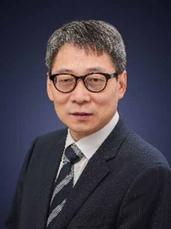

<!-- AUTO-GENERATED-BY: work/generate_obsidian_profiles.py -->

<!-- TEMPLATE: D:\workspace\信息收集整理\医生画像仓库\模板\医生画像模板.md -->

# 姚斌

## 基础信息

| 字段 | 内容 |
|---|---|
| 姓名 | 姚斌 |
| 医院 | 中山大学附属第三医院 |
| 科室 | 内分泌与代谢病学科 |
| 职称/身份 | 主任医师 导师资格 硕士生导师 |
| 来源链接 | [官网原文](https://www.zssy.com.cn/node/14139) |
| 采集日期 | 2026-08-10 |

## 简介/擅长

糖尿病及其急慢性并发症如糖尿病肾病、垂体疾病、甲状腺、肥胖症、肾上腺疾病、生长发育异常、骨质疏松症、痛风、代谢性骨病、继发性高血压、生长发育异常、性腺疾病、内分泌肿瘤、内分泌遗传病及内分泌少见（罕见）病的诊治。

## 可包装亮点

- 主任医师 导师资格 硕士生导师 主任医师，硕士生导师，1987年毕业于中山医科大学。
- 中华医学会内分泌学分会委员、中华医学会内分泌学分会垂体学组委员，中国老年内分泌学会常务委员，中国垂体瘤协作组成员，第六届广东省内分泌学会副主任委员，第七届广东省内分泌学会常务委员，广东省糖尿病学会委员，广东省骨质疏松学会常务委员，广东省老年学会骨质疏松委员会委员。
- 从事内科及内分泌科医疗、教学、科研工作已二十五年，发表学术论文50余篇，8次被评为优秀教师。

## 重点疾病/人群标签

- 慢性病：高血压、糖尿病、慢性、代谢、肿瘤、瘤、罕见
- 肿瘤：高血压、糖尿病、慢性、代谢、肿瘤、瘤、罕见
- 生殖疾病：
- 免疫/风湿：
- 术后恢复/康复：
- 疑难重症：高血压、糖尿病、慢性、代谢、肿瘤、瘤、罕见

## 证据摘录

> 只摘录官网公开信息中的短句或关键字段，不复制大段原文。

- 官网身份字段：主任医师 导师资格 硕士生导师
- 官网简介/擅长：糖尿病及其急慢性并发症如糖尿病肾病、垂体疾病、甲状腺、肥胖症、肾上腺疾病、生长发育异常、骨质疏松症、痛风、代谢性骨病、继发性高血压、生长发育异常、性腺疾病、内分泌肿瘤、内分泌遗传病及内分泌少见（罕见）病的诊治。
- 官网亮眼经历线索：主任医师 导师资格 硕士生导师 主任医师，硕士生导师，1987年毕业于中山医科大学。 中华医学会内分泌学分会委员、中华医学会内分泌学分会垂体学组委员，中国老年内分泌学会常务委员，中国垂体瘤协作组成员，第六届广东省内分泌学会副主任委员，第七届广东省内分泌学会常务委员，广东省糖尿病学会委员，广东省骨质疏松学会常务委员，广东省老年学会骨质疏松委员会委员。 从事内科及内分泌科医疗、教学、科研工作已二十五年，发表学术论文50余篇，8次被评为优秀…
- 来源链接：https://www.zssy.com.cn/node/14139

## BD 画像摘要

姚斌医生可作为慢性病、肿瘤、疑难重症方向的基础画像候选。后续 BD 使用应继续以官网来源和人工复核为准，不添加疗效承诺或无来源包装。

## 合规边界

- 仅使用医院官网、官方公众号、官方小程序等公开渠道。
- 不采集私人电话、私人微信、家庭住址、患者隐私或非公开排班信息。
- 不写“保证治愈”“疗效第一”“包治疑难杂症”等无法由官网证明的表述。
