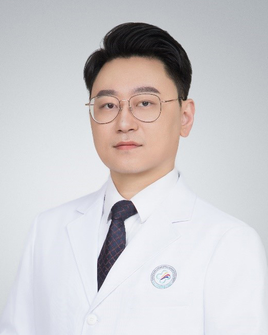

<!-- AUTO-GENERATED-BY: work/generate_obsidian_profiles.py -->

<!-- TEMPLATE: D:\workspace\信息收集整理\医生画像仓库\模板\医生画像模板.md -->

# 孙国亮

## 基础信息

| 字段 | 内容 |
|---|---|
| 姓名 | 孙国亮 |
| 医院 | 中山大学附属第三医院 |
| 科室 | 手术麻醉中心 |
| 职称/身份 | 副主任医师 导师资格 硕士生导师 |
| 来源链接 | [官网原文](https://www.zssy.com.cn/node/28733) |
| 采集日期 | 2026-08-10 |

## 简介/擅长

1.麻醉方向：脊柱矫形麻醉，肝移植麻醉，疑难危重患者麻醉 2.疼痛诊疗：神经病理性性疼痛，带状疱疹神经痛及后遗神经痛，颈肩综合征，小关节紊乱综合征，骨骼肌肉及肌筋膜相关疼痛。 3.围手术期舒适化诊疗

## 可包装亮点

- 副主任医师 导师资格 硕士生导师 1.麻醉方向：脊柱矫形麻醉，肝移植麻醉，疑难危重患者麻醉 2.疼痛诊疗：神经病理性性疼痛，带状疱疹神经痛及后遗神经痛，颈肩综合征，小关节紊乱综合征，骨骼肌肉及肌筋膜相关疼痛。
- 现担任广东省医师协会疼痛科医师分会常委、中国心胸血管麻醉学会舒适化医疗分会委员、广东省医师协会疼痛科医师分会神经病理性疼痛学组组员、广东省医学会疼痛学分会神经病理性疼痛学组组员、广东省医学会麻醉学分会镇痛诊疗学组组员。

## 重点疾病/人群标签

- 慢性病：
- 肿瘤：
- 生殖疾病：
- 免疫/风湿：
- 术后恢复/康复：疼痛、疑难、危重
- 疑难重症：疼痛、疑难、危重

## 证据摘录

> 只摘录官网公开信息中的短句或关键字段，不复制大段原文。

- 官网身份字段：副主任医师 导师资格 硕士生导师
- 官网简介/擅长：1.麻醉方向：脊柱矫形麻醉，肝移植麻醉，疑难危重患者麻醉 2.疼痛诊疗：神经病理性性疼痛，带状疱疹神经痛及后遗神经痛，颈肩综合征，小关节紊乱综合征，骨骼肌肉及肌筋膜相关疼痛。 3.围手术期舒适化诊疗
- 官网亮眼经历线索：副主任医师 导师资格 硕士生导师 1.麻醉方向：脊柱矫形麻醉，肝移植麻醉，疑难危重患者麻醉 2.疼痛诊疗：神经病理性性疼痛，带状疱疹神经痛及后遗神经痛，颈肩综合征，小关节紊乱综合征，骨骼肌肉及肌筋膜相关疼痛。 现担任广东省医师协会疼痛科医师分会常委、中国心胸血管麻醉学会舒适化医疗分会委员、广东省医师协会疼痛科医师分会神经病理性疼痛学组组员、广东省医学会疼痛学分会神经病理性疼痛学组组员、广东省医学会麻醉学分会镇痛诊疗学组组员。
- 来源链接：https://www.zssy.com.cn/node/28733

## BD 画像摘要

孙国亮医生可作为术后恢复/康复、疑难重症方向的基础画像候选。后续 BD 使用应继续以官网来源和人工复核为准，不添加疗效承诺或无来源包装。

## 合规边界

- 仅使用医院官网、官方公众号、官方小程序等公开渠道。
- 不采集私人电话、私人微信、家庭住址、患者隐私或非公开排班信息。
- 不写“保证治愈”“疗效第一”“包治疑难杂症”等无法由官网证明的表述。
