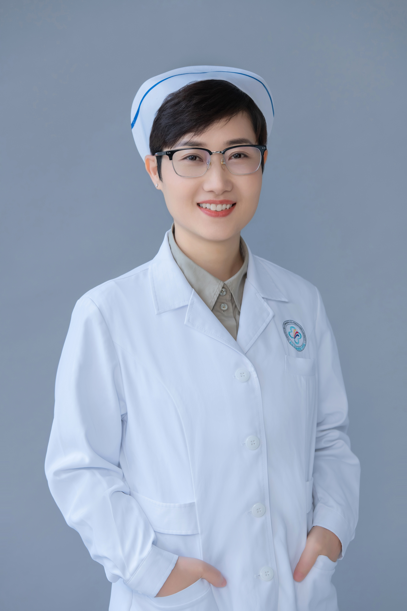

<!-- AUTO-GENERATED-BY: work/generate_obsidian_profiles.py -->

<!-- TEMPLATE: D:\workspace\信息收集整理\医生画像仓库\模板\医生画像模板.md -->

# 安德连

## 基础信息

| 字段 | 内容 |
|---|---|
| 姓名 | 安德连 |
| 医院 | 中山大学附属第三医院 |
| 科室 | 康复医学科 |
| 职称/身份 | 副主任护师 |
| 来源链接 | [官网原文](https://www.zssy.com.cn/node/15210) |
| 采集日期 | 2026-08-10 |

## 简介/擅长

吞咽障碍护理，含神经系统疾病所致的吞咽障碍护理和老年退行性吞咽障碍护理，尤其在吞咽障碍筛查与评估、吞咽障碍分级干预方面具有丰富的经验

## 可包装亮点

- 现任中华护理学会康复护理专业委员会专家库成员、中国康复医学会吞咽障碍康复专业委员会青年委员、广东省护士协会吞咽康复护士分会会长。
- 主编《吞咽障碍康复护理手册》，副主编《吞咽障碍居家康复指导》，参编《吞咽障碍评估与治疗》《吞咽障碍康复治疗技术》《吞咽障碍康复指南》等专著5部。
- 主持有广东省医学科学技术基金、表吞咽相关论文10余篇，获批发明专利1项、实用新型专利4项。
- 以第一完成人获得广东省护理学会第六届科技奖三等奖、广东省康复医学会科技奖二等奖、中国康复医学会科技奖三等奖各1项，并获广东省康复医学会科技奖二等奖1项(排名第七)。

## 重点疾病/人群标签

- 慢性病：
- 肿瘤：
- 生殖疾病：
- 免疫/风湿：
- 术后恢复/康复：康复
- 疑难重症：

## 证据摘录

> 只摘录官网公开信息中的短句或关键字段，不复制大段原文。

- 官网身份字段：副主任护师
- 官网简介/擅长：吞咽障碍护理，含神经系统疾病所致的吞咽障碍护理和老年退行性吞咽障碍护理，尤其在吞咽障碍筛查与评估、吞咽障碍分级干预方面具有丰富的经验
- 官网亮眼经历线索：现任中华护理学会康复护理专业委员会专家库成员、中国康复医学会吞咽障碍康复专业委员会青年委员、广东省护士协会吞咽康复护士分会会长。 主编《吞咽障碍康复护理手册》，副主编《吞咽障碍居家康复指导》，参编《吞咽障碍评估与治疗》《吞咽障碍康复治疗技术》《吞咽障碍康复指南》等专著5部。 主持有广东省医学科学技术基金、表吞咽相关论文10余篇，获批发明专利1项、实用新型专利4项。 以第一完成人获得广东省护理学会第六届科技奖三等奖、广东省康复医学会科技…
- 来源链接：https://www.zssy.com.cn/node/15210

## BD 画像摘要

安德连医生可作为术后恢复/康复方向的基础画像候选。后续 BD 使用应继续以官网来源和人工复核为准，不添加疗效承诺或无来源包装。

## 合规边界

- 仅使用医院官网、官方公众号、官方小程序等公开渠道。
- 不采集私人电话、私人微信、家庭住址、患者隐私或非公开排班信息。
- 不写“保证治愈”“疗效第一”“包治疑难杂症”等无法由官网证明的表述。
