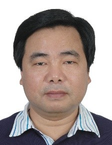

<!-- AUTO-GENERATED-BY: work/generate_obsidian_profiles.py -->

<!-- TEMPLATE: D:\workspace\信息收集整理\医生画像仓库\模板\医生画像模板.md -->

# 帅心涛

## 基础信息

| 字段 | 内容 |
|---|---|
| 姓名 | 帅心涛 |
| 医院 | 中山大学附属第三医院 |
| 科室 | 纳米医学中心 |
| 职称/身份 | 教授 导师资格 博士生导师 |
| 来源链接 | [官网原文](https://www.zssy.com.cn/node/20635) |
| 采集日期 | 2026-08-10 |

## 简介/擅长

肿瘤小分子药物、核酸药物等体内靶向输送材料；肿瘤多靶点药物协同治疗及机理探究；磁共振造影、超声造影可视化的新型多功能诊疗探针；组织再生修复材料。 学术成果：在药物靶向递送与控制释放、医学影像纳米探针等生物医用材料核心研发领域取得一系列研究成果，所研发的材料和技术在肿瘤、心脑血管疾病、自身免疫性疾病等重大疾病的诊断与治疗中显示出临床应用潜力。在Science Advances、Nature Communications、Allergy、Hepatology、Biomaterials、Journal of controlled release、Advanced Materials、Angewandte Chemie International Edition、Advanced Functional Materials、ACS Central Science、ACS Nano等期刊发表高水平研究论文270余篇，他引1万5千余次，H因子68；获授权国家发明专利20余件。

## 可包装亮点

- 教授 导师资格 博士生导师 在Science Advances、Nature Communications、Allergy、Hepatology、Biomaterials、Journal of controlled release、Advanced Materials、Angewandte Chemie International Edition、Adva…
- 获授权国家发明专利20余件。
- 近年来主持国家重点研发计划项目、973计划课题及863计划项目，并主持国家自然科学基金委杰出青年基金项目、重点项目、区域（广东）联合基金重点项目及面上项目等。

## 重点疾病/人群标签

- 慢性病：
- 肿瘤：肿瘤、靶向、免疫
- 生殖疾病：
- 免疫/风湿：肿瘤、靶向、免疫
- 术后恢复/康复：
- 疑难重症：

## 证据摘录

> 只摘录官网公开信息中的短句或关键字段，不复制大段原文。

- 官网身份字段：教授 导师资格 博士生导师
- 官网简介/擅长：肿瘤小分子药物、核酸药物等体内靶向输送材料；肿瘤多靶点药物协同治疗及机理探究；磁共振造影、超声造影可视化的新型多功能诊疗探针；组织再生修复材料。 学术成果：在药物靶向递送与控制释放、医学影像纳米探针等生物医用材料核心研发领域取得一系列研究成果，所研发的材料和技术在肿瘤、心脑血管疾病、自身免疫性疾病等重大疾病的诊断与治疗中显示出临床应用潜力。在Science Advances、Nature Communications、Allergy…
- 官网亮眼经历线索：教授 导师资格 博士生导师 在Science Advances、Nature Communications、Allergy、Hepatology、Biomaterials、Journal of controlled release、Advanced Materials、Angewandte Chemie International Edition、Advanced Functional Materials、ACS Central Sc…
- 来源链接：https://www.zssy.com.cn/node/20635

## BD 画像摘要

帅心涛医生可作为肿瘤、免疫/风湿/感染方向的基础画像候选。后续 BD 使用应继续以官网来源和人工复核为准，不添加疗效承诺或无来源包装。

## 合规边界

- 仅使用医院官网、官方公众号、官方小程序等公开渠道。
- 不采集私人电话、私人微信、家庭住址、患者隐私或非公开排班信息。
- 不写“保证治愈”“疗效第一”“包治疑难杂症”等无法由官网证明的表述。
