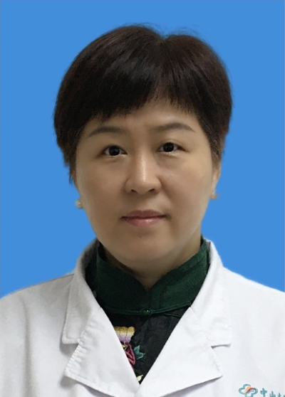

<!-- AUTO-GENERATED-BY: work/generate_obsidian_profiles.py -->

<!-- TEMPLATE: D:\workspace\信息收集整理\医生画像仓库\模板\医生画像模板.md -->

# 席云

## 基础信息

| 字段 | 内容 |
|---|---|
| 姓名 | 席云 |
| 医院 | 中山大学附属第三医院 |
| 科室 | 检验科 |
| 职称/身份 | 主任技师 出诊信息 周一 周二 周三 周四 周五 周六 周日 上午 出诊 出诊 出诊 出诊 出诊 出诊 下午 出诊 出诊 出诊 出诊 出诊 出诊信息仅供参考，有可能随时有更新，以门诊公布为准 |
| 来源链接 | [官网原文](https://www.zssy.com.cn/node/15151) |
| 采集日期 | 2026-08-10 |

## 简介/擅长

席云

## 可包装亮点

- 席云

## 重点疾病/人群标签

- 慢性病：
- 肿瘤：
- 生殖疾病：
- 免疫/风湿：
- 术后恢复/康复：
- 疑难重症：

## 证据摘录

> 只摘录官网公开信息中的短句或关键字段，不复制大段原文。

- 官网身份字段：主任技师 出诊信息 周一 周二 周三 周四 周五 周六 周日 上午 出诊 出诊 出诊 出诊 出诊 出诊 下午 出诊 出诊 出诊 出诊 出诊 出诊信息仅供参考，有可能随时有更新，以门诊公布为准
- 官网简介/擅长：席云
- 来源链接：https://www.zssy.com.cn/node/15151

## BD 画像摘要

席云医生可作为中山大学附属第三医院检验科的基础医生资料入库。当前重点方向以总底表标签为准，官网未展示的信息保持空白。

## 合规边界

- 仅使用医院官网、官方公众号、官方小程序等公开渠道。
- 不采集私人电话、私人微信、家庭住址、患者隐私或非公开排班信息。
- 不写“保证治愈”“疗效第一”“包治疑难杂症”等无法由官网证明的表述。
