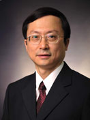

<!-- AUTO-GENERATED-BY: work/generate_obsidian_profiles.py -->

<!-- TEMPLATE: D:\workspace\信息收集整理\医生画像仓库\模板\医生画像模板.md -->

# 张天托

## 基础信息

| 字段 | 内容 |
|---|---|
| 姓名 | 张天托 |
| 医院 | 中山大学附属第三医院 |
| 科室 | 呼吸与危重症医学科 |
| 职称/身份 | 教授 导师资格 博士生导师 |
| 来源链接 | [官网原文](https://www.zssy.com.cn/node/11045) |
| 采集日期 | 2026-08-10 |

## 简介/擅长

对呼吸系统感染性疾病、慢性阻塞性肺病、肺血栓栓塞症和呼吸衰竭等有较深的研究和丰富的诊治经验，擅长呼吸系统内窥镜检查治疗。

## 可包装亮点

- 呼吸与危重症医学科 教授 导师资格 博士生导师 张天托 科室 呼吸与危重症医学科 职称 教授 导师资格 博士生导师 擅长 对呼吸系统感染性疾病、慢性阻塞性肺病、肺血栓栓塞症和呼吸衰竭等有较深的研究和丰富的诊治经验，擅长呼吸系统内窥镜检查治疗。

## 重点疾病/人群标签

- 慢性病：慢性、感染、危重
- 肿瘤：
- 生殖疾病：
- 免疫/风湿：慢性、感染、危重
- 术后恢复/康复：
- 疑难重症：慢性、感染、危重

## 证据摘录

> 只摘录官网公开信息中的短句或关键字段，不复制大段原文。

- 官网身份字段：教授 导师资格 博士生导师
- 官网简介/擅长：对呼吸系统感染性疾病、慢性阻塞性肺病、肺血栓栓塞症和呼吸衰竭等有较深的研究和丰富的诊治经验，擅长呼吸系统内窥镜检查治疗。
- 官网亮眼经历线索：呼吸与危重症医学科 教授 导师资格 博士生导师 张天托 科室 呼吸与危重症医学科 职称 教授 导师资格 博士生导师 擅长 对呼吸系统感染性疾病、慢性阻塞性肺病、肺血栓栓塞症和呼吸衰竭等有较深的研究和丰富的诊治经验，擅长呼吸系统内窥镜检查治疗。
- 来源链接：https://www.zssy.com.cn/node/11045

## BD 画像摘要

张天托医生可作为慢性病、免疫/风湿/感染、疑难重症方向的基础画像候选。后续 BD 使用应继续以官网来源和人工复核为准，不添加疗效承诺或无来源包装。

## 合规边界

- 仅使用医院官网、官方公众号、官方小程序等公开渠道。
- 不采集私人电话、私人微信、家庭住址、患者隐私或非公开排班信息。
- 不写“保证治愈”“疗效第一”“包治疑难杂症”等无法由官网证明的表述。
