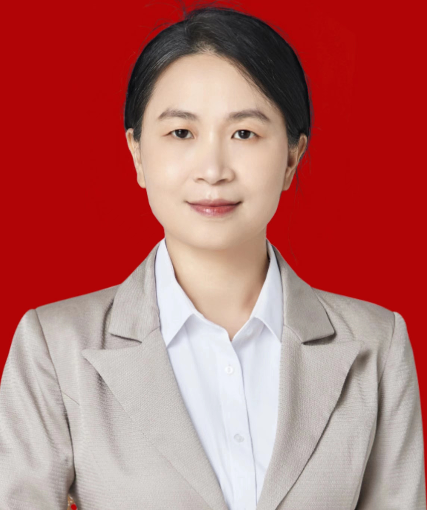

<!-- AUTO-GENERATED-BY: work/generate_obsidian_profiles.py -->

<!-- TEMPLATE: D:\workspace\信息收集整理\医生画像仓库\模板\医生画像模板.md -->

# 张宇

## 基础信息

| 字段 | 内容 |
|---|---|
| 姓名 | 张宇 |
| 医院 | 中山大学附属第三医院 |
| 科室 | 妇科 |
| 职称/身份 | 主任医师 导师资格 硕士生导师 |
| 来源链接 | [官网原文](https://www.zssy.com.cn/node/15103) |
| 采集日期 | 2026-08-10 |

## 简介/擅长

妇科良恶性肿瘤及子宫内膜异位症等疾病诊治，擅长腹式、阴式、腹腔镜、机器人腹腔镜等妇科四级手术，如广泛全子宫切除+腹膜后淋巴结清扫等高难度手术。

## 可包装亮点

- 主任医师 导师资格 硕士生导师 妇科主任，妇科党支部书记, 妇产科副主任， 现任广东省医学会妇产科分会常务委员、广东省优生优育协会妇科肿瘤分会副主任委员、广东省医师协会妇科内镜医师分会常务委员、广州市医师协会妇产科分会常务委员、广东省基层医药学会妇科专委会常务委员及秘书长、广东省健康管理学会妇科肿瘤多学科协作专委会常务委员、广州市抗癌协会妇科肿瘤专业委员会…
- 中山医科大学临床医学七年制毕业，曾多次到国内外著名教学医院妇科交流、进修、访学。
- 主持基金4项、发表论著20篇、主编著作2部、获国家专利4项、获校级教学成果奖1项

## 重点疾病/人群标签

- 慢性病：
- 肿瘤：肿瘤、癌、多学科
- 生殖疾病：
- 免疫/风湿：
- 术后恢复/康复：
- 疑难重症：肿瘤、癌、多学科

## 证据摘录

> 只摘录官网公开信息中的短句或关键字段，不复制大段原文。

- 官网身份字段：主任医师 导师资格 硕士生导师
- 官网简介/擅长：妇科良恶性肿瘤及子宫内膜异位症等疾病诊治，擅长腹式、阴式、腹腔镜、机器人腹腔镜等妇科四级手术，如广泛全子宫切除+腹膜后淋巴结清扫等高难度手术。
- 官网亮眼经历线索：主任医师 导师资格 硕士生导师 妇科主任，妇科党支部书记, 妇产科副主任， 现任广东省医学会妇产科分会常务委员、广东省优生优育协会妇科肿瘤分会副主任委员、广东省医师协会妇科内镜医师分会常务委员、广州市医师协会妇产科分会常务委员、广东省基层医药学会妇科专委会常务委员及秘书长、广东省健康管理学会妇科肿瘤多学科协作专委会常务委员、广州市抗癌协会妇科肿瘤专业委员会常务委员、广东省基层医药学会妇科肿瘤专委会常务委员、广东省预防医学会宫颈癌防治专…
- 来源链接：https://www.zssy.com.cn/node/15103

## BD 画像摘要

张宇医生可作为肿瘤、疑难重症方向的基础画像候选。后续 BD 使用应继续以官网来源和人工复核为准，不添加疗效承诺或无来源包装。

## 合规边界

- 仅使用医院官网、官方公众号、官方小程序等公开渠道。
- 不采集私人电话、私人微信、家庭住址、患者隐私或非公开排班信息。
- 不写“保证治愈”“疗效第一”“包治疑难杂症”等无法由官网证明的表述。
