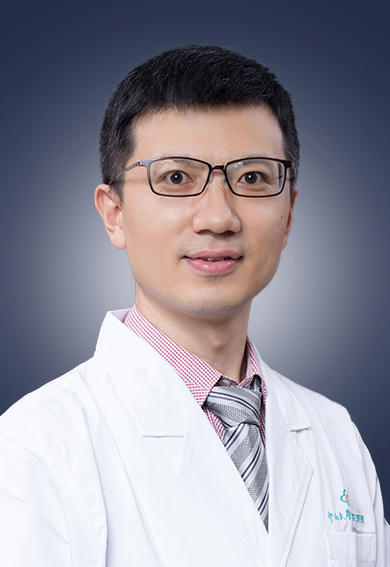

<!-- AUTO-GENERATED-BY: work/generate_obsidian_profiles.py -->

<!-- TEMPLATE: D:\workspace\信息收集整理\医生画像仓库\模板\医生画像模板.md -->

# 张昆

## 基础信息

| 字段 | 内容 |
|---|---|
| 姓名 | 张昆 |
| 医院 | 中山大学附属第三医院 |
| 科室 | 变态反应（过敏）学科 |
| 职称/身份 | 副主任医师 |
| 来源链接 | [官网原文](https://www.zssy.com.cn/node/15291) |
| 采集日期 | 2026-08-10 |

## 简介/擅长

针药结合特别是岐黄针疗法治疗颈肩腰腿痛等骨科疾病、过敏性疾病、消化系统、神经系统等疾病。

## 可包装亮点

- 副主任医师 主治医师，医学硕士，针灸科负责人，毕业于广州中医药大学，中华中医药学会中医体质分会青年委员，广东省自然医学研究会理事及产后康复专业委员会委员。
- 参与省部级课题三项，发表论文十余篇，主编专著一部，人民卫生出版社《岐黄针疗法》副主编，参编专著两部。

## 重点疾病/人群标签

- 慢性病：
- 肿瘤：
- 生殖疾病：
- 免疫/风湿：
- 术后恢复/康复：康复
- 疑难重症：

## 证据摘录

> 只摘录官网公开信息中的短句或关键字段，不复制大段原文。

- 官网身份字段：副主任医师
- 官网简介/擅长：针药结合特别是岐黄针疗法治疗颈肩腰腿痛等骨科疾病、过敏性疾病、消化系统、神经系统等疾病。
- 官网亮眼经历线索：副主任医师 主治医师，医学硕士，针灸科负责人，毕业于广州中医药大学，中华中医药学会中医体质分会青年委员，广东省自然医学研究会理事及产后康复专业委员会委员。 参与省部级课题三项，发表论文十余篇，主编专著一部，人民卫生出版社《岐黄针疗法》副主编，参编专著两部。
- 来源链接：https://www.zssy.com.cn/node/15291

## BD 画像摘要

张昆医生可作为术后恢复/康复方向的基础画像候选。后续 BD 使用应继续以官网来源和人工复核为准，不添加疗效承诺或无来源包装。

## 合规边界

- 仅使用医院官网、官方公众号、官方小程序等公开渠道。
- 不采集私人电话、私人微信、家庭住址、患者隐私或非公开排班信息。
- 不写“保证治愈”“疗效第一”“包治疑难杂症”等无法由官网证明的表述。
