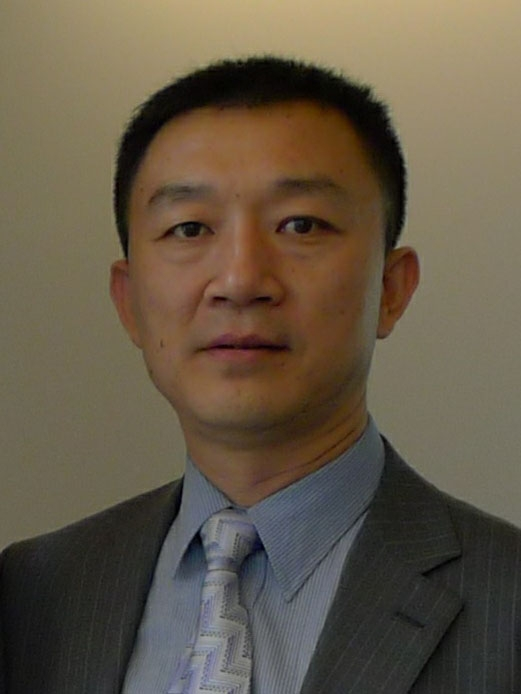

<!-- AUTO-GENERATED-BY: work/generate_obsidian_profiles.py -->

<!-- TEMPLATE: D:\workspace\信息收集整理\医生画像仓库\模板\医生画像模板.md -->

# 张炎

## 基础信息

| 字段 | 内容 |
|---|---|
| 姓名 | 张炎 |
| 医院 | 中山大学附属第三医院 |
| 科室 | 不育与性医学科 |
| 职称/身份 | 主任医师 导师资格 博士生导师 |
| 来源链接 | [官网原文](https://www.zssy.com.cn/node/11266) |
| 采集日期 | 2026-08-10 |

## 简介/擅长

1.无精症（包括先天性输精管缺如）的评估和治疗。 2.外伤或者背神经手术后性功能评估和康复。 3. 显微技术治疗男科疾病：显微技术精索静脉曲张修复术、显微输精管吻合术、显微输精管附睾管吻合术、阴茎离断再植术。 4. 阴茎勃起功能障碍的外科治疗：阴茎支撑体（假体）植入术、显微血管重建治疗血管性勃起功能障碍、阴茎背深静脉及脚静脉结扎、阴茎异常勃起的各种分流手术。 5. 男性生殖器整形：阴茎弯曲畸形的整形、小阴茎外科治疗、阴茎延长技术、成人尿道下裂手术治疗、睾丸假体植入术等。 6.男性尿失禁：人工尿道括约肌植入术、男性吊带术。

## 可包装亮点

- 主任医师 导师资格 博士生导师 科室主任，教授，主任医师，博士生导师，中山大学博士后；
- 中国男科显微外科培训中心副主任、亚洲男科学协会常委兼男性不育专委会副主委、中国医师协会男科医师分会男性生殖专委会副主委、中国性学会性医学分会常委、中国性学会男性生殖医学分会常委兼副秘书长、广东泌尿生殖协会男性生殖医学分会主委、广东省医学会男科分会副主委；

## 重点疾病/人群标签

- 慢性病：
- 肿瘤：
- 生殖疾病：生殖、术后、康复、功能障碍
- 免疫/风湿：
- 术后恢复/康复：生殖、术后、康复、功能障碍
- 疑难重症：

## 证据摘录

> 只摘录官网公开信息中的短句或关键字段，不复制大段原文。

- 官网身份字段：主任医师 导师资格 博士生导师
- 官网简介/擅长：1.无精症（包括先天性输精管缺如）的评估和治疗。 2.外伤或者背神经手术后性功能评估和康复。 3. 显微技术治疗男科疾病：显微技术精索静脉曲张修复术、显微输精管吻合术、显微输精管附睾管吻合术、阴茎离断再植术。 4. 阴茎勃起功能障碍的外科治疗：阴茎支撑体（假体）植入术、显微血管重建治疗血管性勃起功能障碍、阴茎背深静脉及脚静脉结扎、阴茎异常勃起的各种分流手术。 5. 男性生殖器整形：阴茎弯曲畸形的整形、小阴茎外科治疗、阴茎延长技术、成人…
- 官网亮眼经历线索：主任医师 导师资格 博士生导师 科室主任，教授，主任医师，博士生导师，中山大学博士后； 中国男科显微外科培训中心副主任、亚洲男科学协会常委兼男性不育专委会副主委、中国医师协会男科医师分会男性生殖专委会副主委、中国性学会性医学分会常委、中国性学会男性生殖医学分会常委兼副秘书长、广东泌尿生殖协会男性生殖医学分会主委、广东省医学会男科分会副主委；
- 来源链接：https://www.zssy.com.cn/node/11266

## BD 画像摘要

张炎医生可作为生殖疾病、术后恢复/康复方向的基础画像候选。后续 BD 使用应继续以官网来源和人工复核为准，不添加疗效承诺或无来源包装。

## 合规边界

- 仅使用医院官网、官方公众号、官方小程序等公开渠道。
- 不采集私人电话、私人微信、家庭住址、患者隐私或非公开排班信息。
- 不写“保证治愈”“疗效第一”“包治疑难杂症”等无法由官网证明的表述。
