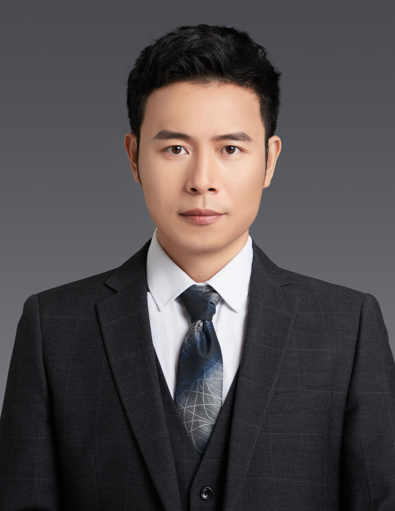

<!-- AUTO-GENERATED-BY: work/generate_obsidian_profiles.py -->

<!-- TEMPLATE: D:\workspace\信息收集整理\医生画像仓库\模板\医生画像模板.md -->

# 张英才

## 基础信息

| 字段 | 内容 |
|---|---|
| 姓名 | 张英才 |
| 医院 | 中山大学附属第三医院 |
| 科室 | 肝脏外科暨肝移植中心 |
| 职称/身份 | 主任医师 导师资格 博士生导师 |
| 来源链接 | [官网原文](https://www.zssy.com.cn/node/11115) |
| 采集日期 | 2026-08-10 |

## 简介/擅长

擅长肝脏、胆道与胰腺外科疾病的诊断与处理，对肝脏外科、肝脏移植、移植免疫、脂肪肝的诊断和治疗等方面有深入的研究。

## 可包装亮点

- 主任医师 导师资格 博士生导师 医学博士，主任医师，博士生导师，博士后合作导师。
- 现为新疆维吾尔族自治区人民医院党委委员、副院长（援疆），中山大学附属第三医院肝脏外科副主任、肇庆医院肝胆胰外科主任、肇庆医院党总支委员兼教职工第二党支部书记。
- 任中华医学会器官移植学分会临床研究与转化学组委员、中国研究型医院学会普通外科青年委员会副主任委员、中国研究型医院学会消化外科专业委员会常务委员、中国医院协会器官获取与分配管理工作委员会青年委员、广东省医师协会器官移植医师分会秘书、广东省肿瘤康复学会肝癌专业委员会副主任委员、广东省药品监督管理局审评专家、广东省医疗行业协会感染病管理分会肝硬化专委会副主任委员…

## 重点疾病/人群标签

- 慢性病：
- 肿瘤：肿瘤、肝癌、免疫、感染、康复
- 生殖疾病：
- 免疫/风湿：肿瘤、肝癌、免疫、感染、康复
- 术后恢复/康复：肿瘤、肝癌、免疫、感染、康复
- 疑难重症：

## 证据摘录

> 只摘录官网公开信息中的短句或关键字段，不复制大段原文。

- 官网身份字段：主任医师 导师资格 博士生导师
- 官网简介/擅长：擅长肝脏、胆道与胰腺外科疾病的诊断与处理，对肝脏外科、肝脏移植、移植免疫、脂肪肝的诊断和治疗等方面有深入的研究。
- 官网亮眼经历线索：主任医师 导师资格 博士生导师 医学博士，主任医师，博士生导师，博士后合作导师。 现为新疆维吾尔族自治区人民医院党委委员、副院长（援疆），中山大学附属第三医院肝脏外科副主任、肇庆医院肝胆胰外科主任、肇庆医院党总支委员兼教职工第二党支部书记。 任中华医学会器官移植学分会临床研究与转化学组委员、中国研究型医院学会普通外科青年委员会副主任委员、中国研究型医院学会消化外科专业委员会常务委员、中国医院协会器官获取与分配管理工作委员会青年委员、广…
- 来源链接：https://www.zssy.com.cn/node/11115

## BD 画像摘要

张英才医生可作为肿瘤、免疫/风湿/感染、术后恢复/康复方向的基础画像候选。后续 BD 使用应继续以官网来源和人工复核为准，不添加疗效承诺或无来源包装。

## 合规边界

- 仅使用医院官网、官方公众号、官方小程序等公开渠道。
- 不采集私人电话、私人微信、家庭住址、患者隐私或非公开排班信息。
- 不写“保证治愈”“疗效第一”“包治疑难杂症”等无法由官网证明的表述。
