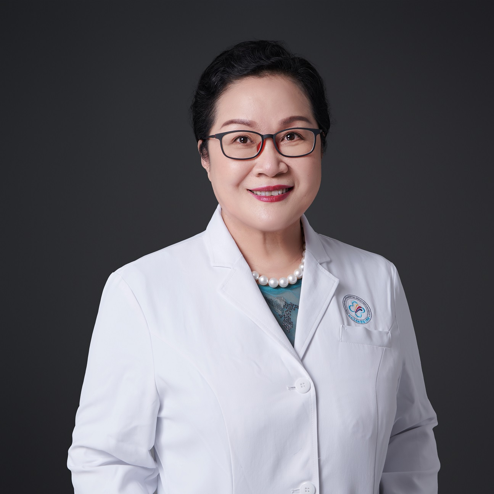

<!-- AUTO-GENERATED-BY: work/generate_obsidian_profiles.py -->

<!-- TEMPLATE: D:\workspace\信息收集整理\医生画像仓库\模板\医生画像模板.md -->

# 徐向英

## 基础信息

| 字段 | 内容 |
|---|---|
| 姓名 | 徐向英 |
| 医院 | 中山大学附属第三医院 |
| 科室 | 肿瘤放射治疗科 |
| 职称/身份 | 主任医师, 教授 导师资格 博士生导师 |
| 来源链接 | [官网原文](https://www.zssy.com.cn/node/11046) |
| 采集日期 | 2026-08-10 |

## 简介/擅长

从事肿瘤诊疗40余年。擅长肺小结节及早期肺癌的影像诊断及病理关系与预后研究，对肺癌精准放疗及综合治疗有较高造诣。对脑瘤、鼻咽癌及头颈部肿瘤（鼻腔筛窦癌、下咽癌、喉癌等）、乳腺癌、食管癌、肝癌、妇科肿瘤（宫颈癌、子宫内膜癌等）、前列腺癌及直肠癌等放化疗及靶向免疫治疗经验丰富。

## 可包装亮点

- 主任医师, 教授 导师资格 博士生导师 擅长肺小结节及早期肺癌的影像诊断及病理关系与预后研究，对肺癌精准放疗及综合治疗有较高造诣。
- 肿瘤放疗科现任科主任、学科科创始人，肿瘤放射治疗学教研室主任，主任医师，教授，博士及博后导师。
- 留日八年，日本医科大学博士学位，东京大学及日本医科大学客座教授，美国MD Anderson癌症中心访问学者。

## 重点疾病/人群标签

- 慢性病：
- 肿瘤：肿瘤、癌、瘤、放疗、化疗、靶向、鼻咽癌、肺癌、肝癌、肠癌、乳腺癌、免疫、康复、营养、多学科
- 生殖疾病：
- 免疫/风湿：肿瘤、癌、瘤、放疗、化疗、靶向、鼻咽癌、肺癌、肝癌、肠癌、乳腺癌、免疫、康复、营养、多学科
- 术后恢复/康复：肿瘤、癌、瘤、放疗、化疗、靶向、鼻咽癌、肺癌、肝癌、肠癌、乳腺癌、免疫、康复、营养、多学科
- 疑难重症：肿瘤、癌、瘤、放疗、化疗、靶向、鼻咽癌、肺癌、肝癌、肠癌、乳腺癌、免疫、康复、营养、多学科

## 证据摘录

> 只摘录官网公开信息中的短句或关键字段，不复制大段原文。

- 官网身份字段：主任医师, 教授 导师资格 博士生导师
- 官网简介/擅长：从事肿瘤诊疗40余年。擅长肺小结节及早期肺癌的影像诊断及病理关系与预后研究，对肺癌精准放疗及综合治疗有较高造诣。对脑瘤、鼻咽癌及头颈部肿瘤（鼻腔筛窦癌、下咽癌、喉癌等）、乳腺癌、食管癌、肝癌、妇科肿瘤（宫颈癌、子宫内膜癌等）、前列腺癌及直肠癌等放化疗及靶向免疫治疗经验丰富。
- 官网亮眼经历线索：主任医师, 教授 导师资格 博士生导师 擅长肺小结节及早期肺癌的影像诊断及病理关系与预后研究，对肺癌精准放疗及综合治疗有较高造诣。 肿瘤放疗科现任科主任、学科科创始人，肿瘤放射治疗学教研室主任，主任医师，教授，博士及博后导师。 留日八年，日本医科大学博士学位，东京大学及日本医科大学客座教授，美国MD Anderson癌症中心访问学者。
- 来源链接：https://www.zssy.com.cn/node/11046

## BD 画像摘要

徐向英医生可作为肿瘤、免疫/风湿/感染、术后恢复/康复、疑难重症方向的基础画像候选。后续 BD 使用应继续以官网来源和人工复核为准，不添加疗效承诺或无来源包装。

## 合规边界

- 仅使用医院官网、官方公众号、官方小程序等公开渠道。
- 不采集私人电话、私人微信、家庭住址、患者隐私或非公开排班信息。
- 不写“保证治愈”“疗效第一”“包治疑难杂症”等无法由官网证明的表述。
