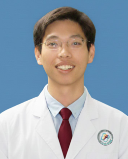

<!-- AUTO-GENERATED-BY: work/generate_obsidian_profiles.py -->

<!-- TEMPLATE: D:\workspace\信息收集整理\医生画像仓库\模板\医生画像模板.md -->

# 徐晓峰

## 基础信息

| 字段 | 内容 |
|---|---|
| 姓名 | 徐晓峰 |
| 医院 | 中山大学附属第三医院 |
| 科室 | 神经内科 |
| 职称/身份 | 副主任医师 |
| 来源链接 | [官网原文](https://www.zssy.com.cn/node/29802) |
| 采集日期 | 2026-08-10 |

## 简介/擅长

中枢神经系统感染、免疫、脑血管病的诊疗 学术成果：主持国家自然科学基金 1 项,广东省省自然 1项,中科院合作1 项；第一/通讯作者在《Brain Stimulation》、《ImmunoTargets Ther》、《PLOS NTDs》等专业期刊发表SCI论文11 篇。人民卫生出版社《隐球菌性脑膜炎》副主编，中山大学出版社《神经免疫学新进展》编者。

## 可包装亮点

- 副主任医师 中枢神经系统感染、免疫、脑血管病的诊疗 学术成果：主持国家自然科学基金 1 项,广东省省自然 1项,中科院合作1 项；
- 第一/通讯作者在《Brain Stimulation》、《ImmunoTargets Ther》、《PLOS NTDs》等专业期刊发表SCI论文11 篇。
- 副主任医师，博士 专业领域：神经病学 研究方向： 中枢神经系统感染、免疫、脑血管病的诊疗 学术成果：主持国家自然科学基金 1 项,广东省省自然 1项,中科院合作1 项；

## 重点疾病/人群标签

- 慢性病：
- 肿瘤：
- 生殖疾病：
- 免疫/风湿：免疫、感染、疼痛
- 术后恢复/康复：免疫、感染、疼痛
- 疑难重症：

## 证据摘录

> 只摘录官网公开信息中的短句或关键字段，不复制大段原文。

- 官网身份字段：副主任医师
- 官网简介/擅长：中枢神经系统感染、免疫、脑血管病的诊疗 学术成果：主持国家自然科学基金 1 项,广东省省自然 1项,中科院合作1 项；第一/通讯作者在《Brain Stimulation》、《ImmunoTargets Ther》、《PLOS NTDs》等专业期刊发表SCI论文11 篇。人民卫生出版社《隐球菌性脑膜炎》副主编，中山大学出版社《神经免疫学新进展》编者。
- 官网亮眼经历线索：副主任医师 中枢神经系统感染、免疫、脑血管病的诊疗 学术成果：主持国家自然科学基金 1 项,广东省省自然 1项,中科院合作1 项； 第一/通讯作者在《Brain Stimulation》、《ImmunoTargets Ther》、《PLOS NTDs》等专业期刊发表SCI论文11 篇。 副主任医师，博士 专业领域：神经病学 研究方向： 中枢神经系统感染、免疫、脑血管病的诊疗 学术成果：主持国家自然科学基金 1 项,广东省省自然 1项,…
- 来源链接：https://www.zssy.com.cn/node/29802

## BD 画像摘要

徐晓峰医生可作为免疫/风湿/感染、术后恢复/康复方向的基础画像候选。后续 BD 使用应继续以官网来源和人工复核为准，不添加疗效承诺或无来源包装。

## 合规边界

- 仅使用医院官网、官方公众号、官方小程序等公开渠道。
- 不采集私人电话、私人微信、家庭住址、患者隐私或非公开排班信息。
- 不写“保证治愈”“疗效第一”“包治疑难杂症”等无法由官网证明的表述。
