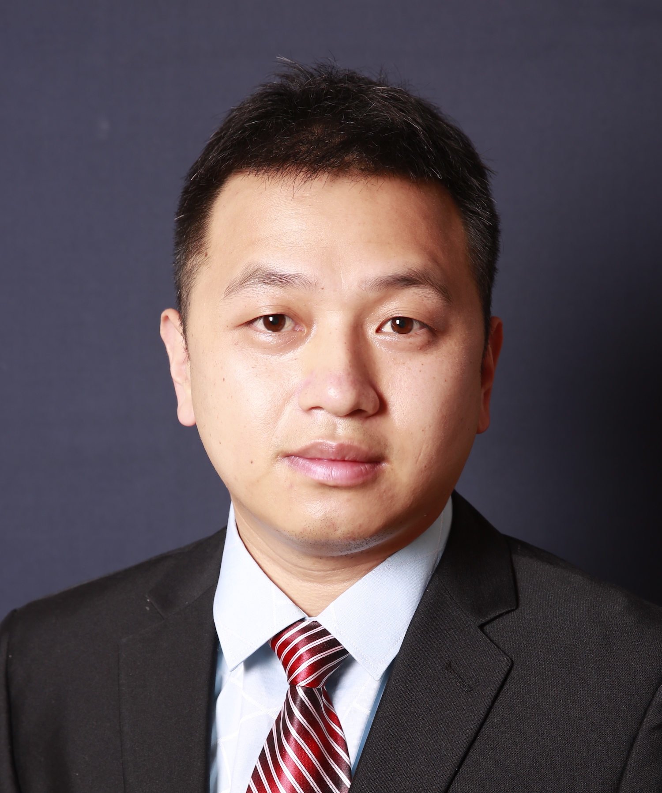

<!-- AUTO-GENERATED-BY: work/generate_obsidian_profiles.py -->

<!-- TEMPLATE: D:\workspace\信息收集整理\医生画像仓库\模板\医生画像模板.md -->

# 徐雄均

## 基础信息

| 字段 | 内容 |
|---|---|
| 姓名 | 徐雄均 |
| 医院 | 中山大学附属第三医院 |
| 科室 | 口腔科 |
| 职称/身份 | 主任医师 导师资格 硕士生导师 |
| 来源链接 | [官网原文](https://www.zssy.com.cn/node/15374) |
| 采集日期 | 2026-08-10 |

## 简介/擅长

擅长单牙与多牙缺失种植修复，前牙美学修复（瓷贴面、微创树脂修复），复杂牙体缺损修复（全瓷冠、烤瓷冠修复），活动义齿与全口义齿修复，全口无牙颌种植覆盖义齿修复。

## 可包装亮点

- 主任医师 导师资格 硕士生导师 主任医师，口腔医学博士，广东省口腔医学会修复专委会委员，广东省医学教育协会口腔种植专委会委会，广东省精准医学应用学会口腔修复种植分会常务委员，国际口腔种植学会（ITI）会员。
- 主持及参与5项国家级、省部级科研课题，发表国内外论著10多篇。

## 重点疾病/人群标签

- 慢性病：
- 肿瘤：
- 生殖疾病：
- 免疫/风湿：
- 术后恢复/康复：
- 疑难重症：复杂

## 证据摘录

> 只摘录官网公开信息中的短句或关键字段，不复制大段原文。

- 官网身份字段：主任医师 导师资格 硕士生导师
- 官网简介/擅长：擅长单牙与多牙缺失种植修复，前牙美学修复（瓷贴面、微创树脂修复），复杂牙体缺损修复（全瓷冠、烤瓷冠修复），活动义齿与全口义齿修复，全口无牙颌种植覆盖义齿修复。
- 官网亮眼经历线索：主任医师 导师资格 硕士生导师 主任医师，口腔医学博士，广东省口腔医学会修复专委会委员，广东省医学教育协会口腔种植专委会委会，广东省精准医学应用学会口腔修复种植分会常务委员，国际口腔种植学会（ITI）会员。 主持及参与5项国家级、省部级科研课题，发表国内外论著10多篇。
- 来源链接：https://www.zssy.com.cn/node/15374

## BD 画像摘要

徐雄均医生可作为疑难重症方向的基础画像候选。后续 BD 使用应继续以官网来源和人工复核为准，不添加疗效承诺或无来源包装。

## 合规边界

- 仅使用医院官网、官方公众号、官方小程序等公开渠道。
- 不采集私人电话、私人微信、家庭住址、患者隐私或非公开排班信息。
- 不写“保证治愈”“疗效第一”“包治疑难杂症”等无法由官网证明的表述。
