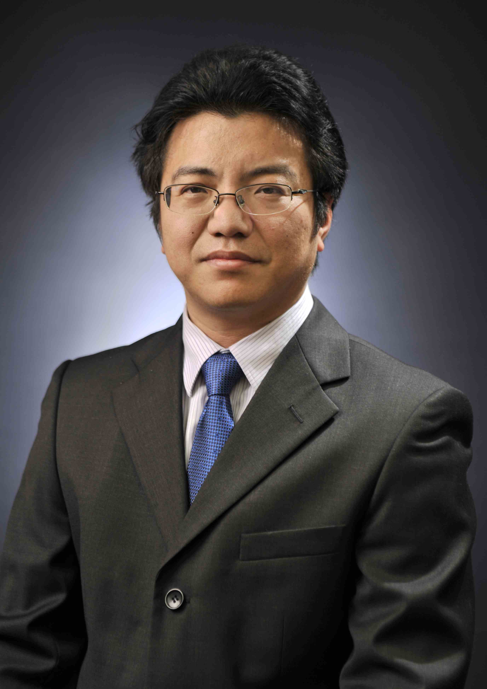

<!-- AUTO-GENERATED-BY: work/generate_obsidian_profiles.py -->

<!-- TEMPLATE: D:\workspace\信息收集整理\医生画像仓库\模板\医生画像模板.md -->

# 戴永强

## 基础信息

| 字段 | 内容 |
|---|---|
| 姓名 | 戴永强 |
| 医院 | 中山大学附属第三医院 |
| 科室 | 神经内科 |
| 职称/身份 | 副主任医师 导师资格 硕士生导师 |
| 来源链接 | [官网原文](https://www.zssy.com.cn/node/11134) |
| 采集日期 | 2026-08-10 |

## 简介/擅长

脑血管病、神经介入，神经重症

## 可包装亮点

- 副主任医师 导师资格 硕士生导师 中山大学附属第三医院神经内科副主任，岭南医院神经内科主任，副主任医师，医学博士，硕士生导师。
- 国家卫计委重症脑血管病专业委员会委员，广东省卒中学会缺血性神经介入分会副主任委员，广东省临床医学学会介入神经病学专业委员会常委，广东省健康管理学会脑血管病防治和健康促进专业委员会常委，广东省中西医结合学会第一届卒中专业委员会常委，广东省医学会神经病学分会第九届委员，广东省医学会神经病学分会介入学组委员，广东省医师协会神经介入医师分会委员。

## 重点疾病/人群标签

- 慢性病：
- 肿瘤：
- 生殖疾病：
- 免疫/风湿：
- 术后恢复/康复：
- 疑难重症：重症

## 证据摘录

> 只摘录官网公开信息中的短句或关键字段，不复制大段原文。

- 官网身份字段：副主任医师 导师资格 硕士生导师
- 官网简介/擅长：脑血管病、神经介入，神经重症
- 官网亮眼经历线索：副主任医师 导师资格 硕士生导师 中山大学附属第三医院神经内科副主任，岭南医院神经内科主任，副主任医师，医学博士，硕士生导师。 国家卫计委重症脑血管病专业委员会委员，广东省卒中学会缺血性神经介入分会副主任委员，广东省临床医学学会介入神经病学专业委员会常委，广东省健康管理学会脑血管病防治和健康促进专业委员会常委，广东省中西医结合学会第一届卒中专业委员会常委，广东省医学会神经病学分会第九届委员，广东省医学会神经病学分会介入学组委员，广东省…
- 来源链接：https://www.zssy.com.cn/node/11134

## BD 画像摘要

戴永强医生可作为疑难重症方向的基础画像候选。后续 BD 使用应继续以官网来源和人工复核为准，不添加疗效承诺或无来源包装。

## 合规边界

- 仅使用医院官网、官方公众号、官方小程序等公开渠道。
- 不采集私人电话、私人微信、家庭住址、患者隐私或非公开排班信息。
- 不写“保证治愈”“疗效第一”“包治疑难杂症”等无法由官网证明的表述。
