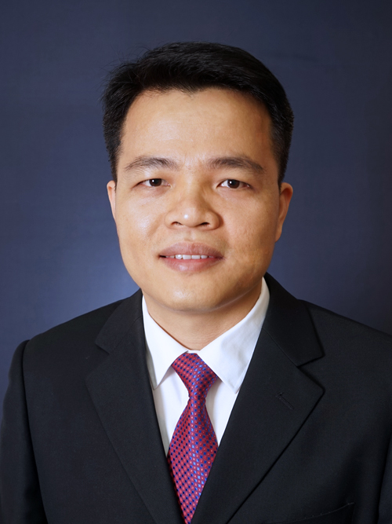

<!-- AUTO-GENERATED-BY: work/generate_obsidian_profiles.py -->

<!-- TEMPLATE: D:\workspace\信息收集整理\医生画像仓库\模板\医生画像模板.md -->

# 揭育胜

## 基础信息

| 字段 | 内容 |
|---|---|
| 姓名 | 揭育胜 |
| 医院 | 中山大学附属第三医院 |
| 科室 | 感染性疾病科 |
| 职称/身份 | 副主任医师 导师资格 硕士生导师 |
| 来源链接 | [官网原文](https://www.zssy.com.cn/node/15044) |
| 采集日期 | 2026-08-10 |

## 简介/擅长

病毒性肝炎治疗方案优化、肝硬化肝癌的早期诊断和精准治疗。对其它病因肝病如脂肪肝、药物性肝病、遗传代谢性肝病等亦有丰富的临床诊治经验。

## 可包装亮点

- 副主任医师 导师资格 硕士生导师 病毒性肝炎治疗方案优化、肝硬化肝癌的早期诊断和精准治疗。
- 主任医师，医学博士，硕士生导师。
- 任广东省肝脏病学会肝炎专业组委员兼秘书、广东省医学教育协会感染性疾病专业委员会委员、广东省精准医学应用学会免疫治疗分会委员、中南八省区域感染科专科联盟秘书。

## 重点疾病/人群标签

- 慢性病：代谢、肝癌、免疫、感染
- 肿瘤：代谢、肝癌、免疫、感染
- 生殖疾病：
- 免疫/风湿：代谢、肝癌、免疫、感染
- 术后恢复/康复：
- 疑难重症：

## 证据摘录

> 只摘录官网公开信息中的短句或关键字段，不复制大段原文。

- 官网身份字段：副主任医师 导师资格 硕士生导师
- 官网简介/擅长：病毒性肝炎治疗方案优化、肝硬化肝癌的早期诊断和精准治疗。对其它病因肝病如脂肪肝、药物性肝病、遗传代谢性肝病等亦有丰富的临床诊治经验。
- 官网亮眼经历线索：副主任医师 导师资格 硕士生导师 病毒性肝炎治疗方案优化、肝硬化肝癌的早期诊断和精准治疗。 主任医师，医学博士，硕士生导师。 任广东省肝脏病学会肝炎专业组委员兼秘书、广东省医学教育协会感染性疾病专业委员会委员、广东省精准医学应用学会免疫治疗分会委员、中南八省区域感染科专科联盟秘书。
- 来源链接：https://www.zssy.com.cn/node/15044

## BD 画像摘要

揭育胜医生可作为慢性病、肿瘤、免疫/风湿/感染方向的基础画像候选。后续 BD 使用应继续以官网来源和人工复核为准，不添加疗效承诺或无来源包装。

## 合规边界

- 仅使用医院官网、官方公众号、官方小程序等公开渠道。
- 不采集私人电话、私人微信、家庭住址、患者隐私或非公开排班信息。
- 不写“保证治愈”“疗效第一”“包治疑难杂症”等无法由官网证明的表述。
