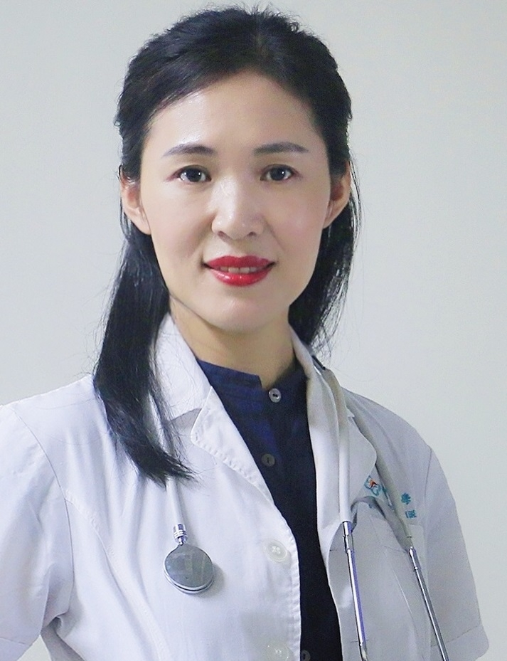

<!-- AUTO-GENERATED-BY: work/generate_obsidian_profiles.py -->

<!-- TEMPLATE: D:\workspace\信息收集整理\医生画像仓库\模板\医生画像模板.md -->

# 朱顺叶

## 基础信息

| 字段 | 内容 |
|---|---|
| 姓名 | 朱顺叶 |
| 医院 | 中山大学附属第三医院 |
| 科室 | 儿科 |
| 职称/身份 | 副主任医师 导师资格 硕士生导师 |
| 来源链接 | [官网原文](https://www.zssy.com.cn/node/11160) |
| 采集日期 | 2026-08-10 |

## 简介/擅长

擅长儿童内分泌与遗传代谢性疾病的救治，特别是生长激素缺乏症、特发性矮小、性早熟、性发育障碍、小阴茎、特纳综合征等染色体疾病、甲状腺疾病、垂体功能异常、儿童肥胖症、营养不良等疾病的综合诊治，开展了儿童生长发育的追踪随诊及早期干预工作。对新生儿各类疾病的诊治特别是小于胎龄儿和早产儿的生长追赶有丰富的临床经验。

## 可包装亮点

- 副主任医师 导师资格 硕士生导师 中国医师协会青春期医学专业委员会社会工作组委员，中国医师协会新生儿科医师分会遗传性肝病专业委员会委员，广东省医学会儿科学分会内分泌与遗传代谢学组委员，广州市妇女儿童保健委员会委员，广东省矮小人协会医学顾问。
- 主持、参与了多项国家、广东省科技项目，参与的《儿童青春发育现状和性早熟诊断治疗的临床和基础的系列研究》获得广东省科学技术二等奖，以第一作者在国内外核心期刊发表文章数十篇。

## 重点疾病/人群标签

- 慢性病：代谢、营养
- 肿瘤：
- 生殖疾病：
- 免疫/风湿：
- 术后恢复/康复：代谢、营养
- 疑难重症：

## 证据摘录

> 只摘录官网公开信息中的短句或关键字段，不复制大段原文。

- 官网身份字段：副主任医师 导师资格 硕士生导师
- 官网简介/擅长：擅长儿童内分泌与遗传代谢性疾病的救治，特别是生长激素缺乏症、特发性矮小、性早熟、性发育障碍、小阴茎、特纳综合征等染色体疾病、甲状腺疾病、垂体功能异常、儿童肥胖症、营养不良等疾病的综合诊治，开展了儿童生长发育的追踪随诊及早期干预工作。对新生儿各类疾病的诊治特别是小于胎龄儿和早产儿的生长追赶有丰富的临床经验。
- 官网亮眼经历线索：副主任医师 导师资格 硕士生导师 中国医师协会青春期医学专业委员会社会工作组委员，中国医师协会新生儿科医师分会遗传性肝病专业委员会委员，广东省医学会儿科学分会内分泌与遗传代谢学组委员，广州市妇女儿童保健委员会委员，广东省矮小人协会医学顾问。 主持、参与了多项国家、广东省科技项目，参与的《儿童青春发育现状和性早熟诊断治疗的临床和基础的系列研究》获得广东省科学技术二等奖，以第一作者在国内外核心期刊发表文章数十篇。
- 来源链接：https://www.zssy.com.cn/node/11160

## BD 画像摘要

朱顺叶医生可作为慢性病、术后恢复/康复方向的基础画像候选。后续 BD 使用应继续以官网来源和人工复核为准，不添加疗效承诺或无来源包装。

## 合规边界

- 仅使用医院官网、官方公众号、官方小程序等公开渠道。
- 不采集私人电话、私人微信、家庭住址、患者隐私或非公开排班信息。
- 不写“保证治愈”“疗效第一”“包治疑难杂症”等无法由官网证明的表述。
