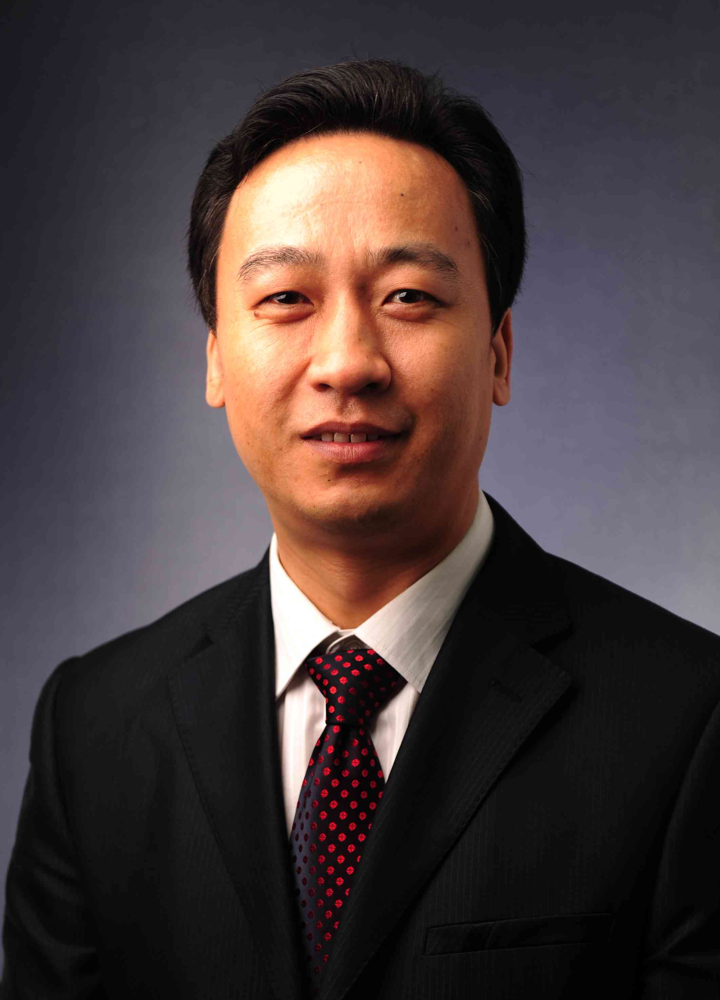

<!-- AUTO-GENERATED-BY: work/generate_obsidian_profiles.py -->

<!-- TEMPLATE: D:\workspace\信息收集整理\医生画像仓库\模板\医生画像模板.md -->

# 李奎

## 基础信息

| 字段 | 内容 |
|---|---|
| 姓名 | 李奎 |
| 医院 | 中山大学附属第三医院 |
| 科室 | 康复医学科 |
| 职称/身份 | 主任技师 |
| 来源链接 | [官网原文](https://www.zssy.com.cn/node/11039) |
| 采集日期 | 2026-08-10 |

## 简介/擅长

神经系统与运动系统疾病功能障碍的精准评估与治疗。

## 可包装亮点

- 神经系统与运动系统疾病功能障碍的精准评估与治疗。
- 现任中国康复医学会物理治疗专业委员会副主任委员、第二届徒手物理治疗学组组长，中国康复医学会康复医学教育专业委员会物理治疗教育学组委员，中国医师协会康复医师分会物理治疗学组委员，广东省康复医学会物理治疗师分会副会长，广东省医学会物理医学与康复学分会物理治疗学组副组长，广东省康复医学发展研究会广东名康复治疗师联盟主任委员，广州市健康科普专家（运动与全民健身组）。
- 发表第一/通讯作者论著30余篇。
- 获广东省卫健委主办的“2024年广东省康复治疗职业技能竞赛”“优秀导师一等奖”等荣誉。

## 重点疾病/人群标签

- 慢性病：
- 肿瘤：
- 生殖疾病：
- 免疫/风湿：
- 术后恢复/康复：康复、功能障碍
- 疑难重症：

## 证据摘录

> 只摘录官网公开信息中的短句或关键字段，不复制大段原文。

- 官网身份字段：主任技师
- 官网简介/擅长：神经系统与运动系统疾病功能障碍的精准评估与治疗。
- 官网亮眼经历线索：神经系统与运动系统疾病功能障碍的精准评估与治疗。 现任中国康复医学会物理治疗专业委员会副主任委员、第二届徒手物理治疗学组组长，中国康复医学会康复医学教育专业委员会物理治疗教育学组委员，中国医师协会康复医师分会物理治疗学组委员，广东省康复医学会物理治疗师分会副会长，广东省医学会物理医学与康复学分会物理治疗学组副组长，广东省康复医学发展研究会广东名康复治疗师联盟主任委员，广州市健康科普专家（运动与全民健身组）。 发表第一/通讯作者论著30…
- 来源链接：https://www.zssy.com.cn/node/11039

## BD 画像摘要

李奎医生可作为术后恢复/康复方向的基础画像候选。后续 BD 使用应继续以官网来源和人工复核为准，不添加疗效承诺或无来源包装。

## 合规边界

- 仅使用医院官网、官方公众号、官方小程序等公开渠道。
- 不采集私人电话、私人微信、家庭住址、患者隐私或非公开排班信息。
- 不写“保证治愈”“疗效第一”“包治疑难杂症”等无法由官网证明的表述。
