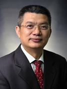

<!-- AUTO-GENERATED-BY: work/generate_obsidian_profiles.py -->

<!-- TEMPLATE: D:\workspace\信息收集整理\医生画像仓库\模板\医生画像模板.md -->

# 李小毛

## 基础信息

| 字段 | 内容 |
|---|---|
| 姓名 | 李小毛 |
| 医院 | 中山大学附属第三医院 |
| 科室 | 妇科 |
| 职称/身份 | 主任医师 导师资格 博士生导师 |
| 来源链接 | [官网原文](https://www.zssy.com.cn/node/15101) |
| 采集日期 | 2026-08-10 |

## 简介/擅长

妇科肿瘤（子宫肌瘤、子宫内膜癌、子宫颈癌）、子宫内膜异位症及妇产科疑难杂症的诊治，卵巢肿瘤与自身免疫性脑炎，熟练掌握妇科腹腔镜、腹式及阴式手术，尤其是腹腔镜下广泛全子宫切除+淋巴清扫术等高难度手术。

## 可包装亮点

- 主任医师 导师资格 博士生导师 妇科肿瘤（子宫肌瘤、子宫内膜癌、子宫颈癌）、子宫内膜异位症及妇产科疑难杂症的诊治，卵巢肿瘤与自身免疫性脑炎，熟练掌握妇科腹腔镜、腹式及阴式手术，尤其是腹腔镜下广泛全子宫切除+淋巴清扫术等高难度手术。
- 妇产科学科带头人，中山大学教授 现任中华医学会全国医学继续教育委员会委员、中国医师协会妇产科分会委员、中华预防医学会微生态学分会微生态诊断学组委员，中国优生科学协会生殖道疾病诊治分会常务委员、中国老年医学会妇科分会常务委员、中国整形美容协会科技创新与器官整复分会常务理事、中国妇幼保健协会医疗美容专业委员会委员、中国医疗保健国际交流促进会妇产科专业委员会委员…

## 重点疾病/人群标签

- 慢性病：
- 肿瘤：肿瘤、癌、瘤、生殖、卵巢、免疫、感染、疑难
- 生殖疾病：肿瘤、癌、瘤、生殖、卵巢、免疫、感染、疑难
- 免疫/风湿：肿瘤、癌、瘤、生殖、卵巢、免疫、感染、疑难
- 术后恢复/康复：
- 疑难重症：肿瘤、癌、瘤、生殖、卵巢、免疫、感染、疑难

## 证据摘录

> 只摘录官网公开信息中的短句或关键字段，不复制大段原文。

- 官网身份字段：主任医师 导师资格 博士生导师
- 官网简介/擅长：妇科肿瘤（子宫肌瘤、子宫内膜癌、子宫颈癌）、子宫内膜异位症及妇产科疑难杂症的诊治，卵巢肿瘤与自身免疫性脑炎，熟练掌握妇科腹腔镜、腹式及阴式手术，尤其是腹腔镜下广泛全子宫切除+淋巴清扫术等高难度手术。
- 官网亮眼经历线索：主任医师 导师资格 博士生导师 妇科肿瘤（子宫肌瘤、子宫内膜癌、子宫颈癌）、子宫内膜异位症及妇产科疑难杂症的诊治，卵巢肿瘤与自身免疫性脑炎，熟练掌握妇科腹腔镜、腹式及阴式手术，尤其是腹腔镜下广泛全子宫切除+淋巴清扫术等高难度手术。 妇产科学科带头人，中山大学教授 现任中华医学会全国医学继续教育委员会委员、中国医师协会妇产科分会委员、中华预防医学会微生态学分会微生态诊断学组委员，中国优生科学协会生殖道疾病诊治分会常务委员、中国老年医学会…
- 来源链接：https://www.zssy.com.cn/node/15101

## BD 画像摘要

李小毛医生可作为肿瘤、生殖疾病、免疫/风湿/感染、疑难重症方向的基础画像候选。后续 BD 使用应继续以官网来源和人工复核为准，不添加疗效承诺或无来源包装。

## 合规边界

- 仅使用医院官网、官方公众号、官方小程序等公开渠道。
- 不采集私人电话、私人微信、家庭住址、患者隐私或非公开排班信息。
- 不写“保证治愈”“疗效第一”“包治疑难杂症”等无法由官网证明的表述。
