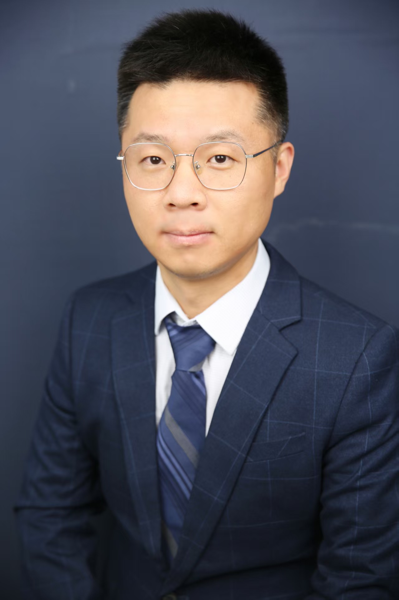

<!-- AUTO-GENERATED-BY: work/generate_obsidian_profiles.py -->

<!-- TEMPLATE: D:\workspace\信息收集整理\医生画像仓库\模板\医生画像模板.md -->

# 李彦杰

## 基础信息

| 字段 | 内容 |
|---|---|
| 姓名 | 李彦杰 |
| 医院 | 中山大学附属第三医院 |
| 科室 | 肝胆外科 |
| 职称/身份 | 副主任医师 导师资格 硕士生导师 |
| 来源链接 | [官网原文](https://www.zssy.com.cn/node/30109) |
| 采集日期 | 2026-08-10 |

## 简介/擅长

肝胆外科专家。致力于肝胆胰脾疾病的微创治疗，包括胆囊结石、胆囊息肉、胆囊腺肌症、胆总管结石、原发性肝癌、肝囊肿、肝内胆管结石、胰腺良恶性肿瘤、肝硬化巨脾、先天性胆管扩张症等常见疾病。对中晚期肝癌的转化治疗，包括介入联合靶免、消融、放疗积累了丰富的临床经验。

## 可包装亮点

- 副主任医师 导师资格 硕士生导师 外科学博士，副主任医师，硕士生导师，美国加州大学圣地亚哥分校联合培养博士，从事肝胆外科工作10余年。
- 任广东省药学会肝胆肿瘤多学科综合治疗专家委员会委员，广东省研究型医院学会肝胆胰外科专业委员会委员，广东省器官医学与技术学会肿瘤介入专业委员会委员，广东省基层医药学会转移性肝癌专业委员会委员，广东省健康管理委员会胰腺疾病专业委员会委员，广东省基层医药学会肝癌防治委员会委员。

## 重点疾病/人群标签

- 慢性病：
- 肿瘤：肿瘤、放疗、肝癌、多学科、转化治疗
- 生殖疾病：
- 免疫/风湿：
- 术后恢复/康复：
- 疑难重症：肿瘤、放疗、肝癌、多学科、转化治疗

## 证据摘录

> 只摘录官网公开信息中的短句或关键字段，不复制大段原文。

- 官网身份字段：副主任医师 导师资格 硕士生导师
- 官网简介/擅长：肝胆外科专家。致力于肝胆胰脾疾病的微创治疗，包括胆囊结石、胆囊息肉、胆囊腺肌症、胆总管结石、原发性肝癌、肝囊肿、肝内胆管结石、胰腺良恶性肿瘤、肝硬化巨脾、先天性胆管扩张症等常见疾病。对中晚期肝癌的转化治疗，包括介入联合靶免、消融、放疗积累了丰富的临床经验。
- 官网亮眼经历线索：副主任医师 导师资格 硕士生导师 外科学博士，副主任医师，硕士生导师，美国加州大学圣地亚哥分校联合培养博士，从事肝胆外科工作10余年。 任广东省药学会肝胆肿瘤多学科综合治疗专家委员会委员，广东省研究型医院学会肝胆胰外科专业委员会委员，广东省器官医学与技术学会肿瘤介入专业委员会委员，广东省基层医药学会转移性肝癌专业委员会委员，广东省健康管理委员会胰腺疾病专业委员会委员，广东省基层医药学会肝癌防治委员会委员。
- 来源链接：https://www.zssy.com.cn/node/30109

## BD 画像摘要

李彦杰医生可作为肿瘤、疑难重症方向的基础画像候选。后续 BD 使用应继续以官网来源和人工复核为准，不添加疗效承诺或无来源包装。

## 合规边界

- 仅使用医院官网、官方公众号、官方小程序等公开渠道。
- 不采集私人电话、私人微信、家庭住址、患者隐私或非公开排班信息。
- 不写“保证治愈”“疗效第一”“包治疑难杂症”等无法由官网证明的表述。
